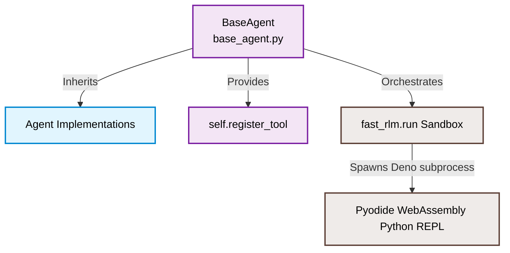

# 🧠 Deep-Dive Multi-Agent Architecture & Code Mappings

This comprehensive guide details the inner workings, codebase files, execution loops, and custom tool registrations of **each autonomous agent separately** within the Magellan AI Search Ops Harness. It maps exactly how agents use the `fast-rlm` sandboxed environment to securely diagnose and fix production outages.

---

## 🏗️ 1. Core Architecture & Base Inheritance

Magellan's agents are structured around a hybrid design: **Generative reasoning loops** (for diagnosis and fixing) combined with **Deterministic execution** (for evaluation and deployment).

Every reasoning agent inherits from a unified base class (`base_agent.py`) which acts as the bridge to the **`fast-rlm` sandbox**.



---

## 📦 2. Agent 1: `GoogleRootCauseAgent` (Catalog RCA)

*   **File Location:** `Catalog/RootCause/google_agent.py`
*   **Primary Task:** Analyzes incoming catalog telemetry and error logs to identify structural catalog outages.

### Core Logic & Execution Loop
When a catalog outage is detected, Temporal schedules the `root_cause_activity`. The agent instantiates, connects to Gemini, parses the XML-blocked log data, and triggers a localized Python search logic inside Pyodide to isolate the broken SKUs or missing schema types.

### Registered Tools:
*   `catalog_coverage` ➔ Runs checks to identify zero-result query gaps.
*   `schema_validation` ➔ Verifies whether ingested product items violate the database types.
*   `freshness` ➔ Checks if the database index matches the time delay.
*   `check_product_completeness` (Custom) ➔ Validates if all critical attributes (price, category, image) exist.
*   `analyze_query_patterns` (Custom) ➔ Analyzes keywords to find long-tail search trends.

### Code Proof: Tool Setup
```python
# From Catalog/RootCause/google_agent.py
class GoogleRootCauseAgent(BaseAgent):
    def __init__(self, model: str = "gemini-2.5-flash"):
        super().__init__(model_name="gemini-2.5-flash", enable_deep_rca=True)
        self.repo = CatalogRepository()
        self.completeness_tool = ProductDataCompletenessTool(self.repo)

        self.register_tool(
            name="check_product_completeness",
            func=self.completeness_tool.run,
            description="Checks for completeness of critical product data fields."
        )
```

---

## 🛠️ 3. Agent 2: `GoogleFixProposalAgent` (Catalog Fix)

*   **File Location:** `Catalog/Fix_Proposal/fix_agent.py`
*   **Primary Task:** Generates and executes database/schema fixes to resolve the issues diagnosed by the Catalog RCA agent.

### Core Logic & Execution Loop
The agent receives the structured output from Agent 1 (RCA). Instead of re-diagnosing, it maps the specific root cause string to its recovery tool and executes the code block directly on your mock database.

### Registered Tools:
*   `apply_patch` ➔ Generates and executes a JSON patch on the metadata.
*   `update_product_attributes` (Custom) ➔ Edits catalog data directly inside LanceDB.
*   `reconcile_data` (Custom) ➔ Resolves conflicting details by merging external feeds based on priority.

### Code Proof: Core Mapping Loop
```python
# From Catalog/Fix_Proposal/fix_agent.py
# The system prompt maps the diagnosed root causes to their exact healing tool
*   `catalog_coverage_gap`: Call `llm_inference`, then `apply_patch`.
*   `missing_product_attributes`: Call `update_product_attributes` with the missing fields.
*   `data_inconsistency`: Call `reconcile_data` to synchronize datasets.
```

---

## 🔍 4. Agent 3: `AutocompleteRootCauseAgent` (Autocomplete RCA)

*   **File Location:** `Autocomplete/RootCause/main_agent.py`
*   **Primary Task:** Triages and analyzes why autocomplete prefix boxes are showing up empty or returned incorrect/outdated suggestions.

### Core Logic & Execution Loop
This agent evaluates the autocomplete search log context, pulling prefix words and testing them against a simulated Trie search index to isolate popularity biases or prefix-matching errors.

### Registered Tools:
*   `run_prefix_matching_analysis` ➔ Evaluates prefix weights.
*   `run_typo_tolerance_analysis` ➔ Verifies if the typo correction lookup handles spelling mistakes.
*   `analyze_suggestion_ranking` (Custom) ➔ Compares actual drop-down suggestions against expected values.
*   `check_data_freshness` (Custom) ➔ Verifies when the query logs used to rank suggestions were compiled.

### Code Proof: Custom Tools Integration
```python
# From Autocomplete/RootCause/main_agent.py
self.ranking_tool = SuggestionRankingTool()
self.register_tool(
    name="analyze_suggestion_ranking", 
    func=self.ranking_tool.run, 
    description="Analyzes the ranking of autocomplete suggestions against expected rankings."
)
```

---

## ✏️ 5. Agent 4: `AutocompleteFixProposalAgent` (Autocomplete Fix)

*   **File Location:** `Autocomplete/Fix_Proposal/fix_agent.py`
*   **Primary Task:** Deploys corrections to the suggestions database to improve search completion relevance.

### Core Logic & Execution Loop
Upon receiving the autocomplete triage results, this agent writes new synonym records or weights directly to the prefix index.

### Registered Tools:
*   `update_typo_dictionary` ➔ Adds corrected synonyms.
*   `apply_dynamic_reranking` (Custom) ➔ Boosts suggestions based on query metrics.
*   `trigger_data_reingestion` (Custom) ➔ Re-ingests query popularity tables to clear stale suggestions.

### Code Proof: Registering Autocomplete Fixes
```python
# From Autocomplete/Fix_Proposal/fix_agent.py
self.reranking_tool = DynamicRerankingTool()
self.register_tool(
    name="apply_dynamic_reranking", 
    func=self.reranking_tool.run, 
    description="Applies dynamic re-ranking rules to autocomplete suggestions."
)
```

---

## 🧠 6. Agent 5: `SemanticRootCauseAgent` (Semantic RCA)

*   **File Location:** `Semantic/RootCause/main_agent.py`
*   **Primary Task:** Triages vector databases to check why semantic search queries are yielding low relevancy scores or connection timeouts.

### Core Logic & Execution Loop
This agent reviews the vector space metadata, measuring connection pools, partition indexes, and cosine distance drift between retraining epochs.

### Registered Tools:
*   `embedding_drift` ➔ Measures cosine distance deviations over time.
*   `vector_db_health` ➔ Checks database partition reachability and connection pool size.
*   `detect_unwanted_bias` (Custom) ➔ Automatically identifies skews or biases in returned attributes.

### Code Proof: Semantic Tools Setup
```python
# From Semantic/RootCause/main_agent.py
self.bias_detector = UnwantedBiasDetectorTool()
self.register_tool(
    name="detect_unwanted_bias",
    func=self.bias_detector.run,
    description="Detects unwanted biases in semantic search results."
)
```

---

## 🧬 7. Agent 6: `SemanticFixProposalAgent` (Semantic Fix)

*   **File Location:** `Semantic/Fix_Proposal/fix_agent.py`
*   **Primary Task:** Deploys vector re-indexing schedules or fine-tunes embeddings to correct search relevancy.

### Core Logic & Execution Loop
This agent takes the cosine drift coordinates or coverage gap report and triggers a background embedding recalculation or query expansion rule to repair vector matches.

### Registered Tools:
*   `vector_refresh` ➔ Forces embedding re-calculations for missing SKUs.
*   `semantic_reindex_trigger` ➔ Re-builds IVF-PQ index files on LanceDB.
*   `fine_tune_embedding_model` (Custom) ➔ Spawns a background training run.
*   `upsert_query_expansion_rule` (Custom) ➔ Establishes query synonyms for vector matches.

### Code Proof: Model Fine-Tuning
```python
# From Semantic/Fix_Proposal/fix_agent.py
self.fine_tuning_tool = EmbeddingFineTuningTool()
self.register_tool(
    name="fine_tune_embedding_model",
    func=self.fine_tuning_tool.run,
    description="Triggers a fine-tuning job for a specified embedding model using new training data."
)
```

---

## ⚙️ 8. Standalone Agent Execution Commands

For diagnostic testing, each agent can be triggered directly from your active shell using these commands:

```bash
# Test Catalog RCA Agent
python3 Catalog/RootCause/google_agent.py

# Test Catalog Fix Agent
python3 Catalog/Fix_Proposal/fix_agent.py

# Test Autocomplete RCA Agent
python3 Autocomplete/RootCause/main_agent.py

# Test Autocomplete Fix Agent
python3 Autocomplete/Fix_Proposal/fix_agent.py

# Test Semantic RCA Agent
python3 Semantic/RootCause/main_agent.py

# Test Semantic Fix Agent
python3 Semantic/Fix_Proposal/fix_agent.py
```
This runs the agents locally, connects to Vertex AI / Gemini, initializes the local tool registries, and logs the output to `fast_rlm_agent.log` for troubleshooting.
    A -->|Provides| D[self.register_tool]:::base
    A -->|Orchestrates| E[fast_rlm.run Sandbox]:::sandbox

    E -->|Spawns Deno subprocess| F[Pyodide WebAssembly Python REPL]:::sandbox
```

### The `BaseAgent` Core (`base_agent.py`)
This class initializes the engine parameters, configures the LLM-client connection (to Google Vertex AI or AI Studio), stashes Python callables into a local dictionary (`self._tool_functions`), and automatically compiles them into **Pyodide-compatible** asynchronous wrappers so they can execute securely inside a WebAssembly sandbox.

---

## 📂 2. File-wise Agent Registry & Domain Mapping

Magellan is divided into three highly specialized search domains, each hosting an **RCA (Investigator)** and a **Fix (Engineer)** agent:

```
Harness Agent Matrix
├── 📦 Catalog QA Domain
│   ├── RCA Agent:      Catalog/RootCause/google_agent.py
│   └── Fix Agent:      Catalog/Fix_Proposal/fix_agent.py
│
├── 🔍 Autocomplete Domain
│   ├── RCA Agent:      Autocomplete/RootCause/main_agent.py
│   └── Fix Agent:      Autocomplete/Fix_Proposal/fix_agent.py
│
└── 🧠 Semantic Vector Domain
    ├── RCA Agent:      Semantic/RootCause/main_agent.py
    └── Fix Agent:      Semantic/Fix_Proposal/fix_agent.py
```

---

## 📦 3. Domain Deep Dive 1: Catalog QA

These agents monitor catalog coverage, schema violations, data freshness, and missing database attributes.

### A. The Detective: `GoogleRootCauseAgent`
*   **File:** `Catalog/RootCause/google_agent.py`
*   **Task:** Uses Gemini to orchestrate tools to analyze search logs and find discrepancies.
*   **Registered Tools:**
    *   `catalog_coverage` ➔ Identifies zero-result search terms representing catalog gaps.
    *   `schema_validation` ➔ Checks product dictionaries for schema type mismatches.
    *   `freshness` ➔ Checks cache and index age to find synchronization lags.
    *   `check_product_completeness` (Custom) ➔ Validates if all critical attributes (price, category, image) exist.
    *   `analyze_query_patterns` (Custom) ➔ Analyzes keywords to find long-tail search trends.

#### Tool Registration Code Proof:
```python
# From Catalog/RootCause/google_agent.py
class GoogleRootCauseAgent(BaseAgent):
    def __init__(self):
        super().__init__(model_name="gemini-2.5-flash", enable_deep_rca=True)
        self.repo = CatalogRepository()
        self.completeness_tool = ProductDataCompletenessTool(self.repo)

        self.register_tool(
            name="check_product_completeness",
            func=self.completeness_tool.run,
            description="Checks for completeness of critical product data fields."
        )
```

---

### B. The Engineer: `GoogleFixProposalAgent`
*   **File:** `Catalog/Fix_Proposal/fix_agent.py`
*   **Task:** Receives the RCA diagnosis and implements database hotfixes.
*   **Registered Tools:**
    *   `apply_patch` ➔ Generates a JSON patch to inject missing fields.
    *   `update_product_attributes` (Custom) ➔ Directly mutates product properties inside LanceDB.
    *   `reconcile_data` (Custom) ➔ Resolves conflicts by merging master database feeds based on priority.

#### Code Proof: The Fix Execution Mapping
```python
# From Catalog/Fix_Proposal/fix_agent.py
# The system prompt maps the diagnosed root causes to their exact healing tool
*   `catalog_coverage_gap`: Call `llm_inference`, then `apply_patch`.
*   `missing_product_attributes`: Call `update_product_attributes` with the missing fields.
*   `data_inconsistency`: Call `reconcile_data` to synchronize datasets.
```

---

## 🔍 4. Domain Deep Dive 2: Autocomplete Tuning

These agents handle broken search drop-downs, zero suggestions, typos, and popularity bias.

### A. The Detective: `AutocompleteRootCauseAgent`
*   **File:** `Autocomplete/RootCause/main_agent.py`
*   **Task:** Triages broken drop-down queries.
*   **Registered Tools:**
    *   `run_prefix_matching_analysis` ➔ Checks if terms match the trie prefix structure.
    *   `run_typo_tolerance_analysis` ➔ Evaluates if spelling corrections are functioning.
    *   `analyze_suggestion_ranking` (Custom) ➔ Evaluates ranking metrics against expected autocomplete suggestions.
    *   `check_data_freshness` (Custom) ➔ Verifies when the query term popularity log was last compiled.

#### Registration Code:
```python
# From Autocomplete/RootCause/main_agent.py
self.ranking_tool = SuggestionRankingTool()
self.register_tool(
    name="analyze_suggestion_ranking", 
    func=self.ranking_tool.run, 
    description="Analyzes autocomplete rankings."
)
```

---

### B. The Engineer: `AutocompleteFixProposalAgent`
*   **File:** `Autocomplete/Fix_Proposal/fix_agent.py`
*   **Task:** Restores drop-down relevancy.
*   **Registered Tools:**
    *   `update_typo_dictionary` ➔ Appends corrections to the lookup dictionary.
    *   `apply_dynamic_reranking` (Custom) ➔ Boosts specific suggestions dynamically based on query length.
    *   `trigger_data_reingestion` (Custom) ➔ Forces immediate re-ingestion of user logs.

---

## 🧠 5. Domain Deep Dive 3: Semantic Vector Search

These agents monitor embedding drift, vector distance regressions, and partition health.

### A. The Detective: `SemanticRootCauseAgent`
*   **File:** `Semantic/RootCause/main_agent.py`
*   **Task:** Diagnoses vector proximity issues.
*   **Registered Tools:**
    *   `embedding_drift` ➔ Identifies cosine distance drift over retraining sessions.
    *   `vector_db_health` ➔ Monitors partition reachability and connection pool timeouts.
    *   `detect_unwanted_bias` (Custom) ➔ Analyzes if results skew toward certain attributes.

---

### B. The Engineer: `SemanticFixProposalAgent`
*   **File:** `Semantic/Fix_Proposal/fix_agent.py`
*   **Task:** Corrects search regressions.
*   **Registered Tools:**
    *   `vector_refresh` ➔ Forces re-generation of embeddings for specific SKUs.
    *   `fine_tune_embedding_model` (Custom) ➔ Submits a background job to fine-tune the model.
    *   `upsert_query_expansion_rule` (Custom) ➔ Registers synonym/expansion rules.

---

## ⚙️ 6. The RLM Execution Loop: Step-by-Step

When the worker triggers an activity, `fast-rlm` executes the agent's logic inside the Pyodide WebAssembly sandbox:

```
[Agent Started] 
      │
      ▼
1. Extract & Parse Context ➔ Populates E['log_records'] and E['state']
      │
      ▼
2. Analyze State ➔ LLM reasons: "Which tool should I call?"
      │
      ▼
3. Code Generation ➔ LLM generates Python code to run ONE tool
      │
      ▼
4. Sandbox Execution ➔ Pyodide compiles and runs the tool locally
      │
      ▼
5. State Observation ➔ State is printed, and LLM repeats until resolved
      │
      ▼
6. Final Report ➔ Agent compiles a JSON matching AgentOutput schema
```

### The Code Proof: Parse & State Init
```python
# System prompt parsed by Pyodide
import json
import re

E['context_data'] = {}
E['events_jsonl'] = []

# Extracts the stashed data blocks safely from the LLM prompt context
context_matches = re.findall(r'<JSON_DATA_CONTEXT>(.*?)</JSON_DATA_CONTEXT>', E['context'], re.DOTALL)
if context_matches:
    E['context_data'] = json.loads(context_matches[-1].strip())

events_matches = re.findall(r'<JSON_DATA_EVENTS>(.*?)</JSON_DATA_EVENTS>', E['context'], re.DOTALL)
if events_matches:
    events_jsonl_str = events_matches[-1].strip()
    parsed_logs = [json.loads(l.strip()) for l in events_jsonl_str.split('\n') if l.strip()]
    E['events_jsonl'] = parsed_logs

E['state'] = {'events': E['events_jsonl'], 'context': E['context_data']}
```

---

## ⚡ 7. Local Operational Verification Commands

You can execute standalone agent runs directly from the terminal to test their tool registration and diagnostic execution:

```bash
# Verify Catalog RCA Agent & Tools:
python3 Catalog/RootCause/google_agent.py

# Verify Catalog Fix Proposal Agent & Tools:
python3 Catalog/Fix_Proposal/fix_agent.py

# Verify Autocomplete Fix Proposal Agent & Tools:
python3 Autocomplete/Fix_Proposal/fix_agent.py

# Verify Semantic Fix Proposal Agent & Tools:
python3 Semantic/Fix_Proposal/fix_agent.py
```
This runs the agents locally, connecting to Vertex AI / Gemini, initializing the local tool registries, and logging the output to `fast_rlm_agent.log`!
