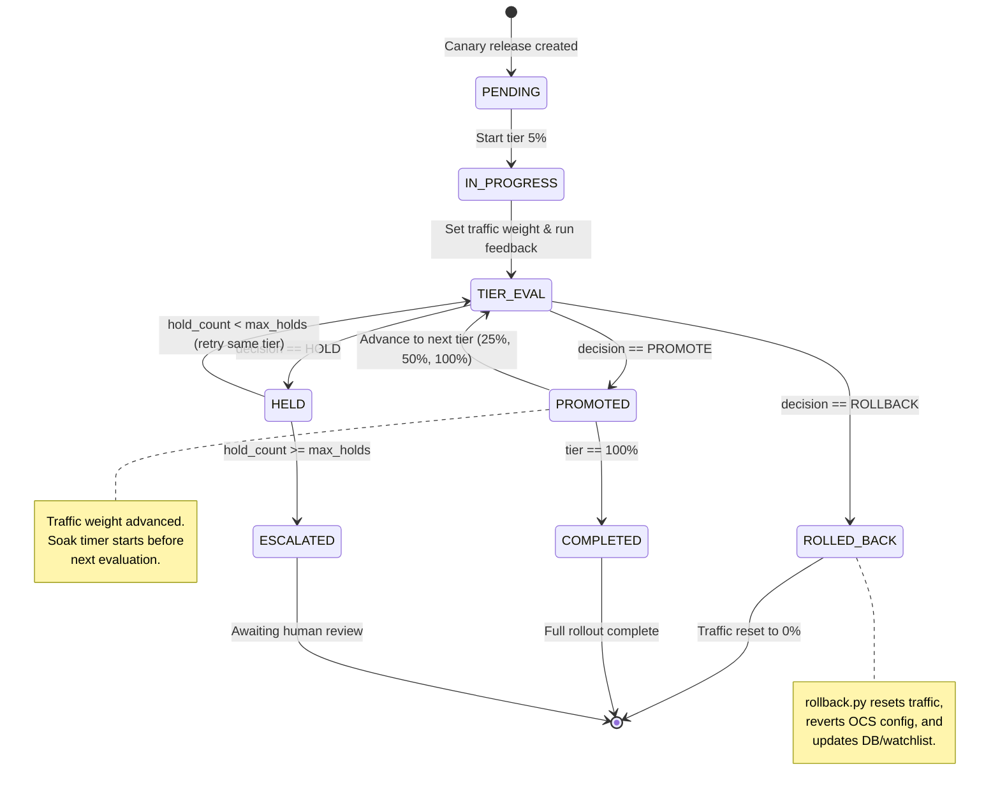

# Canary Release Controller — Implementation Plan

> A step-by-step, code-level implementation guide for building a **Canary Release Controller** that orchestrates progressive traffic rollout for OCS search configuration changes, integrated with the existing Feedback Agent pipeline.

---

## 1. Goal

Build a **CanaryReleaseController** that:
1. Manages progressive traffic routing tiers: `0% → 5% → 25% → 50% → 100%`.
2. At each tier, invokes the existing Feedback Agent pipeline to evaluate the fix.
3. Based on the Feedback Agent's `decision.action` (`PROMOTE` / `ROLLBACK` / `HOLD`), either advances to the next tier, reverts all changes, or pauses for human review.
4. Persists canary state to the database so it survives restarts.
5. Produces a final `canary_release_result.json` summarizing the full rollout lifecycle.

---

## 2. How It Integrates with the Existing Feedback Agent

```
                         ┌─────────────────────────────────┐
                         │     CanaryReleaseController      │
                         │  (canary/controller.py)          │
                         └──────────┬──────────────────────┘
                                    │
              ┌─────────────────────┼─────────────────────┐
              │                     │                       │
         Tier 5%              Tier 25%               Tier 100%
              │                     │                       │
              ▼                     ▼                       ▼
    ┌─────────────────┐  ┌─────────────────┐    ┌─────────────────┐
    │ Feedback Agent   │  │ Feedback Agent   │    │ Feedback Agent   │
    │ (main.py)        │  │ (main.py)        │    │ (main.py)        │
    │ → Verify         │  │ → Verify         │    │ → Verify         │
    │ → Metrics        │  │ → Metrics        │    │ → Metrics        │
    │ → Canary Eval    │  │ → Canary Eval    │    │ → Canary Eval    │
    │ → Thresholds     │  │ → Thresholds     │    │ → Thresholds     │
    │ → Audit          │  │ → Audit          │    │ → Audit          │
    └────────┬────────┘  └────────┬────────┘    └────────┬────────┘
             │                     │                       │
             ▼                     ▼                       ▼
         PROMOTE?              PROMOTE?                PROMOTE?
         → go 25%              → go 50%               → COMPLETE
```

The controller does **NOT** duplicate sub-agent logic. It calls `run_feedback_pipeline()` from `feedback_agent/main.py` at each tier and reads the resulting `decision.action`.

---

## 3. Directory Structure

All new files go under a `canary/` subpackage inside the existing project:

```
feedback_agent/
├── __init__.py
├── main.py                    # Existing — no changes needed
├── config.py                  # MODIFY — add canary settings
├── db.py                      # MODIFY — add canary_releases table
├── models.py                  # MODIFY — add CanaryState dataclass
├── agents/                    # Existing — no changes needed
│   ├── ...
└── canary/                    # NEW — all canary release code
    ├── __init__.py            # [NEW] Empty package init
    ├── controller.py          # [NEW] Main canary orchestration loop
    ├── traffic_router.py      # [NEW] OCS traffic splitting logic
    ├── rollback.py            # [NEW] Rollback / revert handler
    └── run_canary.py          # [NEW] CLI entrypoint for canary release
```

---

## 4. File-by-File Implementation Specification

---

### 4.1 [MODIFY] `feedback_agent/config.py`

**What to add**: Canary-specific configuration constants.

**Append the following block at the end of the existing file:**

```python
# --- Canary Release Settings ---

# Ordered list of traffic tiers (percentages). The controller advances through these.
CANARY_TIERS = [5, 25, 50, 100]

# How long (in seconds) to wait between tiers to collect telemetry.
# In mock mode, set to 0 for instant progression.
CANARY_SOAK_TIME_SECONDS = int(os.environ.get("CANARY_SOAK_TIME", "0" if MOCK_MODE else "300"))

# Maximum number of consecutive HOLD decisions before auto-escalating to human review.
CANARY_MAX_HOLDS = int(os.environ.get("CANARY_MAX_HOLDS", "3"))

# OCS traffic routing header name used to split canary vs baseline traffic.
CANARY_ROUTING_HEADER = os.environ.get("CANARY_ROUTING_HEADER", "X-OCS-Canary-Weight")
```

---

### 4.2 [MODIFY] `feedback_agent/db.py`

**What to add**: A new `canary_releases` table to track the state of each canary rollout.

**Add this SQL block inside the `create_tables()` method, after the existing `runbook_history` table creation:**

```python
# Canary release state tracking table
cursor.execute(f"""
    CREATE TABLE IF NOT EXISTS canary_releases (
        id {serial_type},
        incident_id {text_type},
        query {text_type},
        current_tier INTEGER DEFAULT 0,
        status {text_type} DEFAULT 'PENDING',
        tiers_completed {text_type} DEFAULT '[]',
        hold_count INTEGER DEFAULT 0,
        started_at DATETIME DEFAULT CURRENT_TIMESTAMP,
        updated_at DATETIME DEFAULT CURRENT_TIMESTAMP,
        completed_at DATETIME,
        final_decision {text_type}
    )
""")
```

**Column semantics**:
- `current_tier`: The current traffic percentage (0, 5, 25, 50, 100).
- `status`: One of `PENDING`, `IN_PROGRESS`, `COMPLETED`, `ROLLED_BACK`, `HELD`.
- `tiers_completed`: JSON string array of completed tier percentages, e.g. `"[5, 25]"`.
- `hold_count`: Number of consecutive `HOLD` decisions received.

---

### 4.3 [MODIFY] `feedback_agent/models.py`

**What to add**: A `CanaryState` dataclass.

**Append to the end of the file:**

```python
@dataclass
class CanaryTierResult:
    tier_percent: int
    feedback_decision: str   # PROMOTE | ROLLBACK | HOLD
    confidence: float
    reason: str
    metrics_snapshot: Dict[str, Any] = field(default_factory=dict)
    timestamp: str = ""

@dataclass
class CanaryState:
    incident_id: str
    query: str
    status: str = "PENDING"           # PENDING | IN_PROGRESS | COMPLETED | ROLLED_BACK | HELD
    current_tier: int = 0
    tiers_completed: List[int] = field(default_factory=list)
    tier_results: List[CanaryTierResult] = field(default_factory=list)
    hold_count: int = 0
    final_decision: str = ""
```

---

### 4.4 [NEW] `feedback_agent/canary/__init__.py`

```python
# Canary release subpackage
```

---

### 4.5 [NEW] `feedback_agent/canary/traffic_router.py`

**Purpose**: Sends traffic weight updates to OCS. In mock mode, logs the weight change. In live mode, calls the OCS Config Service API to update the canary traffic split.

**Full implementation:**

```python
import logging
from feedback_agent.config import MOCK_MODE, OCS_CONFIG_URL, CANARY_ROUTING_HEADER

logger = logging.getLogger("feedback_agent.canary.traffic_router")

def set_traffic_weight(tier_percent: int, query: str) -> bool:
    """
    Updates the OCS traffic routing weight for the canary configuration.

    Args:
        tier_percent: The percentage of traffic to route to the candidate config (0-100).
        query: The incident query (for logging/scoping).

    Returns:
        True if the weight was successfully applied, False otherwise.
    """
    logger.info(f"Setting canary traffic weight to {tier_percent}% for query '{query}'")

    if MOCK_MODE:
        logger.info(f"[MOCK] Traffic weight set to {tier_percent}%. No live API call made.")
        return True
    else:
        import requests
        try:
            # OCS Config Service endpoint to update traffic routing rules.
            # This assumes OCS exposes a config endpoint for canary weights.
            # Adjust the URL path and payload schema to match your OCS deployment.
            url = f"{OCS_CONFIG_URL}/config-service/v1/traffic-routing"
            payload = {
                "canaryWeight": tier_percent,
                "baselineWeight": 100 - tier_percent,
                "scope": query,
                "routingHeader": CANARY_ROUTING_HEADER
            }
            response = requests.put(url, json=payload, timeout=5)

            if response.status_code in (200, 204):
                logger.info(f"Traffic weight updated to {tier_percent}% via Config Service.")
                return True
            else:
                logger.error(f"Config Service returned status {response.status_code}: {response.text}")
                return False
        except Exception as e:
            logger.error(f"Failed to set traffic weight: {e}")
            return False


def reset_traffic_to_baseline(query: str) -> bool:
    """
    Resets all traffic to the baseline configuration (0% canary).
    Called during rollback.
    """
    logger.info(f"Resetting all traffic to baseline (0% canary) for query '{query}'")
    return set_traffic_weight(0, query)
```

---

### 4.6 [NEW] `feedback_agent/canary/rollback.py`

**Purpose**: Handles the full rollback procedure: resets traffic to baseline, reverts OCS search configurations, and logs the rollback event.

**Full implementation:**

```python
import logging
import datetime
from typing import Dict, Any
from feedback_agent.canary.traffic_router import reset_traffic_to_baseline
from feedback_agent.config import MOCK_MODE, OCS_CONFIG_URL
from feedback_agent.db import OCSDatabase

logger = logging.getLogger("feedback_agent.canary.rollback")

def execute_rollback(query: str, incident_id: str, db: OCSDatabase, reason: str) -> Dict[str, Any]:
    """
    Performs a full rollback:
    1. Resets traffic weight to 0% (baseline only).
    2. Reverts OCS search configuration changes (synonyms, fields, rules).
    3. Logs the rollback event to the database.

    Args:
        query: The incident query string.
        incident_id: The incident identifier.
        db: Database connection instance.
        reason: Human-readable reason for the rollback.

    Returns:
        Dict with rollback status and details.
    """
    logger.warning(f"Executing rollback for incident {incident_id}, query '{query}'")

    rollback_report = {
        "status": "ROLLED_BACK",
        "incident_id": incident_id,
        "query": query,
        "reason": reason,
        "steps_executed": [],
        "timestamp": datetime.datetime.now().astimezone().isoformat(timespec='seconds')
    }

    # Step 1: Reset traffic routing
    traffic_ok = reset_traffic_to_baseline(query)
    rollback_report["steps_executed"].append({
        "step": "reset_traffic_to_baseline",
        "success": traffic_ok
    })

    # Step 2: Revert OCS configurations
    config_ok = _revert_ocs_config(query)
    rollback_report["steps_executed"].append({
        "step": "revert_ocs_config",
        "success": config_ok
    })

    # Step 3: Update canary release record in DB
    try:
        db.execute_query(
            """
            UPDATE canary_releases
            SET status = 'ROLLED_BACK',
                final_decision = 'ROLLBACK',
                completed_at = CURRENT_TIMESTAMP,
                updated_at = CURRENT_TIMESTAMP
            WHERE incident_id = ? AND query = ?
            """,
            (incident_id, query)
        )
        rollback_report["steps_executed"].append({
            "step": "update_db_record",
            "success": True
        })
    except Exception as e:
        logger.error(f"Failed to update canary DB record during rollback: {e}")
        rollback_report["steps_executed"].append({
            "step": "update_db_record",
            "success": False,
            "error": str(e)
        })

    # Step 4: Update watchlist status to REGRESSED
    try:
        db.execute_query(
            """
            INSERT INTO watchlist (query, status, monitoring_window, regression_threshold)
            VALUES (?, 'REGRESSED', '0d', 'immediate_revert')
            ON CONFLICT(query) DO UPDATE SET status = 'REGRESSED'
            """,
            (query,)
        )
    except Exception as e:
        logger.error(f"Failed to update watchlist during rollback: {e}")

    rollback_report["all_success"] = all(
        step["success"] for step in rollback_report["steps_executed"]
    )

    logger.info(f"Rollback completed. All steps successful: {rollback_report['all_success']}")
    return rollback_report


def _revert_ocs_config(query: str) -> bool:
    """
    Reverts OCS Config Service to the pre-fix baseline.
    In mock mode, logs and returns True.
    In live mode, calls the Config Service revert endpoint.
    """
    if MOCK_MODE:
        logger.info(f"[MOCK] Reverted OCS config for query '{query}'.")
        return True
    else:
        import requests
        try:
            url = f"{OCS_CONFIG_URL}/config-service/v1/revert"
            response = requests.post(url, json={"scope": query}, timeout=5)
            if response.status_code in (200, 204):
                logger.info("OCS config reverted via Config Service.")
                return True
            else:
                logger.error(f"Config revert failed with status {response.status_code}")
                return False
        except Exception as e:
            logger.error(f"Failed to revert OCS config: {e}")
            return False
```

---

### 4.7 [NEW] `feedback_agent/canary/controller.py` — The Core Orchestration Loop

**Purpose**: This is the main canary release state machine. It loops through each traffic tier, runs the Feedback Agent at each tier, evaluates the decision, and advances/rolls back/holds accordingly.

**Full implementation:**

```python
import os
import json
import time
import logging
import datetime
from typing import Dict, Any, Optional

from feedback_agent.config import MOCK_MODE, CANARY_TIERS, CANARY_SOAK_TIME_SECONDS, CANARY_MAX_HOLDS
from feedback_agent.db import OCSDatabase
from feedback_agent.main import run_feedback_pipeline
from feedback_agent.canary.traffic_router import set_traffic_weight
from feedback_agent.canary.rollback import execute_rollback

logger = logging.getLogger("feedback_agent.canary.controller")


class CanaryReleaseController:
    """
    Orchestrates a progressive canary release through traffic tiers.

    State machine:
        PENDING → IN_PROGRESS → (per tier: PROMOTE/HOLD/ROLLBACK) → COMPLETED | ROLLED_BACK | HELD
    """

    def __init__(self, input_path: str, output_dir: str):
        """
        Args:
            input_path: Path to the input.json from FixPlanAgent.
            output_dir: Directory to write per-tier feedback results and final canary result.
        """
        self.input_path = input_path
        self.output_dir = output_dir
        self.db = OCSDatabase()
        self.tiers = CANARY_TIERS  # [5, 25, 50, 100]
        self.soak_time = CANARY_SOAK_TIME_SECONDS
        self.max_holds = CANARY_MAX_HOLDS

        # Load input to extract query and incident_id
        with open(input_path, 'r') as f:
            self.input_data = json.load(f)

        self.query = self.input_data.get("query") or self.input_data.get("result", {}).get("query", "")
        self.incident_id = self._extract_incident_id()

        # Ensure output directory exists
        os.makedirs(self.output_dir, exist_ok=True)

    def _extract_incident_id(self) -> str:
        """Extracts incident ID from input data, matching AuditTrailAgent logic."""
        artifact_dir = self.input_data.get("result", {}).get("applyResult", {}).get("artifactDir", "")
        if artifact_dir and "sequential-" in artifact_dir:
            try:
                parts = artifact_dir.split("sequential-")
                if len(parts) > 1:
                    time_part = parts[1].split("/")[0]
                    date_str = time_part.split("_")[0]
                    return f"INC-{date_str}-001"
            except Exception:
                pass
        return f"INC-{datetime.datetime.now().strftime('%Y%m%d')}-001"

    def run(self) -> Dict[str, Any]:
        """
        Executes the full canary release lifecycle.

        Returns:
            Dict containing the final canary release result.
        """
        logger.info(f"Starting canary release for incident {self.incident_id}, query '{self.query}'")
        logger.info(f"Tiers: {self.tiers}, Soak time: {self.soak_time}s, Max holds: {self.max_holds}")

        # Initialize DB record
        self._create_db_record()

        tier_results = []
        hold_count = 0
        final_status = "COMPLETED"

        for tier_index, tier_percent in enumerate(self.tiers):
            logger.info(f"--- Canary Tier {tier_index + 1}/{len(self.tiers)}: {tier_percent}% ---")

            # Step 1: Set traffic weight
            weight_ok = set_traffic_weight(tier_percent, self.query)
            if not weight_ok:
                logger.error(f"Failed to set traffic weight to {tier_percent}%. Triggering rollback.")
                rollback_result = execute_rollback(self.query, self.incident_id, self.db, "Traffic routing failure")
                final_status = "ROLLED_BACK"
                tier_results.append({
                    "tier_percent": tier_percent,
                    "decision": "ROLLBACK",
                    "reason": "Failed to set traffic weight",
                    "rollback": rollback_result
                })
                break

            # Step 2: Soak — wait for telemetry to accumulate
            if self.soak_time > 0 and tier_percent < 100:
                logger.info(f"Soaking for {self.soak_time}s to collect telemetry at {tier_percent}%...")
                time.sleep(self.soak_time)

            # Step 3: Run the Feedback Agent pipeline for this tier
            tier_output_path = os.path.join(
                self.output_dir, f"feedback_tier_{tier_percent}.json"
            )
            logger.info(f"Running Feedback Agent pipeline → {tier_output_path}")
            run_feedback_pipeline(self.input_path, tier_output_path)

            # Step 4: Read the feedback result and extract the decision
            feedback_result = self._read_feedback_result(tier_output_path)
            decision = feedback_result.get("decision", {})
            action = decision.get("action", "HOLD")
            confidence = decision.get("confidence", 0.0)
            reason = decision.get("reason", "")

            tier_result = {
                "tier_percent": tier_percent,
                "decision": action,
                "confidence": confidence,
                "reason": reason,
                "metrics": feedback_result.get("metrics", {}),
                "timestamp": datetime.datetime.now().astimezone().isoformat(timespec='seconds')
            }
            tier_results.append(tier_result)

            # Step 5: Act on the decision
            if action == "PROMOTE":
                hold_count = 0  # Reset hold counter on a successful promotion
                self._update_db_tier(tier_percent, "PROMOTE", json.dumps([t["tier_percent"] for t in tier_results if t["decision"] == "PROMOTE"]))
                logger.info(f"✅ PROMOTED at {tier_percent}%.")

                if tier_percent == 100:
                    final_status = "COMPLETED"
                    logger.info("🎉 Canary release completed — 100% traffic on candidate.")
                # else: loop continues to next tier

            elif action == "ROLLBACK":
                logger.warning(f"🔴 ROLLBACK triggered at {tier_percent}%: {reason}")
                rollback_result = execute_rollback(self.query, self.incident_id, self.db, reason)
                tier_result["rollback"] = rollback_result
                final_status = "ROLLED_BACK"
                break

            elif action == "HOLD":
                hold_count += 1
                logger.warning(f"🟡 HOLD at {tier_percent}% (hold #{hold_count}/{self.max_holds}): {reason}")

                if hold_count >= self.max_holds:
                    logger.error(f"Max hold count ({self.max_holds}) reached. Escalating to HELD state.")
                    final_status = "HELD"
                    self._update_db_status("HELD")
                    break
                else:
                    # Stay at the same tier — re-run feedback after another soak
                    logger.info(f"Re-soaking at {tier_percent}% before retry...")
                    # We do NOT advance the tier. The `for` loop will move to the next tier,
                    # but we want to retry. So we need to handle this differently.
                    # For simplicity: on HOLD, we DO NOT advance. We break and report HELD.
                    final_status = "HELD"
                    self._update_db_status("HELD")
                    break

        # Build final canary release result
        canary_result = {
            "agent": "CanaryReleaseController",
            "incident_id": self.incident_id,
            "query": self.query,
            "status": final_status,
            "tiers_evaluated": len(tier_results),
            "tiers_promoted": len([t for t in tier_results if t["decision"] == "PROMOTE"]),
            "tier_results": tier_results,
            "final_traffic_percent": tier_results[-1]["tier_percent"] if tier_results else 0,
            "timestamp": datetime.datetime.now().astimezone().isoformat(timespec='seconds')
        }

        # Write final result
        final_path = os.path.join(self.output_dir, "canary_release_result.json")
        with open(final_path, 'w') as f:
            json.dump(canary_result, f, indent=2)
        logger.info(f"Canary release result saved to {final_path}")

        # Update DB final state
        self._finalize_db(final_status)
        self.db.close()

        return canary_result

    def _read_feedback_result(self, path: str) -> Dict[str, Any]:
        """Reads a feedback_result JSON file."""
        try:
            with open(path, 'r') as f:
                return json.load(f)
        except Exception as e:
            logger.error(f"Failed to read feedback result from {path}: {e}")
            return {}

    def _create_db_record(self):
        """Inserts the initial canary release record."""
        try:
            self.db.execute_query(
                """
                INSERT INTO canary_releases (incident_id, query, current_tier, status)
                VALUES (?, ?, 0, 'IN_PROGRESS')
                """,
                (self.incident_id, self.query)
            )
        except Exception as e:
            logger.error(f"Failed to create canary DB record: {e}")

    def _update_db_tier(self, tier: int, decision: str, tiers_completed_json: str):
        """Updates the current tier and completed tiers in the DB."""
        try:
            self.db.execute_query(
                """
                UPDATE canary_releases
                SET current_tier = ?, tiers_completed = ?, updated_at = CURRENT_TIMESTAMP
                WHERE incident_id = ? AND query = ?
                """,
                (tier, tiers_completed_json, self.incident_id, self.query)
            )
        except Exception as e:
            logger.error(f"Failed to update canary tier in DB: {e}")

    def _update_db_status(self, status: str):
        """Updates the canary release status."""
        try:
            self.db.execute_query(
                """
                UPDATE canary_releases
                SET status = ?, updated_at = CURRENT_TIMESTAMP
                WHERE incident_id = ? AND query = ?
                """,
                (status, self.incident_id, self.query)
            )
        except Exception as e:
            logger.error(f"Failed to update canary status in DB: {e}")

    def _finalize_db(self, final_status: str):
        """Marks the canary release as complete in the DB."""
        try:
            self.db.execute_query(
                """
                UPDATE canary_releases
                SET status = ?, final_decision = ?, completed_at = CURRENT_TIMESTAMP, updated_at = CURRENT_TIMESTAMP
                WHERE incident_id = ? AND query = ?
                """,
                (final_status, final_status, self.incident_id, self.query)
            )
        except Exception as e:
            logger.error(f"Failed to finalize canary DB record: {e}")
```

---

### 4.8 [NEW] `feedback_agent/canary/run_canary.py` — CLI Entrypoint

**Purpose**: Command-line entrypoint to start a canary release.

**Full implementation:**

```python
import argparse
import logging
from feedback_agent.main import setup_logging
from feedback_agent.canary.controller import CanaryReleaseController

def main():
    setup_logging()
    logger = logging.getLogger("feedback_agent.canary.run_canary")

    parser = argparse.ArgumentParser(description="OCS Canary Release Controller")
    parser.add_argument("--input", default="input.json", help="Path to input.json from FixPlanAgent")
    parser.add_argument("--output-dir", default="canary_output", help="Directory to write per-tier results and final canary result")
    args = parser.parse_args()

    logger.info("Launching Canary Release Controller...")
    controller = CanaryReleaseController(
        input_path=args.input,
        output_dir=args.output_dir
    )
    result = controller.run()
    logger.info(f"Canary release finished with status: {result['status']}")

if __name__ == "__main__":
    main()
```

**How to run:**
```bash
# From the feedback_agent workspace root:
python3 -m feedback_agent.canary.run_canary --input input.json --output-dir canary_output
```

---

## 5. Output Schema — `canary_release_result.json`

```json
{
  "agent": "CanaryReleaseController",
  "incident_id": "INC-20260603-001",
  "query": "hybrid work backpack",
  "status": "COMPLETED",
  "tiers_evaluated": 4,
  "tiers_promoted": 4,
  "tier_results": [
    {
      "tier_percent": 5,
      "decision": "PROMOTE",
      "confidence": 0.577,
      "reason": "All verification checks passed. ...",
      "metrics": { "zeroResultRate": {...}, "latency_p95_ms": {...}, ... },
      "timestamp": "2026-06-05T12:00:00+05:30"
    },
    {
      "tier_percent": 25,
      "decision": "PROMOTE",
      "confidence": 0.577,
      "reason": "...",
      "metrics": { ... },
      "timestamp": "2026-06-05T12:05:00+05:30"
    },
    {
      "tier_percent": 50,
      "decision": "PROMOTE",
      "confidence": 0.577,
      "reason": "...",
      "metrics": { ... },
      "timestamp": "2026-06-05T12:10:00+05:30"
    },
    {
      "tier_percent": 100,
      "decision": "PROMOTE",
      "confidence": 0.577,
      "reason": "...",
      "metrics": { ... },
      "timestamp": "2026-06-05T12:15:00+05:30"
    }
  ],
  "final_traffic_percent": 100,
  "timestamp": "2026-06-05T12:15:05+05:30"
}
```

---

## 6. State Machine Diagram



---

## 7. Modification Summary

| File | Action | What Changes |
| :--- | :--- | :--- |
| `config.py` | **MODIFY** | Append `CANARY_TIERS`, `CANARY_SOAK_TIME_SECONDS`, `CANARY_MAX_HOLDS`, `CANARY_ROUTING_HEADER` |
| `db.py` | **MODIFY** | Add `canary_releases` table in `create_tables()` |
| `models.py` | **MODIFY** | Add `CanaryTierResult` and `CanaryState` dataclasses |
| `canary/__init__.py` | **NEW** | Empty package init |
| `canary/traffic_router.py` | **NEW** | `set_traffic_weight()` and `reset_traffic_to_baseline()` |
| `canary/rollback.py` | **NEW** | `execute_rollback()` and `_revert_ocs_config()` |
| `canary/controller.py` | **NEW** | `CanaryReleaseController` class with full orchestration loop |
| `canary/run_canary.py` | **NEW** | CLI entrypoint |

---

## 8. Verification Plan

### Automated (Mock Mode)
```bash
# Run the canary release in mock mode (default). Should complete all 4 tiers instantly.
python3 -m feedback_agent.canary.run_canary --input input.json --output-dir canary_output

# Verify outputs:
# 1. canary_output/feedback_tier_5.json   — Feedback result at 5%
# 2. canary_output/feedback_tier_25.json  — Feedback result at 25%
# 3. canary_output/feedback_tier_50.json  — Feedback result at 50%
# 4. canary_output/feedback_tier_100.json — Feedback result at 100%
# 5. canary_output/canary_release_result.json — Final canary summary
```

### Database Verification
```bash
# Check SQLite for the canary release record:
sqlite3 ocs_feedback.db "SELECT * FROM canary_releases;"
# Expected: status=COMPLETED, current_tier=100, final_decision=COMPLETED
```

### Edge Case Tests
1. **Rollback scenario**: Temporarily modify `canary_evaluation.py` to return `ROLLBACK` and verify that `canary_release_result.json` shows `status: "ROLLED_BACK"` and traffic is reset.
2. **Hold scenario**: Modify to return `HOLD` and verify the hold counter increments and the release pauses.
3. **Traffic failure**: In live mode, point `OCS_CONFIG_URL` to an invalid host and verify graceful rollback.
