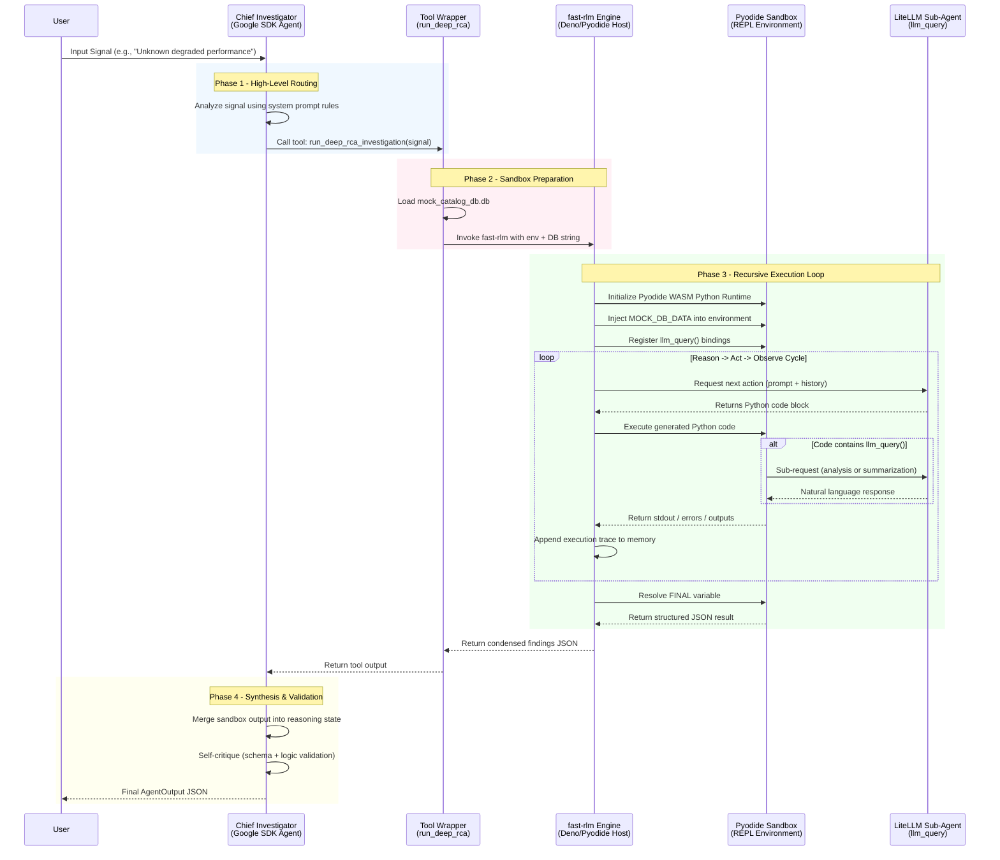

# RootCause Agents

This folder contains the SearchOps root-cause analysis agents and the
deterministic tools they use to explain catalog-driven search issues.

The codebase has a few different agent styles because it evolved through
multiple experiments:

- `google_agent.py` is a Google GenAI + FastRLM hybrid that can run a
  deeper recursive investigation.
- `main_agent.py` is a LangChain ReAct version built around the catalog
  tools.

## Recommended Starting Point

If you want the most "actual RLM" version, start with
`magellan_agent.py`.

If you want a simpler agent that stays closer to the repository's
deterministic tools, start with `main_agent.py`.

## Folder Layout

- `Tools/` contains the deterministic analyzers and repositories.
- `mock_catalog_db.db` at the repo root provides the sample catalog
  data used by the local repository.
- `Tools/common_signals.py` defines `sample_signal`, which is the
  canonical example input for local runs.
- `Tools/catalog_coverage_tool.py`, `schema_validation.py`,
  `freshness.py`, `historical_intent.py`, `search_Quality.py`,
  `capability_mapping_tools.py`, `embedding.py`, `vector_sync.py`,
  `query_intent.py`, and `index.py` make up the diagnostic layer.

## What The Agents Look For

The agents are designed to answer questions like:

- Is the catalog slice missing required attributes?
- Is the catalog stale?
- Are schema violations present?
- Are search results weak because of poor relevance or missing index
  coverage?
- Which search capabilities are affected?

## Input Shape

Most of the agents expect a `signal_data` dictionary with fields like:

- `signal_id`
- `signal_type`
- `severity`
- `catalog_entity.brand`
- `catalog_entity.category`
- `signal.summary`
- `impact.affected_capabilities`
- `remediation`

Example:

```python
from Catalog.RootCause.Tools.common_signals import sample_signal
```

## Output Shape

The output shape varies a little by agent, because each one was built
for a different orchestration style.

Common RCA fields include:

- `overall_status`
- `root_cause`
- `affected_capabilities`
- `summary`
- `detailed_evidence`

The FastRLM-oriented `magellan_agent.py` also returns:

- `status`
- `query`
- `total_turns`
- `evidence_pack`

## Environment Variables

Different agents use different model backends.

- `GOOGLE_API_KEY` or `GEMINI_API_KEY` is required for the Google-based
  agents.
- `OPENAI_API_KEY` is required for the FastRLM-shaped agent when it
  actually executes the loop.
- `fast_rlm` must be installed to run the FastRLM-based files.

The repo currently declares only the core packages in `pyproject.toml`,
so if you want to run every agent file you may also need to install the
agent-specific extras:

- `langchain-google-genai`
- `langchain-openai`
- `fast_rlm`

## How To Run

From the repo root:

```bash
python3 -m Catalog.RootCause.main_agent
python3 -m Catalog.RootCause.google_agent
python3 -m Catalog.RootCause.magellan_agent
python3 -m Catalog.RootCause.fast_rlm_agent
```

If you are using `uv`, the same commands work with `uv run`:

```bash
uv run python3 -m Catalog.RootCause.magellan_agent
```

## Suggested Workflow

1. Start with `sample_signal`.
2. Run the simpler agent first to verify the data path.
3. Move to the FastRLM agent when you want recursive analysis and leaf
   worker behavior.
4. Compare the `detailed_evidence` against the catalog tools to verify
   the diagnosis.

## Development Notes

- The catalog tools are deterministic and async, so they are good for
  testing and reproducible RCA output.
- `CatalogCoverageTool` and `CatalogFreshnessTool` are usually the first
  place to look when catalog quality degrades.
- `QueryIntentDriftTool` and `SearchIndexCoverageTool` help explain
  search-side failures that are not caused by the catalog itself.

## Deep RCA Flow

The diagram below shows the full recursive investigation path used by
the Google SDK agent when it escalates into `run_deep_rca_investigation`.



## Best Entry Points

- `Catalog/RootCause/magellan_agent.py`
- `Catalog/RootCause/google_agent.py`
- `Catalog/RootCause/main_agent.py`
- `Catalog/RootCause/fast_rlm_agent.py`
