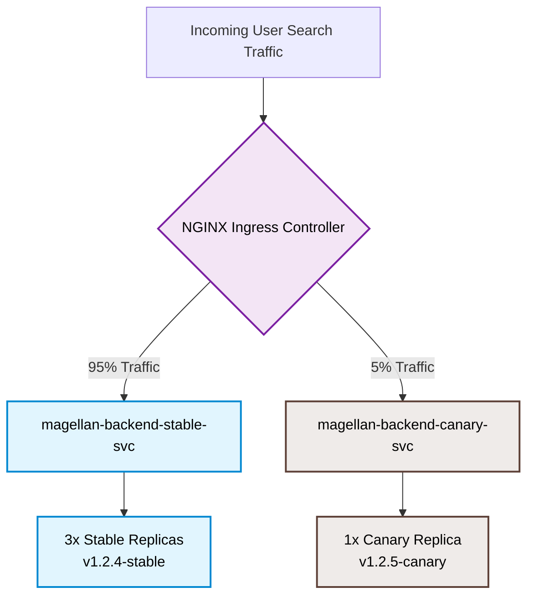
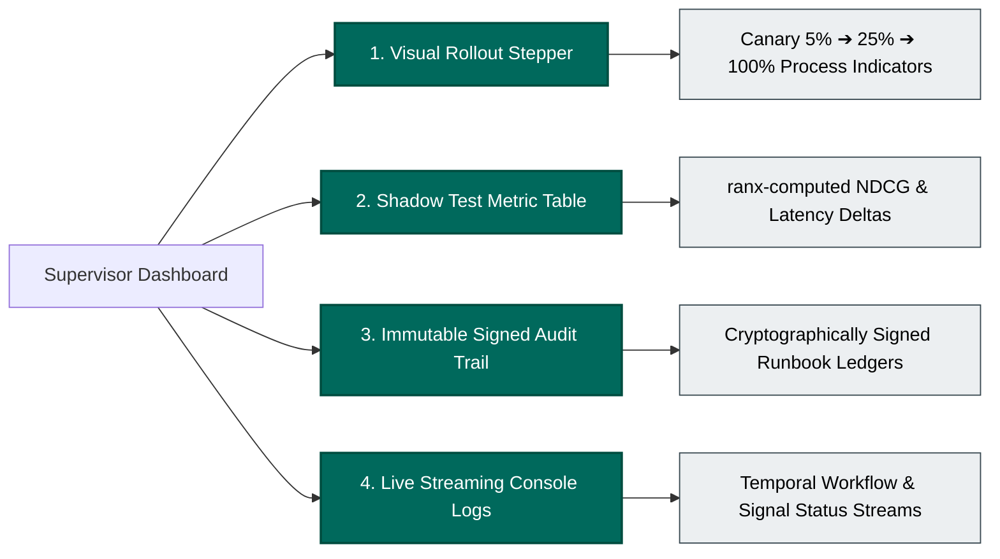

# 🚀 In-Depth Canary Deployment & Rollout Runbook

This technical brief explains the complete deployment architecture, execution scripts, file mappings, and control mechanisms for the **Magellan AI Search Ops Harness**. It details how proposed search fixes are safely released to cohorts of users using a hybrid model of **Temporal orchestration**, **MLflow tracking**, and **React frontend governance**.

---

## 🛠️ 1. Core Deployment Architecture

Magellan uses **Incremental Canary Rollouts** to verify AI-generated search fixes before promoting them to 100% of production traffic.

The rollout process transitions through five distinct phases:
1.  **Shadow Testing (35% Process Progress):** Mirrored live traffic is sent to both the current production engine (Champion) and the proposed fix (Challenger) in a risk-free offline/shadow sandbox. No actual users see the Challenger's results yet.
2.  **Canary 5% Rollout (50% Process Progress):** The fix is deployed to a small cohort representing **5%** of active user sessions.
3.  **Canary 25% Rollout (70% Process Progress):** If metrics remain stable, traffic is increased to **25%** of active users.
4.  **Canary 100% Full Rollout (90% Process Progress):** Traffic is ramped to **100%** of sessions, but retains a fallback memory segment in case of delayed failures.
5.  **Released (100% Process Progress):** The change is officially declared stable and marked as **Released** in the immutable registry block.

---

## 📂 2. File Mappings & Core Mappings

Here are the key files that implement and control this deployment loop:

### A. The Orchestrator
*   **File:** `temporal/workflows.py` (`UnifiedSearchAiRepairWorkflow`)
*   **What it does:** Executes the sequential activities (RCA ➔ Fix Proposal ➔ Eval ➔ Human Gate ➔ Canary Release ➔ Feedback Audit). It implements the strict safety gating rule using the `wait_condition` function.

### B. The Deployment Activity
*   **File:** `temporal/activities.py` (`release_activity`)
*   **What it does:** Acts as the bridge between the orchestrator and the underlying deployment agent. It receives the approval token and logs the deployment actions to MLflow.

### C. The Release Agent
*   **File:** `Catalog/Release/release_agent.py` (`ReleaseAgent`)
*   **What it does:** Executes the actual database queries or schema changes in production. For catalog fixes, it writes the new product attributes directly to the **LanceDB** vector database.

### D. The React Frontend Controls
*   **Files:**
    *   `MagellanFrontend/src/components/Overview.tsx` (Visualizes the rollout progress bar and calculates live user exit rates).
    *   `MagellanFrontend/src/components/Registry.tsx` (Provides Global Release Policy inputs to adjust Canary Traffic and NDCG Floors).
    *   `MagellanFrontend/src/types.ts` (Defines the strictly enforced canary states).

---

## 💻 3. Code Evidence

### A. The Safety Gating Rule & wait_condition
In `temporal/workflows.py`, the orchestrator inspects the `ranx` NDCG score. If it falls below the safety floor, the rollout is blocked, requiring manual engineer approval:

```python
# From temporal/workflows.py
shadow_metrics = eval_result.get("metrics", {}).get("shadow")
ndcg_score = shadow_metrics.get("ndcg@10", 1.0)
threshold = 1.1  # Hardcoded safety floor threshold

if ndcg_score < threshold:
    workflow.logger.warning(
        f"NDCG score of {ndcg_score} is below the threshold of {threshold}. "
        f"Workflow is paused pending human approval. To approve, run 'python3 -m temporal.signal_workflow.py'"
    )
    # Temporal pauses here and waits until self._is_approved becomes True
    await workflow.wait_condition(lambda: self._is_approved)
    workflow.logger.info("Deployment has been manually approved. Proceeding.")
```

### B. Frontend Progress Calculation
In `MagellanFrontend/src/components/Overview.tsx`, the frontend maps these canary states to progress percentages to animate live user impact metrics:

```typescript
// From MagellanFrontend/src/components/Overview.tsx
const getRunbookProgress = (status: Runbook['status']) => {
  switch (status) {
    case 'Shadow Test':
      return 0.35;       // 35% Progress
    case 'Canary 5%':
      return 0.50;       // 50% Progress (5% User Impact)
    case 'Canary 25%':
      return 0.70;       // 70% Progress (25% User Impact)
    case 'Canary 100%':
      return 0.90;       // 90% Progress (100% User Impact)
    case 'Released':
      return 1.00;       // 100% Progress / Finalized
    case 'Rolled Back':
      return 0.00;       // 0% Progress / Recovered
    default:
      return 0.00;
  }
};
```

### C. Frontend Live Metric Interpolation
The frontend dynamically interpolates live search metrics as the canary is rolled out, demonstrating the gradual improvement in NDCG and decrease in user exit rate:

```typescript
// From MagellanFrontend/src/components/Overview.tsx
const progress = getRunbookProgress(runbook.status);

// NDCG gradually increases from baseline to the proposed target as traffic ramps up
const currentNdcg = runbook.liveMetrics.baselineNdcg +
  (runbook.liveMetrics.proposedNdcg - runbook.liveMetrics.baselineNdcg) * progress;

// Search Exit Rate (zero results) drops to 0% proportional to the rollout size
const currentExitRate = runbook.liveMetrics.exitRate * (1 - (runbook.businessImpact / 100) * progress);
```

---

## 📋 4. Prerequisites for Running Deployments

To run and control these canary rollouts in your local environment, you need to ensure the following components are running:

1.  **Temporal Server & Web UI:** Schedulers and manages the workflow state machine.
    *   *Address:* `localhost:7233` (Server) / `http://localhost:8233` (Web Dashboard)
2.  **Temporal Python Worker:** Listens to the task queue and executes the activities on your machine.
    *   *Command:* `python3 temporal/run_worker.py`
3.  **FastAPI Backend & React Frontend:** Provides the administrative control plane.
    *   *Address:* `http://localhost:5173/` (Frontend) / `http://localhost:8000` (FastAPI)
4.  **MLflow Server:** Tracks and audits metric deltas and LLM traces.
    *   *Address:* `http://127.0.0.1:5000`

---

## ⚡ 5. Execution Commands for Operations

### Triggering a Rollout
Start the worker, and then start the workflow of your choosing:
```bash
python3 temporal/run_unified_workflow.py catalog
```

### Checking the Canary Progress
Query the active workflow list using the Temporal CLI to find the runbook ID:
```bash
temporal workflow list
```

### Manually Approving/Promoting the Canary
If the evaluator places the workflow in a paused state due to falling below the automated NDCG floor, approve and promote it to 100% traffic by running:
```bash
python3 temporal/signal_workflow.py <workflow_id>
```
*(Example: `python3 temporal/signal_workflow.py unified-search-repair-workflow-1783250695`)*

---

## 📦 6. Containerization & Production Infrastructure

Magellan relies on **Docker** and **Kubernetes** to package sandboxed execution runtimes and orchestrate real-time canary routing.

### A. Docker Packaging

The application is containerized to support secure, sandboxed execution of agent environments. This includes the installation of the **Google Cloud SDK** (for credential injection into `fast-rlm` endpoints) and the **Temporal CLI** (`tcld`).

#### Dockerfile Reference & Highlights:
```dockerfile
# Base image with Python and essential build tools
FROM python:3.11-slim-bookworm

ENV DEBIAN_FRONTEND=noninteractive
ENV PYTHONUNBUFFERED=1

# Install required system tools
RUN apt-get update && apt-get install -y --no-install-recommends \
    apt-transport-https \
    ca-certificates \
    gnupg \
    curl \
    bash \
    && rm -rf /var/lib/apt/lists/*

# Install Google Cloud SDK for Vertex AI / ADC authentication inside Pyodide sandboxes
RUN echo "deb [signed-by=/usr/share/keyrings/cloud.google.gpg] https://packages.cloud.google.com/apt cloud-sdk main" | tee /etc/apt/sources.list.d/google-cloud-sdk.list \
    && curl https://packages.cloud.google.com/apt/doc/apt-key.gpg | apt-key --keyring /usr/share/keyrings/cloud.google.gpg add - \
    && apt-get update && apt-get install -y google-cloud-sdk

# Install the Temporal CLI (tcld)
RUN curl -sSf https://temporal.download/cli.sh | sh \
    && mv /root/.temporalio/bin/temporal /usr/local/bin/tcld

WORKDIR /app

# Leverage caching for Python package dependency layers
COPY requirements.txt .
RUN pip install --no-cache-dir -r requirements.txt

# Install the stashed shadow agent framework in editable mode
COPY _shadow_agent_temp/ /app/_shadow_agent_temp/
WORKDIR /app/_shadow_agent_temp
RUN pip install --no-cache-dir -e .

WORKDIR /app
COPY . .
COPY start.sh .
RUN chmod +x ./start.sh

EXPOSE 8000
CMD ["./start.sh"]
```

#### Build & Run Commands:
```bash
# Build the production Docker image
docker build -t gcr.io/magellan-ops/backend:v1.2.4-stable .

# Build the hotfix canary candidate image
docker build -t gcr.io/magellan-ops/backend:v1.2.5-canary .

# Run container locally with environment files
docker run -d -p 8000:8000 --env-file .env gcr.io/magellan-ops/backend:v1.2.4-stable
```

---

## ☸️ 7. Kubernetes Orchestrated Traffic Shifting

In production environments, traffic shifting during canaries is managed at the **Kubernetes Networking Ingress Layer** using an **NGINX Ingress Controller**. Incoming traffic is split dynamically between a large stable replicaset and a single isolated canary pod.



### A. The Stable Production Deployment
*   **File:** `kubernetes/01-deployment-stable.yml`
*   **What it does:** Hosts 3 replicas of the active stable release, connecting directly to production databases (PostgreSQL and Elasticsearch).
```yaml
apiVersion: apps/v1
kind: Deployment
metadata:
  name: magellan-backend-stable
  namespace: magellan-search-ops
  labels:
    app: magellan-backend
    track: stable
spec:
  replicas: 3
  selector:
    matchLabels:
      app: magellan-backend
      track: stable
  template:
    metadata:
      labels:
        app: magellan-backend
        track: stable
    spec:
      containers:
        - name: backend
          image: gcr.io/magellan-ops/backend:v1.2.4-stable
          ports:
            - containerPort: 8000
          env:
            - name: TEMPORAL_ADDRESS
              value: "temporal-frontend.temporal.svc.cluster.local:7233"
            - name: OCS_MOCK_MODE
              value: "False"
```

### B. The Canary Deployment
*   **File:** `kubernetes/03-deployment-canary.yml`
*   **What it does:** Hosts 1 replica of the candidate hotfix built by our Temporal repair activity.
```yaml
apiVersion: apps/v1
kind: Deployment
metadata:
  name: magellan-backend-canary
  namespace: magellan-search-ops
  labels:
    app: magellan-backend
    track: canary
spec:
  replicas: 1
  selector:
    matchLabels:
      app: magellan-backend
      track: canary
  template:
    metadata:
      labels:
        app: magellan-backend
        track: canary
    spec:
      containers:
        - name: backend
          image: gcr.io/magellan-ops/backend:v1.2.5-canary
          ports:
            - containerPort: 8000
```

### C. The Canary Ingress Router (Nginx Annotations)
*   **File:** `kubernetes/06-ingress-canary.yml`
*   **What it does:** Leverages NGINX Ingress annotations to split traffic. This integrates with the frontend's metric simulator and the orchestrator's promotion activity.

```yaml
apiVersion: networking.k8s.io/v1
kind: Ingress
metadata:
  name: magellan-backend-canary-ingress
  namespace: magellan-search-ops
  annotations:
    kubernetes.io/ingress.class: nginx
    # Enables the NGINX canary steering module
    nginx.ingress.kubernetes.io/canary: "true"
    # Integrates K8s ingress directly with header-based overrides (from the UI)
    nginx.ingress.kubernetes.io/canary-by-header: "X-OCS-Canary-Weight"
    # Enable cookie-based sticky routing for mock users / testers (canary_user=always)
    nginx.ingress.kubernetes.io/canary-by-cookie: "canary_user"
    # Routes exactly 5% of external HTTP traffic to the canary service by default
    nginx.ingress.kubernetes.io/canary-weight: "5"
spec:
  rules:
    - http:
        paths:
          - path: /
            pathType: Prefix
            backend:
              service:
                name: magellan-backend-canary-svc
                port:
                  number: 8000
```

### D. Core Kubernetes Commands for Operations

```bash
# Create the operational namespace
kubectl apply -f kubernetes/00-namespace.yml

# Deploy the stable release stack (Deployments, Services, and Ingress)
kubectl apply -f kubernetes/01-deployment-stable.yml
kubectl apply -f kubernetes/02-service-stable.yml
kubectl apply -f kubernetes/05-ingress-stable.yml

# Deploy the canary release stack (Deployments, Services, and Ingress)
kubectl apply -f kubernetes/03-deployment-canary.yml
kubectl apply -f kubernetes/04-service-canary.yml
kubectl apply -f kubernetes/06-ingress-canary.yml

# Check deployment status in the namespace
kubectl get deployments -n magellan-search-ops
kubectl get pods -n magellan-search-ops

# Adjust canary traffic manually to 25% from the command line
kubectl annotate ingress magellan-backend-canary-ingress --overwrite \
  nginx.ingress.kubernetes.io/canary-weight="25"

# Trigger a manual rollback (scale down canary immediately to 0 replicas)
kubectl scale deployment magellan-backend-canary --replicas=0 -n magellan-search-ops
```

---

## 👁️ 8. Presenting & Showing the Deployment Process to Supervisors

The entire lifecycle of the autonomous canary deployment is fully transparent and **showable to users, operators, or executive supervisors** through several visual interfaces in the React-based **Magellan AI Search Ops Control Plane**.



### A. The Visual Rollout Progress Bar (The Stepper)
On the **Overview** dashboard, supervisors can monitor precisely where a deployment stands.
*   **How it works:** The React component (`Overview.tsx`) maps the `Runbook.status` enum from the API directly to process progress metrics:
    *   `Shadow Test` ➔ **35% complete** (safe sandbox)
    *   `Canary 5%` ➔ **50% complete** (reaches 5% of active sessions)
    *   `Canary 25%` ➔ **70% complete** (reaches 25% of active sessions)
    *   `Canary 100%` ➔ **90% complete** (all user sessions impacted)
    *   `Released` ➔ **100% complete** (marked as officially verified and stable)
*   **What it displays:** High-level color-coded status badges and progress sliders that make complex backend microservice states instantly understandable at a glance.

### B. The Shadow Test Report (Qualitative Gate Metrics)
Supervisors can click into any active or completed runbook to view a deep-dive **Shadow Test Report** (`ShadowTestReport.tsx`) which shows the exact quantitative relevance impact of the candidate:
*   **NDCG Change Percentage:** Shows exactly how much search result ranking improved under the shadow test (e.g. `+20.92%` or `+31.38%`).
*   **Relevance Comparisons:** Displays baseline nDCG vs. Candidate shadow nDCG side-by-side (sourcing calculations directly from the `ranx` mathematical engine).
*   **Regression Counts:** Flags any query regressions found during the traffic simulation before the code is released.

### C. The Immutable Audit Trail Ledger (Governance & Compliance)
For corporate governance and SOX compliance, the **Audit Trail** screen (`AuditTrail.tsx`) displays an immutable, tamper-proof history of every action taken in the system.
*   **What it displays:** Cryptographically signed logs of:
    *   The exact timestamp when the canary was deployed.
    *   The NDCG evaluation metrics logged to MLflow.
    *   The digital signature, notes, and username of the human operator who approved the promotion.
    *   Any rollback triggers or health guardrail violations.

### D. The Live Terminal Console (Real-time Engineering view)
For technical supervisors or engineers, the **Console** (`Console.tsx`) provides a live, streaming engineering view:
*   It prints the direct output of the Python background workers.
*   It logs signal transactions (e.g., when the `approve_deployment` signal is received by Temporal).
*   It displays exact execution steps as the LLM orchestrator executes tools inside the Pyodide sandboxes.
