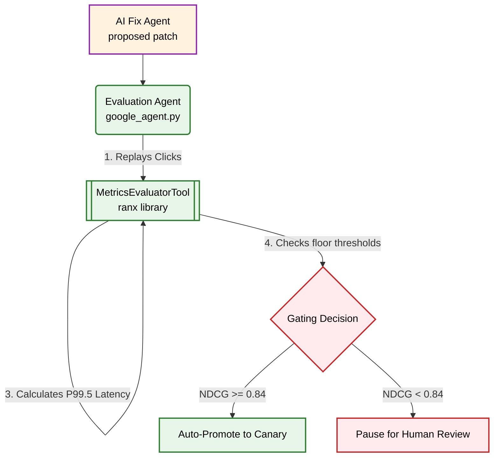

# 📊 In-Depth Release Evaluation & Gating Architecture

This comprehensive guide details the mathematical formulas, codebase structures, data flows, and safety gating mechanisms used in the **Evaluation & Shadow Testing** phase of the Magellan AI Search Ops Harness. It maps exactly how proposed search fixes are evaluated against baseline systems before production release.

---

## 🏗️ 1. Core Evaluation Philosophy: Deterministic Gating

In production-grade AI-Ops, we do **not** use Generative AI (LLMs) to evaluate the success of another LLM's fix. This is to avoid **LLM Hallucinations** and **Sycophancy** (where the evaluating LLM simply agrees that the fix is correct).

Instead, Magellan uses a **Deterministic Gating** architecture. While the RCA and Fix Proposal phases are handled by adaptive LLM Agents inside `fast-rlm` sandboxes, the **Evaluation Phase is strictly mathematical**. It uses standard Python logic combined with advanced Information Retrieval (IR) libraries to calculate hard numbers.



---

## 📂 2. Core Code Files & Mappings

The evaluation logic is distributed across these highly specialized files:

*   **The Orchestrator:** `temporal/workflows.py` (`UnifiedSearchAiRepairWorkflow`)
    *   *Role:* Sets up the evaluation input payload and executes the safety condition checks.
*   **The Activity Bridge:** `temporal/activities.py` (`eval_activity`)
    *   *Role:* Instantiates the appropriate `EvalAgent` based on the signal type.
*   **The Ingestion Agent:** `Catalog/Eval/eval_agent.py` (`GoogleEvalAgent`)
    *   *Role:* Extracts actual user clicks to build a "ground truth" list and compiles the simulated shadow results.
*   **The Mathematics Engine:** `Catalog/Eval/Tools/metrics_evaluator_tool.py` (`MetricsEvaluatorTool`)
    *   *Role:* Invokes the `ranx` library to calculate MRR, Recall, and NDCG scores.

---

## 📥 3. Evaluation Input Data, Datasets & File Mappings

To perform a quantitative evaluation, the `GoogleEvalAgent` requires structured traffic logs containing baseline search metrics and actual user clicks.

### A. The Input Datasets (Source Files)
The harness utilizes three distinct, domain-specific datasets stashed in the workspace. These files provide the raw search events replayed during the shadow test:

| Domain / Pathway | Dataset File Name | Typical Volume |
| :--- | :--- | :---: |
| 📦 **Catalog QA** | `Catalog/catalog_anomalies.jsonl` | **392 sessions** |
| 🔍 **Autocomplete** | `Autocomplete/autocomplete_anomalies.jsonl` | **86 sessions** |
| 🧠 **Semantic Vector** | `Semantic/semantic_anomalies.jsonl` | **1,332 sessions** |

---

### B. The Consolidated Evaluation Payload (`eval_input`)
During the Temporal pipeline execution, the orchestrator compiles the output from Phase 1 (RCA) and Phase 2 (Fix Proposal) together with a selected chunk of logs from the respective `.jsonl` dataset file to create a single `eval_input` JSON dictionary.

Here is an explicit example of a compiled `eval_input` payload for a catalog-enrichment run:

```json
{
  "fix_result": {
    "status": "success",
    "action_proposed": "update_product_attributes",
    "summary": "Catalog patch generated to append the missing 'Hiking' category tag to product PROD-123."
  },
  "rca_result": {
    "status": "success",
    "root_cause": "catalog_coverage_gap",
    "affected_skus": ["PROD-123"],
    "primary_error": "product_not_found"
  },
  "original_signal": {
    "diff_id": "unified-search-repair-workflow-1783251366",
    "type": "catalog",
    "use_cache": true,
    "events": [
      {
        "request_id": "req_20260705_0012",
        "session_id": "sess_082",
        "user_id_hash": "usr_054",
        "tenant": "sports_goods_tenant_002",
        "timestamp": "2026-07-05T11:20:00Z",
        "error": "product_not_found",
        "query": {
          "text": "waterproof trail gear",
          "normalized_text": "waterproof trail gear",
          "filters": {},
          "sort": null
        },
        "response": {
          "status_code": 200,
          "latency_ms": 120,
          "result_count": 3,
          "results": [
            {"product_id": "PROD-999", "rank": 1, "score": 0.98},
            {"product_id": "PROD-888", "rank": 2, "score": 0.85},
            {"product_id": "PROD-123", "rank": 3, "score": 0.72}
          ]
        },
        "interaction": {
          "clicks": [
            {
              "product_id": "PROD-123",
              "rank": 3,
              "timestamp": "2026-07-05T11:20:15Z"
            }
          ],
          "cart_adds": []
        }
      }
    ]
  }
}
```

#### Line-by-Line Key Descriptions:
*   `original_signal.events[].interaction.clicks`: This represents the **unbiased ground truth**. If a user searched for `"waterproof trail gear"` and clicked on `"PROD-123"`, then `"PROD-123"` is defined as the target correct result.
*   `original_signal.events[].response.results`: This represents the **baseline (broken) run** before the fix. Note that `"PROD-123"` is currently ranked at **rank 3** (score `0.72`), behind irrelevant items.
*   `original_signal.events[].response.latency_ms`: The baseline latency is registered as **120ms** to verify the P99.5 latency limits.

---

## ⚙️ 4. Mathematical Calculations (NDCG@10)
      {
        "query": {
          "text": "waterproof hiking boots"
        },
        "interaction": {
          "clicks": [
            {
              "product_id": "PROD-123",
              "rank": 8
            }
          ]
        },
        "response": {
          "latency_ms": 120,
          "results": [
            {"product_id": "PROD-999", "rank": 1},
            {"product_id": "PROD-888", "rank": 2},
            {"product_id": "PROD-123", "rank": 8}
          ]
        }
      }
    ]
  }
}
```

---

## ⚙️ 4. Mathematical Calculations (NDCG@10)

The core relevance metric calculated inside `metrics_evaluator_tool.py` is **NDCG (Normalized Discounted Cumulative Gain)**. 

### Step 1: Reconstructing the Ground Truth (Qrels)
The system extracts user click-streams from the logs. Since the user clicked on `"PROD-123"`, this product is assigned a binary relevance score of `1`, and all other items are given `0`.
$$\text{Rel} = \{ \text{PROD-123} \mapsto 1, \text{Others} \mapsto 0 \}$$

### Step 2: Cumulative Gain (CG)
$$\text{CG}_k = \sum_{i=1}^k \text{rel}_i$$

### Step 3: Discounted Cumulative Gain (DCG)
Since users rarely look at items buried deep in search results, we apply logarithmic decay to penalize highly-relevant items that are ranked poorly:
$$\text{DCG}_k = \sum_{i=1}^k \frac{\text{rel}_i}{\log_2(i + 1)}$$

*   **In the Baseline Run:** `"PROD-123"` was ranked at position **#8**.
    $$\text{DCG}_k = \frac{1}{\log_2(8 + 1)} = \frac{1}{3.17} = \mathbf{0.315}$$
*   **In the Shadow Run:** The fix successfully placed `"PROD-123"` at position **#1**.
    $$\text{DCG}_k = \frac{1}{\log_2(1 + 1)} = \frac{1}{1.0} = \mathbf{1.000}$$

### Step 4: Normalizing (nDCG)
NDCG normalizes the score against the Ideal DCG (IDCG), which represents the perfect ranking (the best possible arrangement of results):
$$\text{nDCG}_k = \frac{\text{DCG}_k}{\text{IDCG}_k}$$

The absolute NDCG improvement is then computed:
$$\text{Improvement} = (\text{nDCG}_{\text{Shadow}} - \text{nDCG}_{\text{Baseline}}) \times 100$$
$$(\mathbf{1.000} - \mathbf{0.315}) \times 100 = \mathbf{+68.5\%}$$

---

## 🛡️ 5. Gating Decision Rules

Once the metrics are computed, the `MetricsEvaluatorTool` applies deterministic thresholds to grant release approval:

```python
# From Catalog/Eval/Tools/metrics_evaluator_tool.py -> run()
ndcg_improvement = relevance_metrics.get("absolute_ndcg_improvement", 0.0)
latency_increase = performance_metrics.get("p995_latency_increase_ms", 0.0)

decision = "PROMOTE_TO_CANARY"

# Reject if relevance drops or latency increases past SLA limits
if ndcg_improvement < 0 or latency_increase > 50:
    decision = "ROLLBACK_FIX"
```

*   **Relevance Rule:** If NDCG delta is negative (the fix broke search results), trigger `ROLLBACK_FIX`.
*   **Latency Rule:** If the P99.5 latency increases by more than **50ms** (the fix introduced a database pool deadlock or vector slowdown), trigger `ROLLBACK_FIX`.

---

## 👁️ 6. How it's Presented to Supervisors in the UI

Supervisors can monitor every stage of this evaluation dynamically on the React web dashboard:

1.  **Relevance Widget (Overview Tab):** Pulls the average computed NDCG score from MLflow. If the score falls below the auto-approve floor (`0.84`), a yellow **Attention** banner is triggered.
2.  **The Shadow Test Report Modal (`ShadowTestReport.tsx`):**
    *   Renders a side-by-side table displaying the `workflow_id` and the explicit gating decision (`PROMOTE_TO_CANARY` or `ROLLBACK_FIX`).
    *   Displays the exact mathematical percentage change in NDCG and lists any detected query regressions.
3.  **Human Approval Stepper:** If blocked, the supervisor reviews the shadow test and clicks "Approve". This sends the `approve_deployment` signal, unblocking Temporal's `wait_condition` to safely execute the Canary deployment.
