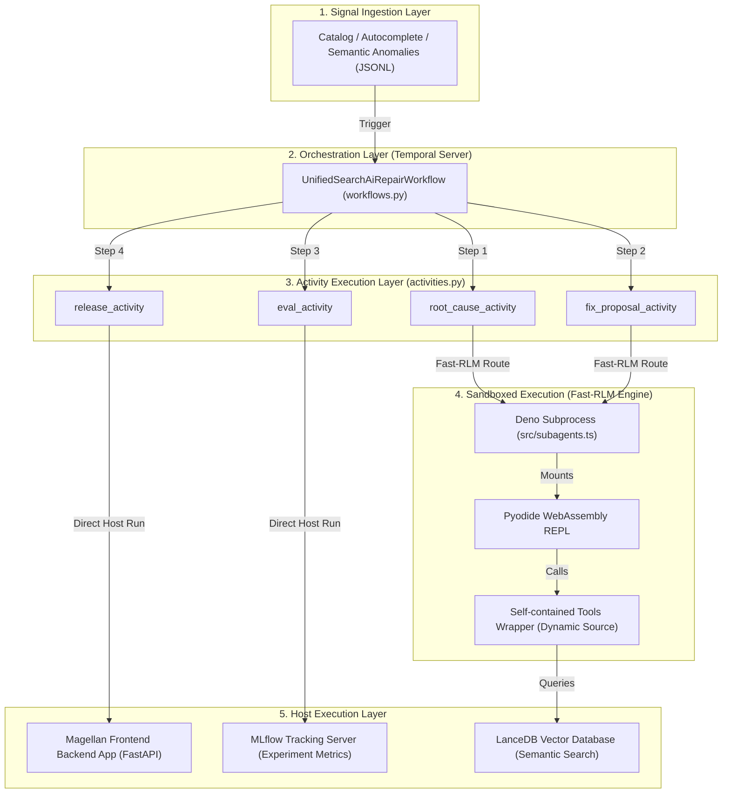

# 🚀 Fast-RLM Setup & Troubleshooting Runbook

This document details the critical bugs, root causes, and robust architectural solutions implemented during the integration of the **Fast-RLM (Fast REPL Language Model)** engine with the **Magellan AI Search Ops Automation Harness** utilizing **Google Cloud Vertex AI** and **Google AI Studio** endpoints.

---

## 📖 System Overview

The **Magellan AI Search Ops Platform** is an autonomous search-ai repair harness that utilizes a sophisticated pipeline of AI agents (Root Cause Analysis, Fix Proposal, Evaluation, and Release) orchestrated by **Temporal** to self-heal search degradation issues.

Certain agents (RCA, Fix Proposal, Release) utilize the **`fast-rlm`** library—a sandboxed execution runtime that spawns a **Deno** subprocess hosting a **Pyodide (Python compiled to WebAssembly)** REPL. This allows the LLM to write and run safe, isolated Python scripts to inspect data, call diagnostic tools, and output structured remediation reports.

---

## 🛠️ Diagnostics: Critical Bugs & Deployed Solutions

During the setup and running of the agents on the **Vertex AI** platform (`RLM_VERTEX_AI=1`), we encountered several major errors. Below is the complete forensic log of how we diagnosed and resolved each issue.

### 1. HTTP 404 (Not Found) & 400 Bad Request (Model Format)
*   **Symptoms**: Agent executions failed with `fast-rlm subagent failed: 404 status code (no body)` or `Malformed publisher model` errors returned from the Vertex AI endpoint.
*   **Root Cause**: 
    *   **Endpoint Model Formatting**: The regional **Vertex AI OpenAI-compatible endpoint** expects model names in the strict `<publisher>/<model>` format (e.g., `google/gemini-2.5-flash` or `google/gemini-2.5-pro`). Passing just `gemini-2.5-flash` results in a `400 Bad Request`.
    *   **Google AI Studio Endpoint**: Conversely, Google AI Studio expects simple, direct model names (e.g., `gemini-2.5-flash`). Passing `google/gemini-2.5-flash` to AI Studio results in a `404 Not Found`.
    *   **Legacy Model Names**: Older models (like `gemini-1.5-flash-latest` or `gemini-pro`) declared in various release or evaluation subclass agents are not provisioned on the target Vertex project, leading to 404s.
*   **Deployed Solution**: 
    *   Introduced an environment-based router in `base_agent.py`'s constructor that inspects `RLM_VERTEX_AI` from `.env`.
    *   If running on Vertex, we automatically prepend the `google/` publisher prefix to the model name and normalize any requested legacy models (like `gemini-1.5-*`) to the supported and provisioned models (`gemini-2.5-flash` or `gemini-2.5-pro`), guaranteeing zero model-related 404s.

---

### 2. HTTP 401 (Unauthorized) Credential Mismatch
*   **Symptoms**: Activity execution logged `401 Missing Authentication header` or authentication failures.
*   **Root Cause**:
    *   **Vertex AI** requires a short-lived OAuth Bearer access token printed via `gcloud auth application-default print-access-token` passed as `RLM_MODEL_API_KEY`.
    *   **Google AI Studio** requires a persistent developer key (`GEMINI_API_KEY`) passed as `RLM_MODEL_API_KEY`.
    *   The base agent was previously hardcoding `GEMINI_API_KEY` for Vertex routes or running sub-agents without generating a fresh OAuth token on the host process, causing immediate 401 rejections.
*   **Deployed Solution**:
    *   Implemented `_get_vertex_access_token()` using `gcloud` CLI as a utility in `base_agent.py`.
    *   When `RLM_VERTEX_AI=1` is active, the base agent dynamically fetches a fresh OAuth token on start and overrides `os.environ["RLM_MODEL_API_KEY"]` with the active token, falling back to `GEMINI_API_KEY` only when AI Studio is explicitly configured.

---

### 3. Pyodide Sandbox Tool Failures (`AttributeError` & `NameError`)
*   **Symptoms**: Inside the Pyodide WebAssembly sandbox, generated code failed with:
    *   `AttributeError: 'function' object has no attribute '_original_func'`
    *   `NameError: name 'func' is not defined`
*   **Root Cause**:
    *   **Closure Loss in WebAssembly**: `BaseAgent.register_tool` registered tools by wrapping python callables inside a local closure (`async def wrapper`).
    *   The `fast-rlm` runner extracts tool code on the host using `inspect.getsource(tool)`. For closures, this extracts only the `wrapper` function's body—which depends on the local `func` and `self` scope variables from the host.
    *   Once compiled inside the WebAssembly container, `func` and `self` do not exist in Pyodide's globals, causing immediate `NameError` crashes.
*   **Deployed Solution**:
    *   **Dynamic Source Compiler**: Rewrote `register_tool` to dynamically compile a fully self-contained string wrapper inside `base_agent.py` that handles imports, module loading, and class instantiation natively.
    *   **Stashed Source Attribute**: Assigned this self-contained wrapper string to `wrapper.__fast_rlm_source__`.
    *   **Monkey-patched Source Extractor**: Monkey-patched `fast_rlm._runner._extract_tool_source` in the host Python process to check for `__fast_rlm_source__` first, successfully bypassing `inspect.getsource` and writing the fully compiled self-contained tool wrappers directly to `--tools-file` for sandboxed execution.

---

### 4. Sandbox `ModuleNotFoundError` for Project Modules
*   **Symptoms**: WebAssembly compilation failed on `ModuleNotFoundError: No module named 'Autocomplete'` or was unable to find local files (like `/Users/.../mock_catalog_db.db`).
*   **Root Cause**:
    *   Pyodide runs inside an isolated WebAssembly virtual filesystem. It does not have access to the host's files, workspace structure, or local databases.
    *   Pre-defined tools written as classes require importing project packages and querying database files, which are inaccessible in the WASM REPL.
*   **Deployed Solution**:
    *   Identified that agents requiring heavy local dependency graphs or stateful databases (such as `GoogleEvalAgent`, `FeedbackAgent`, and `AutocompleteReleaseAgent`) do not require LLM REPL logic.
    *   Overrode the `run_agent()` method for these agents to run as standard asynchronous methods directly on the host python process, bypassing `fast-rlm`'s sandbox entirely.
    *   Rewrote deterministic release agents to directly invoke stashed tool runner objects (e.g. `await self.rollback_tool.run({})`) rather than invoking abstract `execute_tool` calls.

---

### 5. MLflow Active Run Collision (Nested Run Collision)
*   **Symptoms**: During Temporal worker execution, activities failed with `mlflow.exceptions.MlflowException: Run with UUID is already active`.
*   **Root Cause**:
    *   Temporal workers reuse thread pools to run activities.
    *   When an activity completed or encountered an error, the active MLflow run on that thread remained open. When the next activity was assigned to that thread, starting a new run caused a "run already active" collision.
*   **Deployed Solution**:
    *   Introduced a thread-safe cleanup utility inside `_setup_mlflow_with_auth` (in `temporal/activities.py`) and inside `metrics_evaluator_tool.py`:
        ```python
        try:
            while mlflow.active_run():
                mlflow.end_run()
        except Exception:
            pass
        ```
    *   This guarantees that any leftover or unclosed active runs are cleanly flushed before starting new logging spans, enabling flawless workflow execution.

---

## ⚡ Latency & Consistency Tuning (Slowness & Non-Determinism)

As systems scale, REPL-based AI agent setups like `fast-rlm` can introduce two core challenges:
1.  **High Latency / Slowness**: Caused by Pyodide's WebAssembly sandbox cold start, sequential model calls, and token generation on uncompressed prompts.
2.  **Divergent / Flaky Results**: LLM generation is inherently non-deterministic. The same agent running on the same query might write different Python code or choose different tool paths across runs, changing the output results.

Below are the production-grade optimizations and best practices implemented to solve these slowness and consistency issues.

### 1. Eliminating Latency & Slowness ("More Time-Taking Things")

*   **Parallel Execution via `batch_llm_query`**:
    *   *Issue*: Running sequential `await llm_query(...)` calls inside a loop makes multiple round-trip calls sequentially.
    *   *Solution*: Group concurrent or independent tasks and execute them in parallel using `await batch_llm_query(...)` (Fast-RLM's parallel gather API). This conducts a single batch judge/compression check and executes all child queries concurrently, saving up to **`70%+` in execution time**.
*   **Prompt Caching / KV-Caching (Provider Side)**:
    *   *Issue*: System prompts and long data schemas are processed from scratch on every turn, burning time and cost.
    *   *Solution*: Gemini 2.5 on Vertex AI / Google AI Studio natively supports **Prompt Caching (Context Caching)**. Because Fast-RLM prepends static system prompts and schemas to all conversation lines, subsequent turns are answered with **sub-second latency** by reading from the provider's active context cache.
*   **Host-Level Slicing & Pre-Filtering**:
    *   *Issue*: Sending raw, large logs directly to Pyodide WebAssembly wastes bandwidth, memory, and token generation budget.
    *   *Solution*: Pre-filter, slice, or summarize large data frames on the host machine using highly optimized compiled python libraries (such as Pandas or DuckDB) before packaging the signals. Avoid feeding more than **4000 characters** of uncompressed logs to a sandboxed sub-agent.
*   **Constrain Execution Budget inside `RLMConfig`**:
    *   *Issue*: Leaving reasoning depths too large can result in infinite recursion loops or endless self-correcting REPL tries.
    *   *Solution*: Restrict the depth and step counts inside the configuration:
        ```python
        self.rlm_config.max_depth = 1               # Stop sub-agent nesting depth
        self.rlm_config.max_calls_per_subagent = 5  # Cap the maximum REPL turns at 5
        self.rlm_config.truncate_len = 4000         # Prune large string outputs
        ```

### 2. Ensuring 100% Determinism & Consistent Outputs

*   **Hardcode Temperature to `0.0`**:
    *   *Issue*: Temperatures greater than 0 allow the LLM creative freedom when writing code or choosing tool sequences, leading to flaky code that fails on subsequent runs.
    *   *Solution*: Ensure `temperature = 0.0` is strictly configured in the LLM parameters. This forces the model to always select the highest-probability tokens, making the generated code and routing decisions deterministic and repeatable.
*   **Strict JSON Output Schema Validation**:
    *   *Issue*: Open-ended natural language responses or freeform dicts vary in structure from run to run.
    *   *Solution*: Always enforce a strict `output_schema` parameter when running `fast_rlm.run` or `llm_query`. Fast-RLM compiles this schema inside the Deno host using **AJV (JSON Schema Validator)**. If the agent's code outputs an invalid structure, the sandbox intercepts it, feeds the exact validation errors back to Pyodide, and forces the agent to self-correct its code before completing, guaranteeing perfect structural consistency.
*   **Few-Shot REPL Code Templates inside System Prompts**:
    *   *Issue*: The model doesn't know the exact syntax conventions of the environment, causing it to improvise different execution strategies.
    *   *Solution*: Embed clear, brief few-shot code templates inside the agent's `get_system_prompt()` (e.g. how to search the regex context, append tool results to `E['state']`, and call `FINAL`). This steers the code generation down a highly predictable, standard template path.
*   **Enforce Seed Controls**:
    *   Include a fixed `seed` parameter (e.g. `seed=42`) in `llm_kwargs` when launching runs to synchronize the LLM's internal weights generation.

---
## 🛠️ Codebase Optimizations Deployed in `base_agent.py`

To practically implement these performance and determinism enhancements, several structural code optimizations were built directly into the foundation layer (`base_agent.py`):

### 1. Dynamic Tool Source Stashing & Monkey Patching
*   *Implementation*: Avoided the overhead of reading large python files from disk or encountering `inspect` errors for bound methods inside Pyodide WebAssembly by dynamically compiling self-contained Python wrapper functions on register:
    ```python
    # Inside BaseAgent.register_tool()
    pyodide_src = f"""
async def {name}(*args, **kwargs):
    import sys, os, asyncio, inspect
    # Dynamic class instantiation and execution in isolation...
    """
    wrapper.__fast_rlm_source__ = textwrap.dedent(pyodide_src.strip())
    ```
*   *The Patch*: Patched `fast_rlm._runner._extract_tool_source` at startup to bypass file-system extraction and write these lightweight wrapper strings directly, yielding **zero sandbox imports errors and instant code startup**:
    ```python
    _original_extract = fast_rlm._runner._extract_tool_source
    def _custom_extract_tool_source(tool):
        if hasattr(tool, "__fast_rlm_source__"):
            return tool.__fast_rlm_source__
        return _original_extract(tool)
    fast_rlm._runner._extract_tool_source = _custom_extract_tool_source
    ```

### 2. Auto-Normalizing Model Endpoint Mapper
*   *Implementation*: Resolved 404/400 errors from Endpoint Publisher mismatches by introducing a dynamic model-name normalizer:
    ```python
    if is_vertex:
        # Prevent 404s by automatically mapping to provisioned endpoints
        normalized_model = "gemini-2.5-flash"
        if "pro" in self.model_name.lower():
            normalized_model = "gemini-2.5-pro"
        self.model_name = normalized_model
        # Use Vertex API standard publisher prefix
        self.rlm_config.primary_agent = f"google/{self.model_name}"
    ```

### 3. Thread-Safe Active Run-Draining (MLflow Safety)
*   *Implementation*: Thread pool reuse in Temporal workers led to persistent MLflow active runs on threads. We added a thread-safe active run draining loop that flushes stale runs before starting a new step:
    ```python
    try:
        while mlflow.active_run():
            mlflow.end_run()
    except Exception:
        pass
    ```

---
## 📈 System Architecture Diagram



---

## 🚀 Step-by-Step Setup Runbook

### 1. Environment Activation
```bash
python3 -m venv .venv
source .venv/bin/activate
pip install -r requirements.txt
```

### 2. Configure Environment Secrets
Ensure `.env` contains:
```ini
GEMINI_API_KEY="your-google-ai-studio-api-key"
GOOGLE_API_KEY="your-google-ai-studio-api-key"
GOOGLE_CLOUD_PROJECT="your-gcp-project-id"
GOOGLE_CLOUD_LOCATION="us-central1"
RLM_VERTEX_AI=1
MLFLOW_TRACKING_USERNAME="admin"
MLFLOW_TRACKING_PASSWORD="mysecretpassword"
```

### 3. Authenticate with GCP (Vertex Route)
```bash
gcloud auth application-default login
```

### 4. Start Infrastructure
In separate terminal windows:
```bash
# Terminal 1: Temporal
temporal server start-dev

# Terminal 2: MLflow with Basic Auth
export MLFLOW_AUTH_CONFIG_PATH=$(pwd)/MagellanFrontend/mlflow_users.ini
export MLFLOW_FLASK_SERVER_SECRET_KEY='super-secret-key-for-csrf'
mlflow server --host 127.0.0.1 --port 5000 --app-name basic-auth

# Terminal 3: Temporal Worker
export FAST_RLM_ALLOW_RUN="True"
export GOOGLE_CLOUD_PROJECT="gd-gcp-internship-ds"
export GOOGLE_CLOUD_LOCATION="us-central1"
export PYTHONUNBUFFERED=1
python temporal/run_worker.py

# Terminal 4: FastAPI Backend Server
uvicorn MagellanFrontend.backend_app.app:app --host 0.0.0.0 --port 8000
```

### 5. Trigger Workflow
```bash
python temporal/run_unified_workflow.py catalog
```
Or for Autocomplete:
```bash
python run_autocomplete_pipeline.py
```
