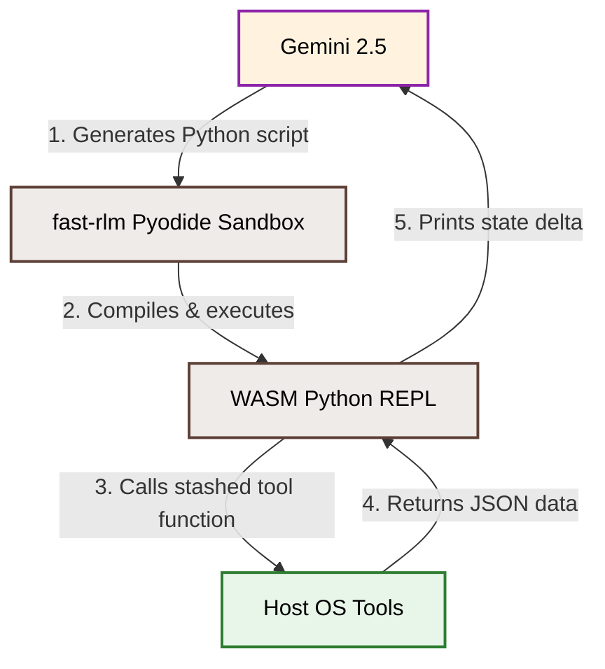

# 🧠 In-Depth FAST-RLM Engine & Recursive Agent Execution Runbook

This comprehensive guide details the design, configuration, data injection protocols, and recursive reasoning models of the **`fast-rlm` (Fast Reasoning Language Model)** framework. It explains how the system securely sandboxes large language models (LLMs) and enables them to run Python code recursively to solve complex database and search outages.

---

## 🏗️ 1. What is FAST-RLM?

**FAST-RLM** is an advanced, production-grade **Agent Execution Layer**. Instead of treating LLMs as simple text completion services, FAST-RLM transforms them into active **Orchestrators** operating within a sandboxed **Read-Eval-Print Loop (REPL) environment**.

### Core Execution Sandbox (Deno + Pyodide)
To execute LLM-generated code safely without putting the host machine at risk, FAST-RLM implements a double-layered sandbox:
1.  **Deno Subprocess:** Spawns a completely isolated containerized runtime process.
2.  **Pyodide (WebAssembly Python REPL):** Inside the Deno process, it runs a WebAssembly compiled Python environment. 
3.  **Local Isolation:** The LLM's generated Python scripts execute entirely within this WASM sandbox. It cannot access host environment variables, files, or network resources unless they are explicitly registered and passed in as stashed tools.



---

## 📈 2. How Signal Data is Passed Into the Sandbox

Because Pyodide is sandboxed, it cannot read files or listen to API ports. Signal data must be **pushed directly into the prompt context** in a highly structured XML format.

### The Ingestion Flow (`base_agent.py`):
When a Temporal activity triggers an agent via `run_agent(signal_data)`, the following sequence occurs:

1.  **Serialization:** The `BaseAgent` splits the signal into two components: `context_data` (general alerts/metadata) and `events_data` (granular search log lines).
2.  **XML Tagging:** The data is serialized to JSON and wrapped inside explicit `<JSON_DATA_CONTEXT>` and `<JSON_DATA_EVENTS>` XML tags to isolate it from instruction text.
3.  **Prompt Concatenation:** The system instructions, tools documentation, and XML-tagged signal are compiled into a single long string:

```python
# From base_agent.py
def format_user_message(self, signal_data: dict) -> str:
    user_message_parts = []
    context_data = {k: v for k, v in signal_data.items() if k != "events"}
    events_data = signal_data.get("events", [])

    # Embed general context metadata
    user_message_parts.append(f"<JSON_DATA_CONTEXT>\n{json.dumps(context_data, indent=2)}\n</JSON_DATA_CONTEXT>")

    # Embed granular logs in JSON-Lines (JSONL) format
    events_jsonl = "\n".join([json.dumps(event) for event in events_data])
    user_message_parts.append(f"<JSON_DATA_EVENTS>\n{events_jsonl}\n</JSON_DATA_EVENTS>")
    
    return "\n".join(user_message_parts)
```

4.  **Pyodide Extraction:** When the sandboxed Python REPL starts, the prompt instructs the agent to run a regex script on its own `E['context']` variable (which contains the raw prompt string) to extract and parse the JSON:

```python
# System prompt regex executed inside Pyodide on step 1:
import re
import json

# Extract and load context data
context_matches = re.findall(r'<JSON_DATA_CONTEXT>(.*?)</JSON_DATA_CONTEXT>', E['context'], re.DOTALL)
E['context_data'] = json.loads(context_matches[-1].strip()) if context_matches else {}

# Extract and parse events JSONL lines
events_matches = re.findall(r'<JSON_DATA_EVENTS>(.*?)</JSON_DATA_EVENTS>', E['context'], re.DOTALL)
if events_matches:
    E['events_jsonl'] = [json.loads(line) for line in events_matches[-1].strip().splitlines() if line.strip()]
```

This populates `E['state'] = {'events': E['events_jsonl'], 'context': E['context_data']}`, giving the LLM immediate, clean Python access to the data inside the sandbox.

---

## 🧬 3. Recursive Agent Execution (Recursive Language Models)

One of the most powerful features of the `fast-rlm` framework is **Recursive Sub-Agent Spawning**. 

When a standard agent encounters an issue that is too complex or lacks predefined tools, it can **recursively spawn a specialized specialist sub-agent** to perform a deeper, multi-step investigation.

### How Recursion Works Under the Hood

The recursive execution is governed by three primary settings in `RLMConfig`:
```python
# From base_agent.py
self.rlm_config.max_depth = 1               # Controls how deep sub-agents can spawn (0 = no sub-agents)
self.rlm_config.max_calls_per_subagent = 5   # Limits how many steps a recursive sub-agent can take
self.rlm_config.truncate_len = 4000         # Caps context window size to prevent recursive feedback bloat
```

### The Recursive Tool: `run_deep_rca_investigation`
If an agent has `enable_deep_rca=True` (like `GoogleRootCauseAgent`), it registers a built-in recursive tool:

```python
self.register_tool(
    name="run_deep_rca_investigation",
    func=self._run_deep_rca_investigation_tool,
    description="Deeply analyzes unknown or complex issues by writing Python scripts and spawning recursive sub-agents."
)
```

### The Step-by-Step Recursive Loop:

```
[Primary Agent running in Sandbox]
               │
               ▼ (Reads corrupted or complex logs)
1. Registers "unusual_pattern" ➔ LLM decides it needs deeper analysis
               │
               ▼
2. Call Tool: `run_deep_rca_investigation(signal_data)`
               │
               ▼
3. Parent suspends execution ➔ Spawns a New "Specialist" RLM Sub-Agent
               │
               ▼
4. Specialist Sandbox starts ➔ Executes a highly granular diagnostic script
               │
               ▼ (Generates findings report)
5. Specialist returns JSON payload ➔ Handed back to the Parent Agent
               │
               ▼
6. Parent resumes execution with the specialized findings in its E['state']
```

#### Code Proof of the Pyodide Recursive Specialist:
```python
# Self-contained specialist compiled inside Pyodide when run_deep_rca_investigation is called:
async def run_deep_rca_investigation(*args, **kwargs):
    import json
    
    # 1. Fetch parent context signal
    signal = args[0] if args else globals().get("context", {})
    events = signal.get("events", [])
    
    # 2. Perform granular loop analysis on events to find anomalies
    error_counts = {}
    evidence = []
    for idx, event in enumerate(events):
        err = event.get("error")
        if err:
            error_counts[err] = error_counts.get(err, 0) + 1
            evidence.append(f"Event #{idx+1}: query='{event.get('query', {}).get('text')}' failed.")

    # 3. Derive specific root cause
    primary_error = max(error_counts, key=error_counts.get) if error_counts else "unknown"
    
    # 4. Generate structured findings payload
    return {
        "status": "success",
        "root_cause": f"System anomaly of type '{primary_error}'.",
        "summary": f"Detected {len(events)} events with issue '{primary_error}'.",
        "detailed_evidence": evidence[:10]
    }
```

This recursive structure allows the parent orchestrator to delegate difficult, unstructured parsing tasks to specialized child sandboxes, keeping the parent's context window small, fast, and cost-effective.

---

## ⚡ 4. How to Invoke and Test FAST-RLM

Since FAST-RLM is integrated into the Temporal Worker, any standard workflow run triggers it under the hood. However, you can also run standalone python executions to inspect the raw `fast-rlm` logs:

```bash
# 1. Trigger a workflow (uses fast-rlm in the background):
python3 temporal/run_unified_workflow.py catalog

# 2. View the local fast-rlm runtime logs (containing Pyodide step-by-step executions):
cat fast_rlm_agent.log | tail -n 100

# 3. View the detailed JSONL trace files logged by fast-rlm:
# (Allows you to view exact code generated by the LLM step-by-step)
ls -la logs/run_*.jsonl
```

This completes the in-depth structural review of the **FAST-RLM** recursive engine! This document has been permanently stashed in your workspace at `FAST_RLM_IN_DEPTH.md`. Let me know if you would like to run any further verification or compile new specialist tools!