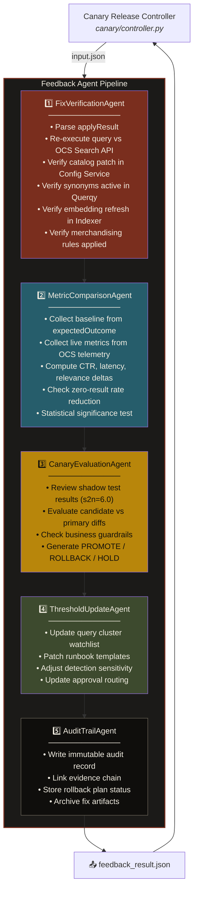
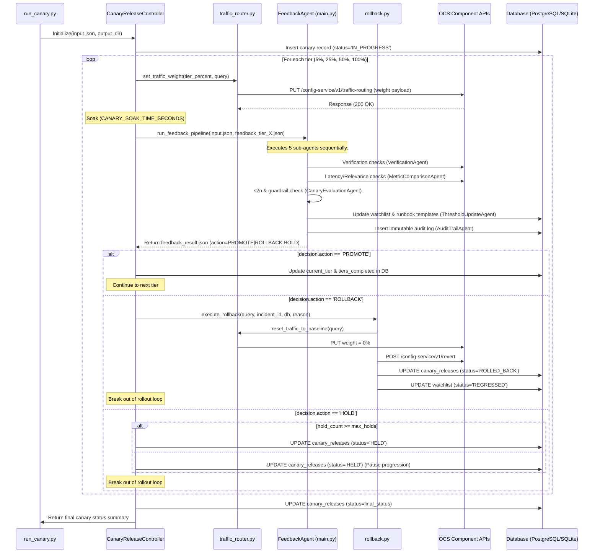
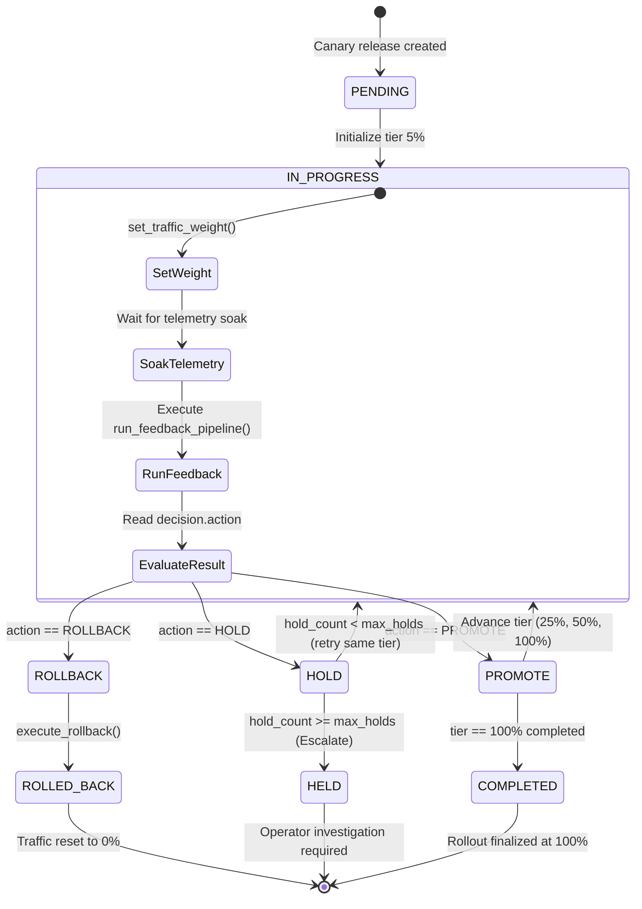
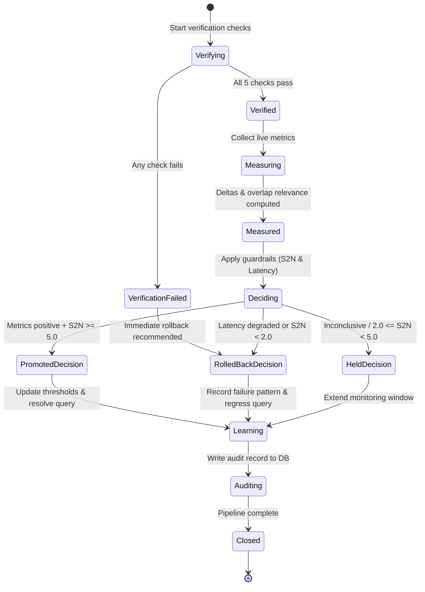
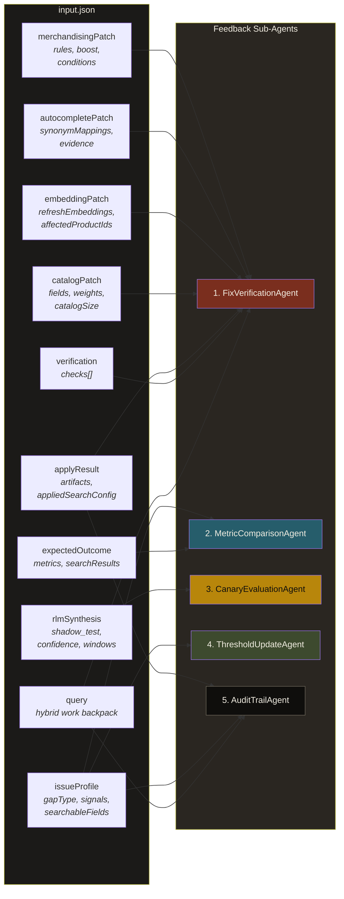

# OCS Feedback Agent — Architecture & Workflow

> Architecture and workflow diagrams for the **Feedback Agent** and the **Canary Release Controller** in the Magellan OCSS Ops Harness pipeline, adapted for [Open Commerce Search Stack](https://github.com/CommerceExperts/open-commerce-search).

---

## 1. System Context — Where the Canary and Feedback Agent Fit

The **Canary Release Controller** orchestrates the rollout phase of search configuration changes, executing progressive traffic weight steps ($5\% \rightarrow 25\% \rightarrow 50\% \rightarrow 100\%$). At each step, it triggers the **Feedback Agent** to verify, measure, and evaluate the candidate configuration, automatically promoting the tier, rolling back all modifications on regressions, or pausing for human review.

```mermaid
graph TD
    subgraph Upstream & Diagnosis
        A["User / Channel<br/><i>query: hybrid work backpack</i>"] --> B["Search API / Gateway"]
        B --> C["OCS Search Engine<br/><i>Elasticsearch + Querqy</i>"]
        C --> D["Observability Layer<br/><i>telemetry metrics</i>"]
        D --> E["Signal Detection<br/><i>zero-result, drift</i>"]
        E --> F["Diagnosis Agent<br/><i>runbook selection</i>"]
        F --> G["Fix Plan Agent<br/><i>Produces input.json</i>"]
    end

    subgraph Governed Release Ops (Phase 4)
        G --> H["Canary Release Controller<br/><i>canary/controller.py</i>"]
        H -->|1. Route Traffic| I["OCS Config Service<br/><i>traffic_router.py (5%, 25%, 50%, 100%)</i>"]
        I -->|2. Invoke Pipeline| J["🔄 Feedback Agent Pipeline<br/><i>main.py</i>"]
        J -->|3. Evaluate Decision| K{"Feedback Decision?"}
        K -->|PROMOTE| L{"All Tiers Completed?"}
        L -->|No| H
        L -->|Yes| M["Release Finalized<br/><i>COMPLETED (100% Traffic)</i>"]
        
        K -->|ROLLBACK| N["Revert Config & Reset Traffic<br/><i>rollback.py (0% Traffic)</i>"]
        N --> O["Mark status: ROLLED_BACK"]
        
        K -->|HOLD| P["Pause Progression<br/><i>Max holds check / Human review</i>"]
        P --> Q["Mark status: HELD"]
    end

    subgraph Database & Learning (Phase 3)
        J -->|4. Threshold Updates| R["PostgreSQL / SQLite<br/><i>watchlists, runbooks, sensitivities</i>"]
        R -.->|"learning loop"| E
    end

    style H fill:#7A2E1E,color:#F2EDE1,stroke:#D4A017,stroke-width:2px
    style J fill:#265D6B,color:#F2EDE1,stroke:#D4A017,stroke-width:2px
    style R fill:#3D4A2E,color:#F2EDE1
    style N fill:#B8860B,color:#0F0E0C
```

---


## 2. Feedback Agent — Internal Architecture

The Feedback Agent is composed of **5 sub-agents** orchestrated sequentially to analyze the applied configuration at the current canary traffic tier:



---

## 3. End-to-End Workflow Flowchart


---

## 4. Sequence Diagram — Canary Orchestrated Release Flow

The following diagram illustrates the complete execution trace, showing how the outer Canary Controller manages traffic tiers and triggers the internal Feedback Agent sub-agents at each step.



---

## 5. State Machine Lifecycles

### 5.1 Canary Release Orchestrator State Machine

The **CanaryReleaseController** drives progressive weight advancement. It transitions between states based on feedback decisions at each evaluation tier.



### 5.2 Feedback Loop Pipeline State Machine

Within the `RunFeedback` state, the Feedback Agent executes its five sequential sub-agents to compute verification and metric states.



---

## 6. Data Flow — input.json → Sub-Agent Mapping

Shows which fields from `input.json` flow to which sub-agent.



---

## 7. OCS Component Mapping (Magellan → OCS)

How the Feedback Agent replaces Magellan's proprietary AI search engine with Open Commerce Search Stack components:

| Magellan Concept | OCS Replacement | API Endpoint |
|-----------------|-----------------|--------------|
| AI Search Engine | **OCS Search API** | `POST /search-api/v1/search` |
| Embedding Refresh | **Indexer Service** | `POST /indexer-service/v1/full-index` |
| Synonym / Autocomplete | **Suggest Service** + **Querqy** | `GET /suggest-service/v1/suggest` |
| Searchable Fields Config | **Config Service** | `GET/PUT /config-service/v1/index-config` |
| Merchandising Rules | **Querqy rules** via Search Service | Querqy rule files in config |
| A/B / Shadow Testing | OCS with **traffic routing** | Custom header-based routing |
| Observability | **OCS Search Response Headers** (e.g. `X-Search-Time`) + HTTP round-trip telemetry | Search response headers & metadata |
| Audit / Persistence | **PostgreSQL** | Direct JDBC/connection |

---

## 8. Output Schemas

### 8.1 Feedback Result Schema — `feedback_result.json`

Produced by the **Feedback Agent pipeline** at each evaluation tier:

```json
{
  "agent": "FeedbackAgent",
  "status": "ok",
  "query": "hybrid work backpack",
  "timestamp": "2026-06-03T17:30:00+05:30",
  "verification": {
    "allPassed": true,
    "checks": [
      {"name": "query_returns_results", "passed": true, "resultCount": 3},
      {"name": "searchable_fields_applied", "passed": true, "fieldsAdded": 4},
      {"name": "synonyms_active", "passed": true, "mappingsVerified": 3},
      {"name": "embedding_refreshed", "passed": true, "productsRefreshed": 1},
      {"name": "merchandising_rules_applied", "passed": true, "rulesApplied": 3}
    ]
  },
  "metrics": {
    "zeroResultRate": {"before": 1.0, "after": 0.0, "delta": -1.0},
    "ctr": {"before": 0, "after": "pending_canary", "delta": "n/a"},
    "latency_p95_ms": {"before": 45, "after": 52, "delta": +7},
    "relevanceScore": {"before": 0, "after": 0.82, "delta": +0.82}
  },
  "decision": {
    "action": "PROMOTE",
    "confidence": 0.577,
    "reason": "All verification checks passed. Zero-result rate eliminated. Latency within acceptable bounds. Shadow test s2n=6.0 indicates strong signal.",
    "nextTrafficTier": "25%"
  },
  "thresholdUpdates": {
    "watchlistAdded": "hybrid work backpack",
    "monitoringWindow": "7d",
    "regressionThreshold": "zero_result_rate > 0.05",
    "runbookTemplatePatched": true,
    "signalSensitivityAdjusted": ["autocomplete_miss", "stale_embedding"]
  },
  "auditRecord": {
    "incidentId": "INC-20260603-001",
    "gapType": "query_vocabulary_gap",
    "fixOrderExecuted": 5,
    "patchesApplied": 4,
    "evidenceArtifacts": 7,
    "ownerPath": "Application owner",
    "rollbackAvailable": true
  }
}
```

### 8.2 Canary Release Result Schema — `canary_release_result.json`

Produced by the **CanaryReleaseController** summarizing the complete lifecycle of the progressive rollout:

```json
{
  "agent": "CanaryReleaseController",
  "incident_id": "INC-20260603-001",
  "query": "hybrid work backpack",
  "status": "COMPLETED",
  "tiers_evaluated": 4,
  "tiers_promoted": 4,
  "tier_results": [
    {
      "tier_percent": 5,
      "decision": "PROMOTE",
      "confidence": 0.577,
      "reason": "All verification checks passed...",
      "metrics": {
        "zeroResultRate": {"before": 1.0, "after": 0.0, "delta": -1.0},
        "ctr": {"before": 0.0, "after": "pending_canary", "delta": "n/a"},
        "latency_p95_ms": {"before": 45.0, "after": 52.0, "delta": 7.0},
        "relevanceScore": {"before": 0.0, "after": 0.82, "delta": 0.82}
      },
      "timestamp": "2026-06-05T12:00:00+05:30"
    }
  ],
  "final_traffic_percent": 100,
  "timestamp": "2026-06-05T12:15:05+05:30"
}
```

---

## 9. Deployment Notes

> [!TIP]
> To run the OCS stack locally for development, follow the [OCSS Quick Start Demo](https://commerceexperts.github.io/open-commerce-search/quick_start_demo.html). The feedback agent should be configured with base URLs for:
> - Search API: `http://localhost:8534`
> - Indexer Service: `http://localhost:8535`
> - Config Service: `http://localhost:8536`
> - Elasticsearch: `http://localhost:9200`
