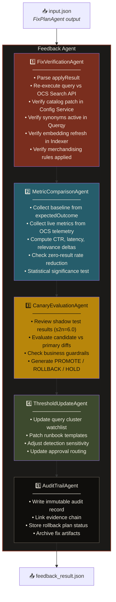
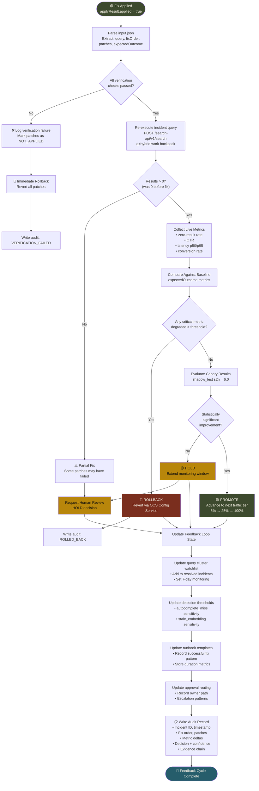
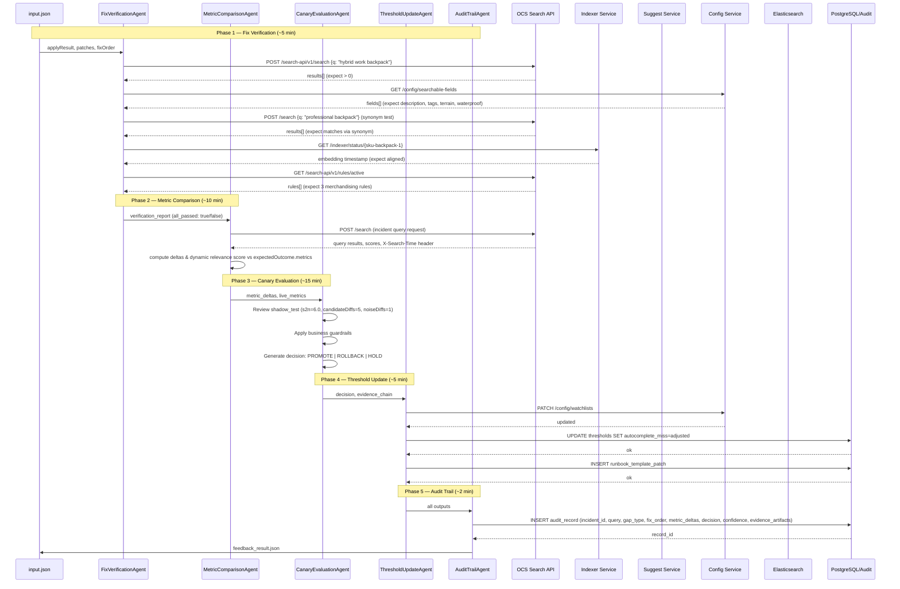
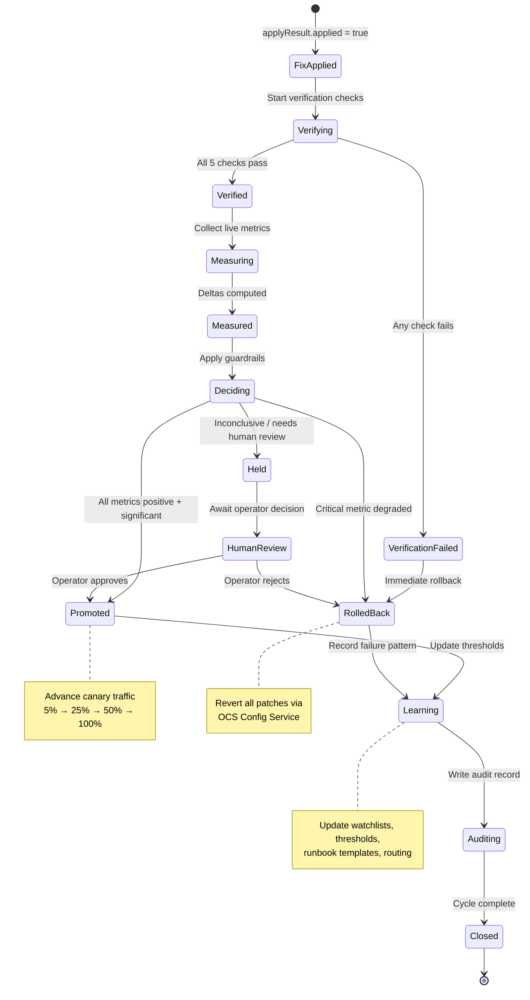
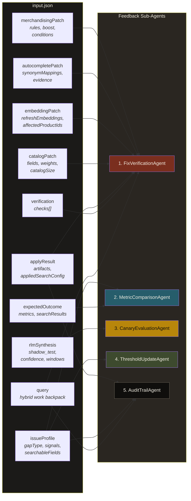

# OCS Feedback Agent — Architecture & Workflow

> Architecture and workflow diagrams for the **Feedback Agent** in the Magellan OCSS Ops Harness pipeline, adapted for [Open Commerce Search Stack](https://github.com/CommerceExperts/open-commerce-search).

---

## 1. System Context — Where the Feedback Agent Fits

The Feedback Agent sits at the **end of the sequential pipeline**, after the FixPlanAgent has applied its changes to the OCS stack. It closes the loop by verifying, measuring, deciding, and learning.

```mermaid
graph LR
    subgraph Upstream Pipeline
        A["User / Channel<br/><i>query: hybrid work backpack</i>"] --> B["Search API / Gateway"]
        B --> C["OCS Search Engine<br/><i>Elasticsearch + Querqy</i>"]
        C --> D["Observability Layer<br/><i>query logs, metrics</i>"]
        D --> E["Signal Detection<br/><i>zero-result, drift</i>"]
        E --> F["Diagnosis<br/><i>CapabilityImpact,<br/>MetricImpact,<br/>DataGapRuleDiff</i>"]
        F --> G["Runbook / Fix Plan<br/><i>FixPlanAgent</i>"]
    end

    subgraph Release Phase
        G --> H["Human Approval<br/><i>optional gate</i>"]
        H --> I["Apply Fix<br/><i>applyResult: ok</i>"]
    end

    subgraph Feedback Loop
        I --> J["🔄 FEEDBACK AGENT<br/><i>verify → measure → decide</i>"]
        J -->|PROMOTE| K["Search Config Update<br/><i>OCS Config Service</i>"]
        J -->|ROLLBACK| L["Release Controller<br/><i>revert patches</i>"]
        J -->|threshold updates| M["PostgreSQL / Audit<br/><i>watchlists, thresholds</i>"]
        M -.->|"learning loop"| E
        K --> N["Canary Workflow<br/><i>5% → 25% → 100%</i>"]
    end

    style J fill:#7A2E1E,color:#F2EDE1,stroke:#D4A017,stroke-width:3px
    style M fill:#265D6B,color:#F2EDE1
    style K fill:#3D4A2E,color:#F2EDE1
    style L fill:#B8860B,color:#0F0E0C
```



---

## 2. Feedback Agent — Internal Architecture

The agent is composed of **5 sub-agents**, each responsible for a phase of the feedback loop.



---

## 3. End-to-End Workflow Flowchart



---

## 4. Sequence Diagram — Sub-Agent ↔ OCS Component Interactions



---

## 5. State Machine — Feedback Loop Lifecycle



---

## 6. Data Flow — input.json → Sub-Agent Mapping

Shows which fields from `input.json` flow to which sub-agent.



---

## 7. OCS Component Mapping (Magellan → OCS)

How the Feedback Agent replaces Magellan's proprietary AI search engine with Open Commerce Search Stack components:

| Magellan Concept | OCS Replacement | API Endpoint |
|-----------------|-----------------|--------------|
| AI Search Engine | **OCS Search API** | `POST /search-api/v1/search` |
| Embedding Refresh | **Indexer Service** | `POST /indexer-service/v1/full-index` |
| Synonym / Autocomplete | **Suggest Service** + **Querqy** | `GET /suggest-service/v1/suggest` |
| Searchable Fields Config | **Config Service** | `GET/PUT /config-service/v1/index-config` |
| Merchandising Rules | **Querqy rules** via Search Service | Querqy rule files in config |
| A/B / Shadow Testing | OCS with **traffic routing** | Custom header-based routing |
| Observability | **OCS Search Response Headers** (e.g. `X-Search-Time`) + HTTP round-trip telemetry | Search response headers & metadata |
| Audit / Persistence | **PostgreSQL** | Direct JDBC/connection |

---

## 8. Output Schema — `feedback_result.json`

```json
{
  "agent": "FeedbackAgent",
  "status": "ok",
  "query": "hybrid work backpack",
  "timestamp": "2026-06-03T17:30:00+05:30",
  "verification": {
    "allPassed": true,
    "checks": [
      {"name": "query_returns_results", "passed": true, "resultCount": 3},
      {"name": "searchable_fields_applied", "passed": true, "fieldsAdded": 4},
      {"name": "synonyms_active", "passed": true, "mappingsVerified": 3},
      {"name": "embedding_refreshed", "passed": true, "productsRefreshed": 1},
      {"name": "merchandising_rules_applied", "passed": true, "rulesApplied": 3}
    ]
  },
  "metrics": {
    "zeroResultRate": {"before": 1.0, "after": 0.0, "delta": -1.0},
    "ctr": {"before": 0, "after": "pending_canary", "delta": "n/a"},
    "latency_p95_ms": {"before": 45, "after": 52, "delta": +7},
    "relevanceScore": {"before": 0, "after": 0.82, "delta": +0.82}
  },
  "decision": {
    "action": "PROMOTE",
    "confidence": 0.577,
    "reason": "All verification checks passed. Zero-result rate eliminated. Latency within acceptable bounds. Shadow test s2n=6.0 indicates strong signal.",
    "nextTrafficTier": "25%"
  },
  "thresholdUpdates": {
    "watchlistAdded": "hybrid work backpack",
    "monitoringWindow": "7d",
    "regressionThreshold": "zero_result_rate > 0.05",
    "runbookTemplatePatched": true,
    "signalSensitivityAdjusted": ["autocomplete_miss", "stale_embedding"]
  },
  "auditRecord": {
    "incidentId": "INC-20260603-001",
    "gapType": "query_vocabulary_gap",
    "fixOrderExecuted": 5,
    "patchesApplied": 4,
    "evidenceArtifacts": 7,
    "ownerPath": "Application owner",
    "rollbackAvailable": true
  }
}
```

---

## 9. Deployment Notes

> [!TIP]
> To run the OCS stack locally for development, follow the [OCSS Quick Start Demo](https://commerceexperts.github.io/open-commerce-search/quick_start_demo.html). The feedback agent should be configured with base URLs for:
> - Search API: `http://localhost:8534`
> - Indexer Service: `http://localhost:8535`
> - Config Service: `http://localhost:8536`
> - Elasticsearch: `http://localhost:9200`
