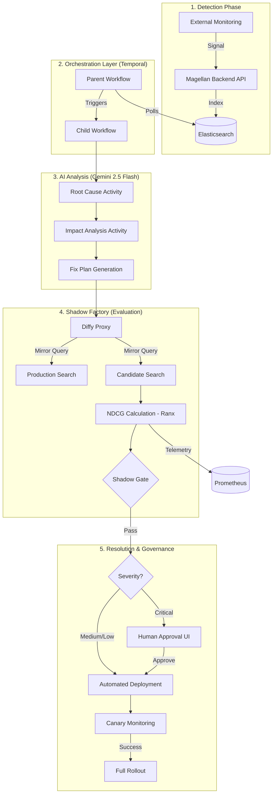

# Magellan AI: Automated Search Ops & Runbook Execution

Magellan is an advanced AI Search Operations platform that automates the lifecycle of search relevance issues. It transitions from **Detection** (Elasticsearch signals) to **Analysis** (AI Agents) to **Verification** (Shadow Testing) and finally **Resolution** (Automated Fixes).

---

## 🏗 System Architecture

Magellan uses a sophisticated event-driven architecture orchestrated by Temporal.



### Workflow Pattern:
1.  **Parent Workflow (`SignalToRunbookWorkflow`)**: Periodically polls Elasticsearch for new system alerts (Signals).
2.  **Child Workflow (`FullPipelineWorkflow`)**: Triggered for every unique signal to perform analysis and execution.

---

## 🛠 Core Technology Stack

*   **Temporal.io**: Industrial-grade orchestration for reliable, retriable AI agent flows.
*   **Google Gemini 2.5 Flash**: The LLM "brain" used for deep reasoning and fix generation.
*   **Elasticsearch**: The source of truth for system signals and product data.
*   **Diffy Proxy**: A traffic-shadowing proxy that compares JSON responses between Prod and AI-Fix versions.
*   **Ranx**: A specialized library used to calculate **NDCG@3** (Normalized Discounted Cumulative Gain).
*   **Prometheus**: Real-time telemetry for tracking search latency and quality scores.

---

## 📂 Component Deep-Dive

### 1. `temporal/` (The Brain)
-   **`all_activities.py`**: The heart of the project. It consolidates all AI "Agents" into Temporal Activities. This solves environment isolation issues and allows individual steps (like LLM calls) to retry independently.
-   **`workflows.py`**: Definites the state-machine and execution order of the agents.
-   **`worker.py`**: The background process that connects to Temporal and actually runs the code.
-   **`schemas.py`**: Strict Pydantic models ensuring data consistency as it moves through the pipeline.

### 2. `infra/diffy/` (The Shadow Factory)
-   This folder contains a **Traffic Mirroring Proxy**. When the evaluation agent runs, it sends a search query to Diffy. 
-   Diffy multicasts that query to three targets:
    1.  **Primary**: Your current production search engine.
    2.  **Secondary**: A duplicate production instance (to detect "noise").
    3.  **Candidate**: The new search configuration generated by the AI.
-   The differences are highlighted in the **Diffy Dashboard**.

### 3. `mock-data/` (The Golden Standard)
-   **`relevance_judgments.json`**: This is the **Ground Truth**. It contains "Ideal" results for benchmark queries. If the AI fix makes the search results significantly different from this set, the deployment is aborted.

---

## 🚀 Setup & Installation

### Prerequisites
-   Docker and Docker Compose.
-   A Google Gemini API Key.

### 1. Environment Configuration
Create a `.env` file in the root directory:
```env
GOOGLE_API_KEY=AIzaSy...your_key...
ELASTICSEARCH_URL=http://elasticsearch:9200
```

### 2. Start the Cluster
This command builds the AI worker, backend, and all infrastructure:
```bash
docker-compose up --build
```

### 3. Running a Test
To see the system in action, you can manually trigger a workflow that fetches the latest signal from Elasticsearch:
```bash
docker-compose exec worker python temporal/trigger_workflow.py
```

---

## 📊 Monitoring & Visibility

| Dashboard | URL | What to check |
| :--- | :--- | :--- |
| **Temporal UI** | [http://localhost:8233](http://localhost:8233) | Watch agents run, check logs, and approve/reject fixes. |
| **Diffy UI** | [http://localhost:31149](http://localhost:31149) | See the visual JSON diff between Prod and the AI Fix. |
| **Prometheus** | [http://localhost:8001/metrics](http://localhost:8001/metrics) | Real-time NDCG and Latency metrics. |
| **Magellan API** | [http://localhost:8000](http://localhost:8000) | The backend API documentation (Swagger/Redoc). |

---

## 🛡 Safety & Guardrails (The Shadow Gate)

To prevent the AI from making bad deployments, every fix must pass the **Shadow Gate**:
*   **NDCG Floor ($\ge 0.84$)**: The search relevance must meet this minimum score against the Ground Truth.
*   **Latency Ceiling ($\le 150ms$)**: The fix cannot make the search engine significantly slower.
*   **Human Approval**: Any signal marked as **CRITICAL** will pause the workflow and wait for a human to click "Approve" in the Temporal UI.
