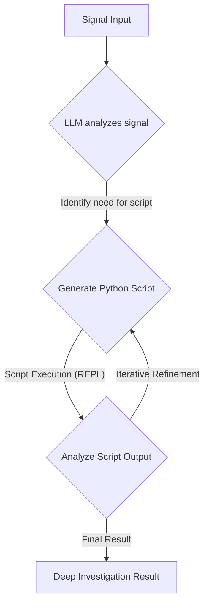

# Catalog Agent Pipeline: Autonomous E-commerce Catalog & Search Management

This project implements a multi-stage autonomous agent pipeline designed to detect, diagnose, fix, evaluate, and release changes for e-commerce catalog and search systems. Leveraging Google's Agent Development Kit (ADK) and `fast-rlm`, it automates complex operational workflows to ensure data quality, search relevance, and efficient release management.

## 🚀 Overview

The Catalog Agent Pipeline acts as an intelligent automation layer, responding to "signals" (e.g., detected data inconsistencies, search performance degradation) and orchestrating a series of specialized AI agents to resolve them end-to-end.

## 🏗️ Architecture

The system is built upon a modular architecture with a foundational `BaseAgent` and several specialized agents, each responsible for a distinct phase of the operational workflow.

### Core Components:

1.  **`BaseAgent` (`base_agent.py`)**:
    *   **Foundation**: Provides common functionalities for all agents, including LLM model initialization (using `gemini-2.5-flash`), robust tool registration, and the execution mechanism for ADK's `LlmAgent`.
    *   **Context Injection**: Dynamically injects `signal` or `signal_data` into tool calls at runtime, ensuring tools receive necessary contextual information.
    *   **`fast-rlm` Integration**: Integrates `fast-rlm` for advanced "deep investigation" capabilities, allowing agents to generate and execute Python scripts for complex data analysis and remediation.

2.  **Specialized Agents**:
    *   **Phase 1: Root Cause Analysis (RCA)**
        *   **`GoogleRootCauseAgent` (`Catalog/RootCause/google_agent.py`)**: Diagnoses the underlying reasons for catalog or search quality issues. It uses tools like `catalog_coverage`, `schema_validation`, `freshness_check`, `historical_intent`, `search_quality`, `capability_mapping`, and can escalate to `run_deep_rca_investigation` (via `fast-rlm`).
    *   **Phase 2: Fix Proposal & Execution**
        *   **`GoogleFixProposalAgent` (`Catalog/Fix_Proposal/fix_agent.py`)**: Develops and executes remediation plans based on RCA findings. It employs tools such as `llm_inference` (for data generation), `apply_patch`, `vector_refresh`, `trigger_reindex`, `generate_synonyms`, `apply_synonyms`, `generate_semantic_mapping`, `deploy_semantic_rules`, and `run_deep_remediation_script` (via `fast-rlm`).
    *   **Phase 3: Evaluation (Shadow Testing)**
        *   **`EvalAgent` (`Catalog/Eval/eval_agent.py`)**: Evaluates the effectiveness and safety of a deployed fix using metrics and shadow testing. It utilizes `fetch_diffy_report` (to simulate traffic comparison, potentially with mock data) and `evaluate_metrics` (to assess relevance via NDCG).
    *   **Phase 4: Release Management**
        *   **`ReleaseAgent` (`Catalog/Release/release_agent.py`)**: Orchestrates the deployment of approved changes (canary release) or initiates a rollback if evaluation indicates issues. It uses `initiate_canary_release` and `execute_rollback` tools.

## ⚙️ Workflow (`run_full_pipeline.py`)

The `run_full_pipeline.py` script orchestrates the entire lifecycle:

```mermaid
graph TD
    A[Initial Signal (signal_data)] --> B{Phase 1: Root Cause Analysis Agent};
    B -- GoogleRootCauseAgent --> C[RCA Output (AgentOutput)];

    C --> D{Phase 2: Fix Proposal Agent};
    D -- GoogleFixProposalAgent --> E[Fix Report (FixAgentOutput)];

    E --> F{Phase 3: Evaluation Agent (Shadow Testing)};
    F -- EvalAgent --> G[Evaluation Decision (EvalOutput)];

    G --> H{Phase 4: Release Agent};
    H -- ReleaseAgent --> I[Release Actions (ReleaseOutput)];

    I --> J[Phase 5: LanceDB Verification];
    J --> K[End of Pipeline];
```

1.  **Signal Ingestion**: The pipeline starts with a `signal_data` object describing an issue.
2.  **RCA**: The `GoogleRootCauseAgent` analyzes the signal, uses its tools to gather evidence, and produces a root cause diagnosis.
3.  **Fix Proposal**: The `GoogleFixProposalAgent` receives the RCA output, determines the necessary fixes, and executes them (e.g., data enrichment, re-indexing).
4.  **Evaluation**: The `EvalAgent` assesses the implemented fix, typically by comparing "shadow" (staging) traffic against production, and makes a decision to promote or rollback.
5.  **Release**: The `ReleaseAgent` acts on the evaluation decision, initiating a canary release or reverting changes.
6.  **Verification**: A final check (e.g., against LanceDB) confirms the integrity and impact of the changes on the system.

## ✨ Detailed Agent Workflows

This section provides a deeper look into the internal logic and tool orchestration of each specialized agent.

### 1. `fast-rlm` Deep Investigation Workflow (within BaseAgent)

`fast-rlm` enables recursive, script-driven analysis for complex issues where standard tools are insufficient.



### 2. `GoogleRootCauseAgent` Workflow

This agent focuses on diagnosing the root cause of catalog and search-related issues.

```mermaid
graph TD
    A[Initial Signal (signal_data)] --> B{LLM receives signal and prompt};
    B -- Reasoning --> C{Selects relevant Tool(s)};
    C -- Tool Input (extracted from signal) --> D[Execute Tool];
    D -- Tool Output --> E{LLM analyzes Tool Output};
    E -- More Info Needed? --> C;
    E -- Root Cause Identified --> F[RCA Output (AgentOutput)];
    E -- Complex Issue? --> G{Escalate to run_deep_rca_investigation};
    G --> H[Deep RCA Result];
    H --> F;
```

### 3. `GoogleFixProposalAgent` Workflow

Responsible for generating and executing remediation plans based on the RCA findings.

```mermaid
graph TD
    A[RCA Output (Fix Signal)] --> B{LLM receives RCA findings};
    B -- Reasoning --> C{Selects relevant Remediation Tool(s)};
    C -- Tool Input --> D[Execute Tool];
    D -- Tool Output --> E{LLM confirms Fix Applied};
    E -- More Fixes Needed? --> C;
    E -- All Fixes Applied --> F[Fix Report (FixAgentOutput)];
```

### 4. `EvalAgent` Workflow

Evaluates the success of a fix, typically using shadow testing and metrics.

```mermaid
graph TD
    A[Fix Proposal Output] --> B{LLM receives Fix Report};
    B -- Reasoning --> C{Execute fetch_diffy_report};
    C -- Diffy Report/Results --> D{Execute evaluate_metrics};
    D -- Metrics Results --> E{LLM analyzes metrics and Diffy};
    E -- Determine decision --> F[Evaluation Decision (EvalOutput)];
```

### 5. `ReleaseAgent` Workflow

Orchestrates the release or rollback of changes based on the evaluation decision.

```mermaid
graph TD
    A[Evaluation Decision (EvalOutput)] --> B{LLM receives decision};
    B -- Decision: PROMOTE_TO_CANARY --> C[Execute initiate_canary_release];
    B -- Decision: ROLLBACK_FIX --> D[Execute execute_rollback];
    C --> E[Release Actions (ReleaseOutput)];
    D --> E;
```

## 🛠️ Setup

To run this pipeline, you'll need Python 3.9+ and the necessary environment variables.

1.  **Clone the Repository**:
    ```bash
    git clone <your-repo-url>
    cd Capstone5
    ```

2.  **Create a Python Virtual Environment**:
    ```bash
    python3 -m venv .venv
    source .venv/bin/activate
    ```

3.  **Install Dependencies**:
    ```bash
    pip install -r requirements.txt
    ```

4.  **Google API Key Configuration**:
    *   Obtain a Google Gemini API Key from the Google AI Studio or Google Cloud Console.
    *   Set it as an environment variable:
        ```bash
        export GOOGLE_API_KEY="YOUR_GEMINI_API_KEY"
        ```
    *   If using `fast-rlm` with OpenRouter, ensure your OpenRouter credits are sufficient or adjust `max_tokens` in `base_agent.py`.

## ▶️ Running the Pipeline

To execute the entire autonomous catalog agent pipeline, run the `run_full_pipeline.py` script:

```bash
python3 run_full_pipeline.py
```

**Note**: For meaningful RCA and evaluation results, you will need to customize the `signal_data` in `run_full_pipeline.py` (or `Catalog/RootCause/google_agent.py`) to include realistic raw data, logs, or detailed error information that the agents can analyze. The current `sample_signal` is primarily for demonstrating the pipeline flow.

---
