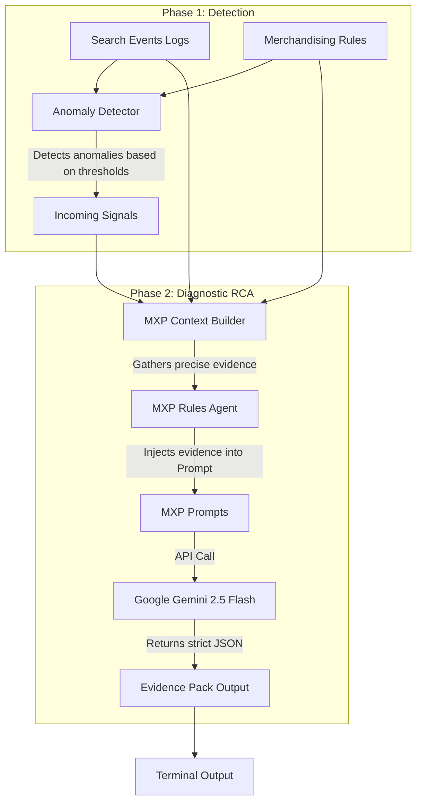

# E-Commerce Merchandising (MXP) RCA Agent

This repository contains an automated Root Cause Analysis (RCA) pipeline designed to detect and diagnose anomalies in e-commerce search merchandising (MXP). 

The system operates in two distinct phases: a deterministic anomaly detection engine that scans telemetry logs and merchandising rules, followed by a Generative AI diagnostic engine powered by Google's Gemini that explains *why* the anomaly occurred.

## Table of Contents
- [Project Structure](#project-structure)
- [Architecture Overview](#architecture-overview)
- [How It Works (The Data Flow)](#how-it-works-the-data-flow)
- [Detection Logic & Thresholds](#detection-logic--thresholds)
- [Setup & Execution](#setup--execution)

---

## Project Structure

This project is organized into a clean, production-ready layout separated by functional domain.

```text
mxp_rca_agent/
├── .env                        # Secure environment variables (GEMINI_API_KEY)
├── conftest.py                 # Empty file to assist pytest resolution
├── run_agent.py                # Single unified entrypoint/orchestrator
├── anomalies.json              # Auto-generated log of detected faults
├── mock_data/
│   ├── rules.json              # Simulated merchandising rules and stock data
│   └── search_events.jsonl     # Simulated search telemetry logs (queries, clicks, impressions)
└── Magellan-rca-engine-backend/
    ├── requirements.txt        # Strict Python dependencies (pydantic, google-genai)
    └── app/
        ├── agents/
        │   └── experts/
        │       └── mxp_rules_agent.py # The AI Detective. Wraps Google GenAI SDK, defines strict JSON schemas, handles inference.
        ├── core/
        │   └── prompts/
        │       └── mxp_prompts.py     # Stores the System persona and User prompt templates used by the AI.
        ├── schemas/
        │   ├── rca_schema.py          # Pydantic models enforcing the LLM output structure (EvidencePackOutput).
        │   └── shared_ingress.py      # Pydantic models defining the Anomaly triggers passed between phases.
        └── services/
            └── context/
                ├── anomaly_detector.py # Phase 1 Scanner. Evaluates mock data against business logic thresholds.
                └── mxp_context.py      # Phase 2 Evidence Gatherer. Fetches hard evidence for failing products.
```

---

## Architecture Overview

The system is built using an event-driven design. The orchestrator (`run_agent.py`) triggers the Anomaly Detector, which generates `IncomingSignal` payloads. These signals trigger the `MXPRulesAgent` to gather specific contextual evidence and pass it to the Gemini LLM for structured analysis.



---

## How It Works (The Data Flow)

1. **Trigger (Simulation):** `run_agent.py` initializes the pipeline and runs the `AnomalyDetector`.
2. **Phase 1 (Scanning):** The detector parses `search_events.jsonl` to calculate exact Click-Through Rates (CTR) and impressions. It simultaneously parses `rules.json` to map products to active merchandising rules (like `boost` or `suppress`) and checks live warehouse stock.
3. **Signal Generation:** When the logic thresholds are breached, the detector generates a list of anomalies, formats them into `IncomingSignal` objects, and saves a backup to `anomalies.json`.
4. **Phase 2 (Context Gathering):** For every signal generated, the `MXPAgent` calls the `MXPContextBuilder`. This deterministic tool queries the data strictly for the failing product, extracting its exact performance metrics and any active rules affecting it.
5. **Prompt Injection:** The collected facts are serialized into JSON string blocks and injected into the `MXP_USER_PROMPT_TEMPLATE`.
6. **Structured Inference:** The agent calls the `gemini-2.5-flash` model via the new `google-genai` SDK. It uses a strict `google.genai.types.Schema` to force the LLM to return a perfectly structured `EvidencePackOutput` JSON object, ensuring the model provides specific data points (Rule IDs, timestamps, exact stock counts) instead of generalized summaries.
7. **Payload Delivery:** The final, machine-readable JSON Evidence Pack is printed to the terminal.

---

## Detection Logic & Thresholds

The `AnomalyDetector` (`app/services/context/anomaly_detector.py`) uses two specific scans to identify critical merchandising failures.

### Scan 1: Poor Performance Detection
This scan looks for products that are being actively promoted by merchandisers but are failing to engage users.
*   **Impression Threshold:** `>= 2 impressions` (The product must be appearing in search results).
*   **CTR Threshold:** `== 0%` (The product is being entirely ignored by users).
*   **Rule Condition:** The product must be actively targeted by a `boost` rule.
*   *Logic:* If we are artificially boosting a product and no one is clicking it, the rule is ineffective or the product is irrelevant to the queries it is appearing on.

### Scan 2: The "Ghost Boost" Detector (Zero-Stock Boosts)
This scan identifies critical logical faults in the merchandising configuration.
*   **Stock Threshold:** `== 0 units` (The warehouse is empty).
*   **Rule Condition:** The product is actively targeted by a `boost` rule.
*   *Logic:* If a product is out of stock, the search engine typically hides it from results. Boosting a hidden product is a severe misconfiguration. This scan flags the error immediately, regardless of log impressions (which will naturally be 0).

---

## Setup & Execution

### Prerequisites
1. Python 3.10+
2. A valid Google AI Studio Developer Key (`GEMINI_API_KEY`).

### Installation
1. Clone the repository.
2. Install the required packages using the explicit requirements file:
   ```bash
   pip install -r Magellan-rca-engine-backend/requirements.txt
   ```
3. Create a `.env` file in the root directory (`mxp_rca_agent/`) and add your key:
   ```env
   GEMINI_API_KEY="AIzaSyYourRealKeyHere..."
   ```

### Running the Agent
Execute the orchestrator script from the root directory:
```bash
python run_agent.py
```
The terminal will display the Phase 1 scanning results, followed by the specific JSON Evidence Packs generated by Gemini for every detected anomaly.
