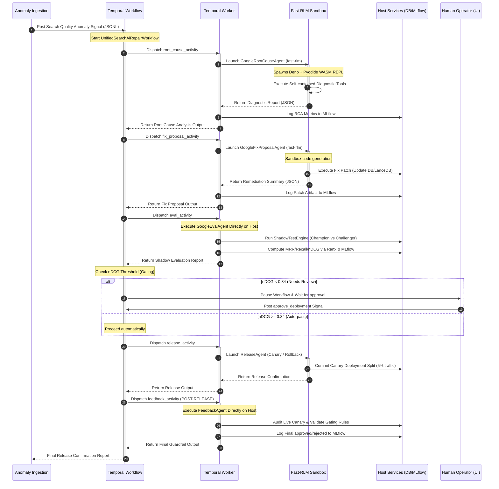

# 📐 Magellan AI Search Ops Platform — Deep Technical Architecture

This document provides a highly detailed, comprehensive, production-grade technical architecture specification for the **Magellan AI Search Ops Platform**—the autonomous self-healing repair pipeline for AI-powered search engines.

---

## 🏛️ Comprehensive System Topology

Magellan AI Search Ops is structured as a distributed, decoupled, and highly asynchronous architecture comprised of five main core components:
1.  **Observability & Ingestion Layer**: Captures live search queries, result impressions, and clickstream events, serializing anomaly events into JSON Lines (JSONL) datasets.
2.  **Orchestration Engine (Temporal.io)**: Statefully orchestrates the multi-phase self-healing workflow. Guarantees 100% execution reliability, automated retries, time-outs, heartbeat monitoring, and human-in-the-loop approval gates.
3.  **Autonomous Agent Execution Layer (`fast-rlm` Sandbox)**: Spawns sandboxed **Deno** subprocesses running **Pyodide (WebAssembly Python REPL)**. This lets Google Gemini models securely write and run Python scripts to query databases, call diagnostic tools, and diagnose/repair issues without executing arbitrary code on the host.
4.  **Verification, Shadow Testing & Feedback Layer (`shadow_agent_framework`)**: Mirror production traffic to run side-by-side **Champion (Baseline) vs Challenger (Shadow)** model evaluations, logging metrics to MLflow and querying vector embeddings in LanceDB.
5.  **Telemetry, Dashboard & Control Center**:
    *   **FastAPI Backend Server**: Manages runs, processes audits, integrates with LanceDB, and acts as the Temporal client.
    *   **React-based Frontend Dashboard**: Displays live Temporal workflow execution pipelines, Diffy shadow comparison reports, and MLflow experiment charts.
    *   **MLflow Server (with Basic Auth)**: Logs telemetry runs, metrics (nDCG@10, MRR@10, Recall@5, P99 latency), and stashes JSON patches as artifacts.
    *   **LanceDB Vector Database**: Stores high-dimensional product vectors for semantic search.

---

## 📊 End-to-End Self-Healing Workflow Pipeline



---

## 🛠️ Deep Technical Specification of Layers

### 1. Observability, Databases & Telemetry (Host Layer)
*   **LanceDB**:
    *   An embedded, serverless vector database utilizing Apache Arrow format for low-latency vector search.
    *   Holds the semantic search index embeddings (high-dimensional representations generated via Gemini text embedding models) for product catalogs.
*   **MLflow**:
    *   A central telemetry platform configured on port `5000` with Basic Authentication.
    *   Every workflow run initiates an MLflow parent run. Each activity step (RCA, Fix, Eval, Feedback) logs parameters, metrics, and JSON patches recursively as nested runs.
*   **Heartbeating Streams**:
    *   Stdout and Stderr logs inside activities are captured and redirected to a `HeartbeatingStream`.
    *   To prevent `asyncio.queues.QueueFull` exceptions during heavy console logging, heartbeats are dynamically throttled on the host to trigger at most once every **2.0 seconds**.

### 2. Execution Isolation Sandbox (`fast-rlm` REPL)
*   **Sandbox Topology Blueprint**: Below is the detailed architectural map of Fast-RLM sandboxing, bridging python host runners, Deno subprocesses, the WASM Pyodide sandbox, and external APIs:


*   **Sandboxing via Deno**: Spawns a lightweight Deno subprocess using `--allow-read`, `--allow-env`, `--allow-net`, and `--allow-sys` flags. This isolates the Python environment and restricts it from writing arbitrary system files.
*   **Pyodide WASM Runtime**: Inside Deno, a Python 3.11 environment is loaded into memory as WebAssembly. Standard pure-python HTTP libraries (`requests`, `httpx`) are automatically patched (`pyodide_http.patch_all()`) to route requests through the Deno host's safe network stack.
*   **Dynamic Source Stashing**:
    *   Because the Pyodide WebAssembly container cannot read host workspace packages (e.g. `Autocomplete/` directories) or closure scopes, host-level tools are dynamically compiled into **self-contained, standalone Python function wrappers** at registration time.
    *   These wrapper strings are stashed inside the tool's `__fast_rlm_source__` attribute.
    *   `fast_rlm._runner._extract_tool_source` is monkey-patched at import time to extract this stashed wrapper directly, allowing flawless execution in the sandbox.

### 3. Gating, verification & Shadow Testing (`shadow_agent_framework`)
*   **Champion vs Challenger Shadowing**:
    *   The `ShadowTestEngine` mirrors a configured sample split of production queries.
    *   It concurrently dispatches the query requests to both the active production **Champion (Baseline)** model and the proposed patched **Challenger (Shadow)** model, recording latency distributions.
*   **Evaluation & Gating Rules**:
    *   Relevance scores (NDCG@10, MRR@10, Recall@5) are computed on the host process using the `ranx` information retrieval metrics engine.
    *   Gating rules (e.g., maximum average score drop of 5%, or maximum latency overhead of 100ms) are evaluated. If a rule is violated, an alert is triggered and the gating engine flags the fix for rollback (`ROLLBACK_FIX`). If all rules pass, the fix is approved (`PROMOTE_TO_CANARY`).

### 4. Post-Release Guardrails (Feedback Layer)
*   **Canary Release First**: To protect the system, the **Feedback Agent (`feedback_activity`) executes strictly after `release_activity` (Canary Release)**.
*   **Feedback Auditing**: The Feedback Agent operates directly on the host process to evaluate the live canary split, review post-canary telemetry data, and write the final guardrail approval or warnings report, acting as the ultimate system auditor.

---

## 📈 Detailed File Relationships (Code Map)

```
- requirements.txt                          # Project dependency mappings
- Dockerfile / Dockerfile.frontend          # Containerization configurations
- docker-compose.yml                        # Full-stack services orchestration
- base_agent.py                             # BASE CLASS: normalizes endpoints, stashes tool code
- rlm_config.yaml                           # Configuration variables for the fast-rlm sandbox
- FAST_RLM_BUGS_AND_SOLUTIONS.md            # Critical troubleshoot runbook for Fast-RLM integration
- SYSTEM_ARCHITECTURE.md                    # THIS SPECIFICATION FILE

├─ temporal/                                # ORCHESTRATION FOLDER
│  ├─ workflows.py                          # Unified workflow pipelines and threshold gating
│  ├─ activities.py                         # Activities wrapping agents, MLflow, and Heartbeats
│  ├─ worker.py / run_worker.py             # Temporal background polling workers
│  └─ run_unified_workflow.py               # CLI tool to trigger repair workflows (catalog/autocomplete/semantic)

├─ shadow_agent/                            # SHADOW TESTING FRAMEWORK (shadow_agent_framework)
│  ├─ src/shadow_agent/core/engine.py       # Core traffic mirroring & shadow orchestration
│  ├─ src/shadow_agent/config/settings.py   # SLA gating rules & model configurations
│  └─ src/shadow_agent/evaluators/          # LLM-as-Judge & Ranx IR metrics evaluators

├─ Catalog/                                 # CATALOG REPAIR PIPELINE
│  ├─ RootCause/google_agent.py             # RCA Agent: Orchestrates catalog diagnostic tools
│  ├─ Fix_Proposal/fix_agent.py             # Fix Agent: Proposes patches & triggers reindexing
│  └─ Eval/eval_agent.py                    # Eval Agent: Executes ShadowTestEngine over signals

├─ Autocomplete/                            # AUTOCOMPLETE REPAIR PIPELINE
│  ├─ RootCause/main_agent.py               # RCA Agent: Typo tolerance and matched bias analysis
│  ├─ Fix_Proposal/fix_agent.py             # Fix Agent: Appends rules to suggestions dictionaries
│  └─ Eval/eval_agent.py                    # Eval Agent: Shadow-test CTR comparisons

├─ Semantic/                                # SEMANTIC SEARCH REPAIR PIPELINE
│  ├─ RootCause/main_agent.py               # RCA Agent: Checks vector sync & embedding drifts
│  └─ Fix_Proposal/fix_agent.py             # Fix Agent: Re-syncs LanceDB vector segments

├─ Release/ / Feedback/                     # SHARED CANARY RELEASE & AUDITING PIPELINES
│  ├─ release_agent.py                      # Deterministic Canary release manager
│  └─ feedback_agent.py                     # Deterministic Post-Release Audit Guardrail
```

---

## 🤖 Agent-Wise Architecture & Specialized Pipelines

The platform's intelligence is distributed across **five core categories of agents**, each engineered with specialized tool registries, processing loops, and scopes:

### 1. Root Cause Analysis (RCA) Agents
The RCA Agents are RLM-orchestrated agents. Their role is to parse telemetry logs, select the appropriate diagnostic tool(s), execute them in the Pyodide sandbox, and produce a structured root-cause report.

#### 📊 Catalog Root Cause Agent (`GoogleRootCauseAgent`)
*   **Pipeline Scopes**: Investigates catalog schema validation gaps, freshness, catalog coverage, and zero-result queries.
*   **Tool Registry**:
    1.  `catalog_coverage`: Analyzes search event logs to identify zero-result terms indicative of coverage gaps.
    2.  `search_quality`: Inspects search results to isolate low-scoring or irrelevant listings.
    3.  `schema_validation`: Validates catalog JSON structures against schemas.
    4.  `freshness`: Checks product update timestamps against an SLA staleness threshold (e.g., 24 hours).
    5.  `historical_intent` / `query_intent_drift`: Analyzes historical search behaviors to isolate queries with drifting user intent over time.
    6.  `embedding` / `vector_sync`: Compares vector database embeddings against the structured catalog database to locate out-of-sync or malformed vectors.
    7.  `search_index_coverage`: Verifies if all indexed catalog products are present in the search indices.
    8.  `capability_mapping`: Maps raw diagnostic warnings to impacted search engine capabilities (e.g. `semantic_search`, `discoverability`).

#### 🔤 Autocomplete Root Cause Agent (`AutocompleteRootCauseAgent`)
*   **Pipeline Scopes**: Diagnoses spelling mismatches, typo tolerance failures, prefix weights, and suggestion quality.
*   **Tool Registry**:
    1.  `run_prefix_matching_analysis`: Checks if query inputs map correctly to standard category prefixes.
    2.  `run_popularity_bias_analysis`: Validates if suggestions are biased towards legacy popular products, hiding newer items.
    3.  `run_typo_tolerance_analysis`: Matches common misspelled inputs (e.g., `"shos"`) to expected vocabulary suggestions (`"shoes"`).

#### 🧮 Semantic Root Cause Agent (`SemanticRootCauseAgent`)
*   **Pipeline Scopes**: Diagnoses vector DB latencies, query-to-product embedding drift, and semantic indexing misses.
*   **Tool Registry**:
    1.  `embedding_drift`: Computes Cosine Similarity variance of recent vectors against historical baselines.
    2.  `vector_db_health`: Logs reachability, partition states, and indexing latencies of the vector store.
    3.  `semantic_coverage`: Identifies catalog items missing from vector indexes.
    4.  `semantic_search_quality`: Evaluates precision-at-k for semantic vector search queries.

---

### 2. Fix Proposal Agents
The Fix Proposal Agents analyze the structured RCA findings, identify the correct remediation sequence, and invoke the stashed python tool code to apply patches and reindex database structures.

#### 🛠️ Catalog Fix Proposal Agent (`GoogleFixProposalAgent`)
*   **Remediation Mapping**:
    *   `catalog_coverage_gap` / `catalog_attribute_gap` -> Call `llm_inference` (to enrich missing data) -> Call `apply_patch` -> Call `vector_refresh` -> Call `trigger_reindex`.
    *   `incorrect_search_relevance` -> Call `map_semantic_intent` -> Call `apply_synonyms` -> Call `trigger_reindex`.
*   **Registered Tools**:
    - `llm_inference`: Calls Gemini on the host to infer missing attributes (e.g., mapping `"TH-XT-001"` to `waterproof_flag=True`).
    - `apply_patch`: Applies JSON Patches to the catalog sqlite database.
    - `vector_refresh`: Re-embeds patched products and syncs arrow tables in LanceDB.
    - `trigger_reindex`: Re-indexes products inside the lexical search engines.

#### 🔤 Autocomplete Fix Agent (`AutocompleteFixProposalAgent`)
*   **Remediation Mapping**:
    *   `prefix_matching_issue` -> Call `adjust_prefix_weights`.
    *   `popularity_bias` -> Call `boost_popular_entities`.
    *   `typo_tolerance_issue` -> Call `update_typo_dictionary`.
*   **Registered Tools**:
    - `adjust_prefix_weights`: Dynamically recalibrates completion scores.
    - `boost_popular_entities`: Enhances query scoring weights for trending terms.
    - `update_typo_dictionary`: Enriches the spell-check dictionary with mapped synonyms (e.g., adding `shos -> shoes`).

---

### 3. Evaluation & Gating Agents
Operate as deterministic async managers **directly on the host process** to calculate quality improvements from shadow test runs.

#### 📊 Google Evaluation Agent (`GoogleEvalAgent`)
*   **Traffic Mirroring**: Drives Champion (baseline) and Challenger (shadow) queries concurrently.
*   **Metrics Integration**: Integrates directly with the `ranx` library.
*   **Evaluation Engine**: Runs `MetricsEvaluatorTool` on the simulated diffy report, measuring average NDCG, MRR, Recall, and P99 latency overheads.
*   **Threshold Gating**: Computes the final deployment recommendation. If improvement rules pass, it outputs `PROMOTE_TO_CANARY`. If a regression is detected or latency increases past SLA thresholds, it outputs `ROLLBACK_FIX`.

---

### 4. Canary Release Agents
Deterministic managers that handle the physical canary routing splits or rollbacks of remediated search indexes.

#### 🚀 Autocomplete/Catalog Release Agent (`ReleaseAgent`)
*   **Canary Deployment**: If the evaluation decision is `PROMOTE_TO_CANARY`, it triggers the canary release tool (`initiate_canary_release`), directing a 5% split of live traffic to the shadow candidate model.
*   **Canary Rollback**: If the evaluation decision is `ROLLBACK_FIX`, it triggers the rollback tool (`execute_rollback`) to revert configurations.

---

### 5. Post-Release Guardrail Agents
Act as the final supervisor loop to verify production canary releases and write final system auditing telemetry.

#### 🛡️ Feedback Agent (`FeedbackAgent`)
*   **Post-Canary Execution**: **Executes strictly AFTER the Canary Release has been successfully committed**.
*   **Safety Audit**: Reviews the live canary metrics. If the canary release operates cleanly without any latency spikes, it flags the deployment status as `APPROVED`. If a late-stage regression is captured, it flags the status as `REJECTED`, alerting operators to manually sign-off or trigger a safe rollback.
*   **Audit Logging**: Automatically logs the finalized release approvals and telemetry records directly to MLflow.

