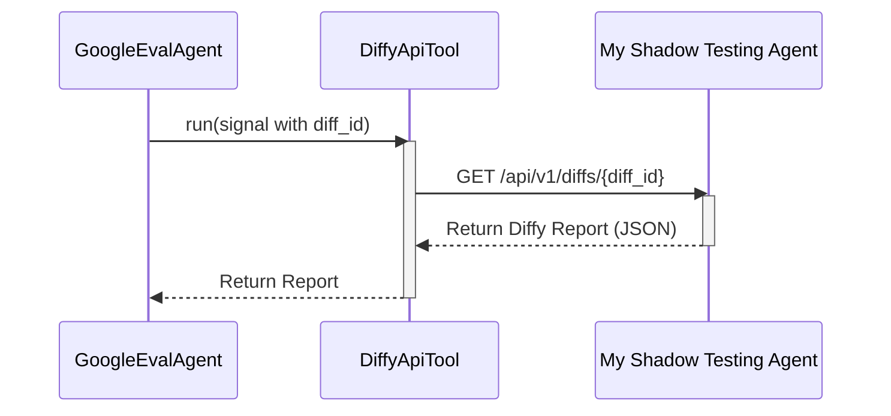

```mermaid
sequenceDiagram
    participant EvalAgent as GoogleEvalAgent
    participant DiffyApiTool as DiffyApiTool
    participant DiffyServer as My Shadow Testing Agent

    EvalAgent->>DiffyApiTool: run(signal with diff_id)
    activate DiffyApiTool

    DiffyApiTool->>DiffyServer: GET /api/v1/diffs/{diff_id}
    activate DiffyServer

    DiffyServer-->>DiffyApiTool: Return Diffy Report (JSON)
    deactivate DiffyServer

    DiffyApiTool-->>EvalAgent: Return Report
    deactivate DiffyApiTool
```

This diagram shows the specific interactions between the `GoogleEvalAgent`, its `DiffyApiTool`, and the `diffy-server` during the shadow testing phase.
