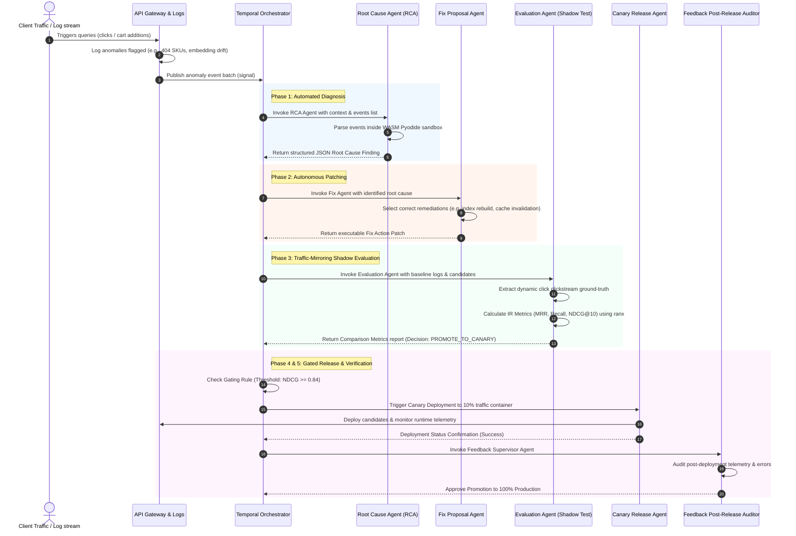

# 8. Self-Healing Closed-Loop Sequence Diagram

This diagram shows the complete end-to-end telemetry-driven repair sequence managed by the **Temporal Orchestration Engine**, showing how an issue is detected, diagnosed, patched, and dynamically evaluated.

