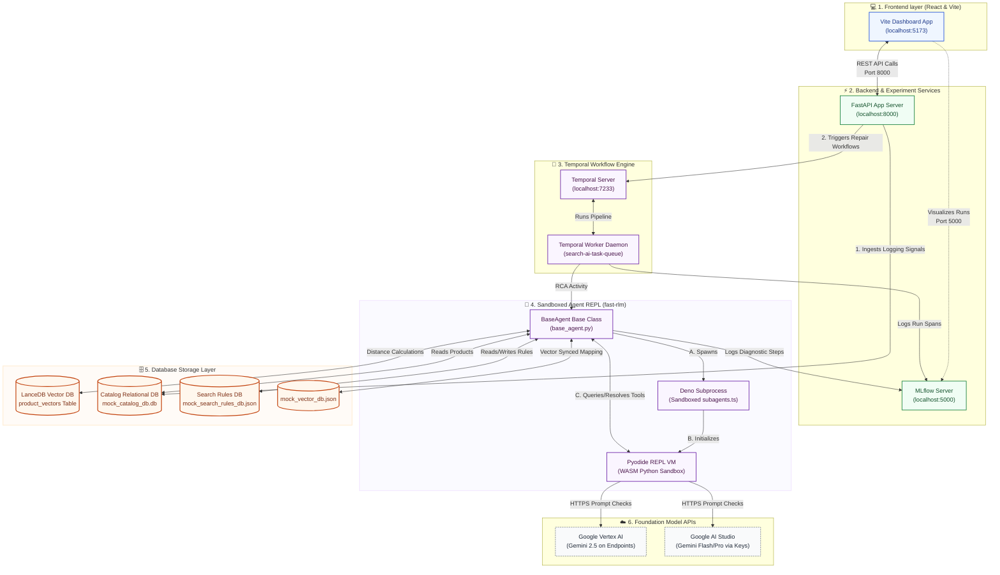

# 9. System & Database Architecture Blueprint

This diagram provides a high-fidelity mapping of all project components, backend microservices, orchestration engines, and database systems (including LanceDB and relational database backends).

