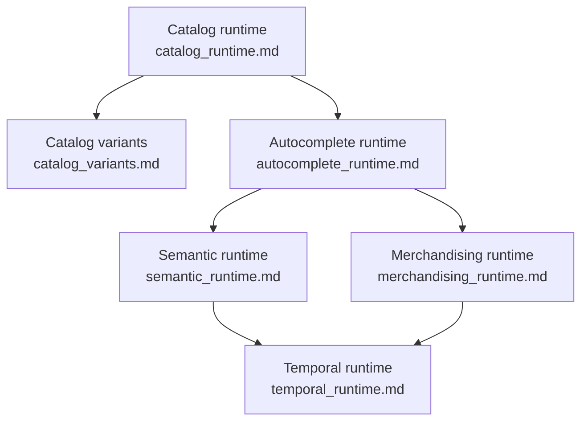

# Agent Mermaid Diagrams

These diagrams reflect the current source tree in this workspace.
Some launcher scripts still have stale imports, so the diagrams use the real module and class names that exist in the code.

Notes:
- `run_full_pipeline.py`, `run_autocomplete_pipeline.py`, and `run_semantic_pipeline.py` still import class names that do not match the current modules.
- `temporal/workflows.py` currently defines `UnifiedSearchAiRepairWorkflow` and `SemanticAiRepairWorkflow`.
- `temporal/catalog_workflows.py` currently defines `AdkSearchOpsWorkflow`.
- `temporal/catalog_workflow.py` and several older launcher helpers look legacy and are not used in the diagrams below.

Open the individual files for the detailed Mermaid diagrams:

- `catalog_deep_flow.md`
- `autocomplete_deep_flow.md`
- `merchandising_deep_flow.md`
- `semantic_deep_flow.md`
- `scenario_rootcause_fix_map.md`
- `baseagent_inheritance.md`
- `catalog_runtime.md`
- `catalog_variants.md`
- `autocomplete_runtime.md`
- `merchandising_runtime.md`
- `semantic_runtime.md`
- `temporal_runtime.md`
