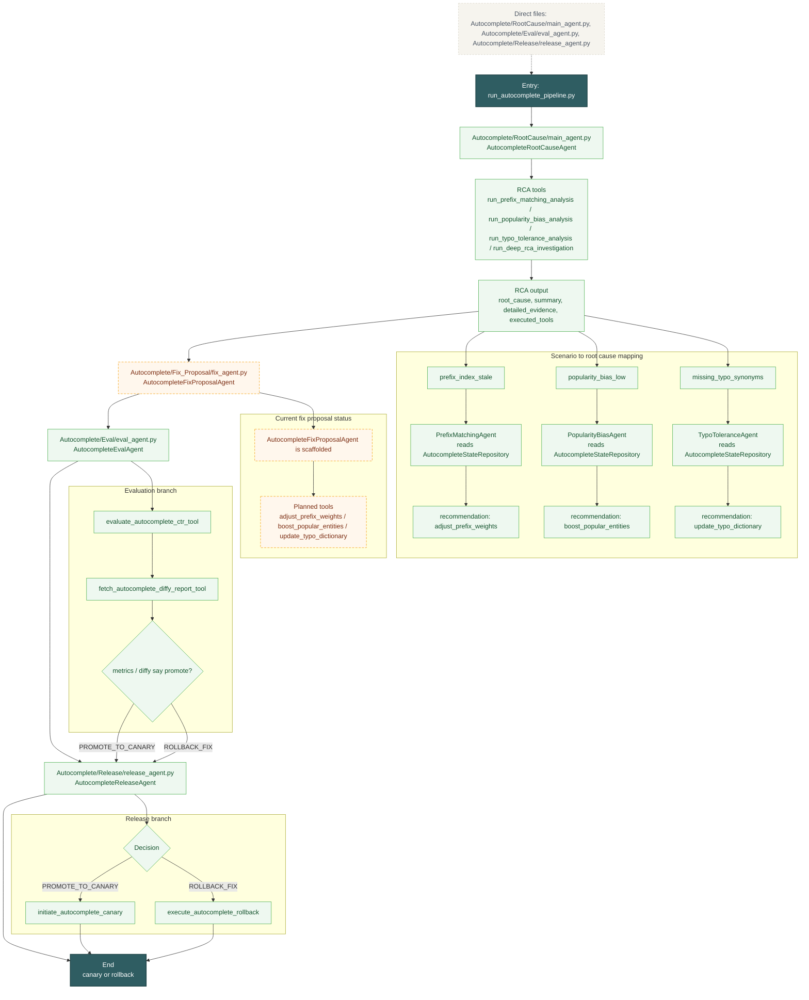

# Autocomplete Deep Flow

This diagram shows the autocomplete RCA path and the current fix/eval/release working state.

Reading guide:
- RCA is working and selects between prefix, popularity, and typo causes.
- Fix proposal exists as a class, but the actual fix tools are still commented out.
- Evaluation and release are wired and already choose promote vs rollback.
