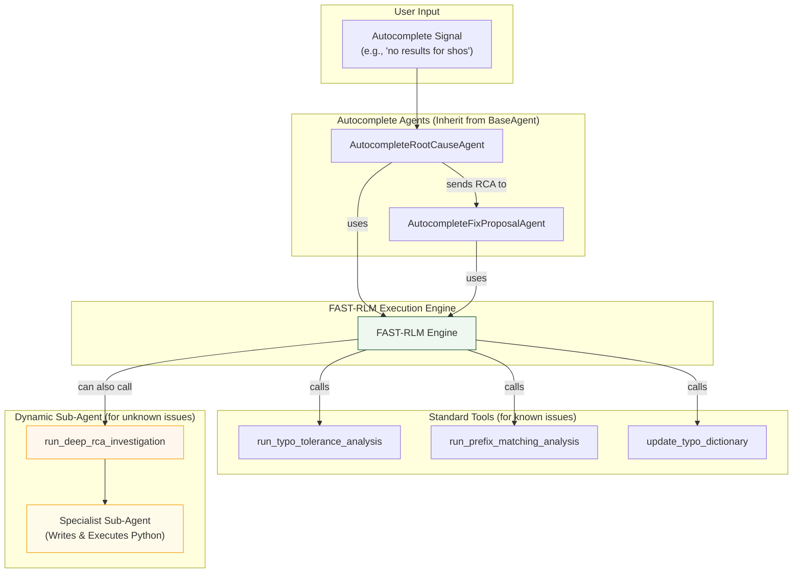

# Autocomplete Agent and FAST-RLM Workflow

This diagram illustrates how the Autocomplete agents use FAST-RLM to identify and fix issues related to search suggestions, using specialized tools for typo tolerance, prefix matching, and popularity bias.

