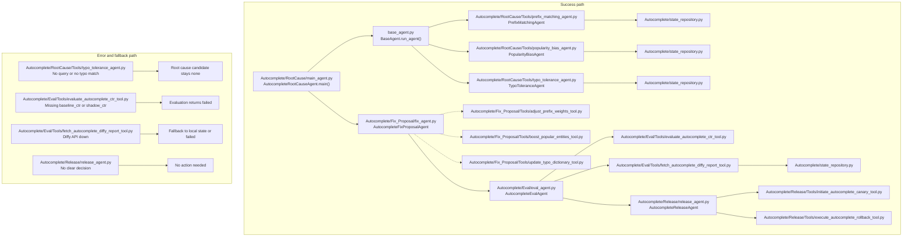

# Autocomplete Runtime Diagram

This diagram follows the current autocomplete modules in the workspace.
The fix agent is present but currently acts as a scaffold, while the evaluation and release layers are wired.

The autocomplete fix tools already exist in `Autocomplete/Fix_Proposal/Tools/`.
They are shown as a dashed link because `Autocomplete/Fix_Proposal/fix_agent.py` has not wired them in yet.

