# BaseAgent Inheritance Diagram

This diagram shows how the main agent classes inherit from `BaseAgent` and which pieces they override or extend.

```mermaid
flowchart LR
    classDef base fill:#2f5d62,color:#ffffff,stroke:#23484b,stroke-width:2px;
    classDef cat fill:#efe7ff,color:#2d1f4e,stroke:#b79cff,stroke-width:1px;
    classDef auto fill:#e8f4ff,color:#12314a,stroke:#8cc3ff,stroke-width:1px;
    classDef merch fill:#fff0e5,color:#5a2d0c,stroke:#f0b37a,stroke-width:1px;
    classDef sem fill:#edf7ef,color:#1e4a27,stroke:#93c79b,stroke-width:1px;
    classDef note fill:#f6f4ee,color:#4b5563,stroke:#d9d4c7,stroke-dasharray: 4 3;

    BA["base_agent.py<br/>BaseAgent<br/>Shared: register_tool, run_agent, deep RCA"]:::base

    subgraph catalog["Catalog package"]
        C1["Catalog/RootCause/google_agent.py<br/>GoogleRootCauseAgent<br/>inherits run_agent + registers RCA tools"]:::cat
        C2["Catalog/Fix_Proposal/fix_agent.py<br/>GoogleFixProposalAgent<br/>inherits run_agent + overrides format_user_message"]:::cat
        C3["Catalog/Eval/eval_agent.py<br/>GoogleEvalAgent<br/>inherits run_agent"]:::cat
        C4["Catalog/Release/release_agent.py<br/>ReleaseAgent<br/>inherits run_agent"]:::cat
    end

    subgraph autocomplete["Autocomplete package"]
        A1["Autocomplete/RootCause/main_agent.py<br/>AutocompleteRootCauseAgent<br/>inherits run_agent + registers RCA tools"]:::auto
        A2["Autocomplete/Fix_Proposal/fix_agent.py<br/>AutocompleteFixProposalAgent<br/>inherits run_agent + overrides format_user_message"]:::auto
        A3["Autocomplete/Eval/eval_agent.py<br/>AutocompleteEvalAgent<br/>inherits run_agent"]:::auto
        A4["Autocomplete/Release/release_agent.py<br/>AutocompleteReleaseAgent<br/>inherits BaseAgent + custom run() wrapper"]:::auto
    end

    subgraph merchandising["Merchandising package"]
        M1["Merchandising/RootCause/main_agent.py<br/>MerchandisingRootCauseAgent<br/>inherits run_agent + registers RCA tools"]:::merch
        M2["Merchandising/Fix_Proposal/fix_agent.py<br/>MerchandisingFixAgent<br/>inherits BaseAgent + custom fast_rlm router"]:::merch
        M3["Merchandising/Eval/eval_agent.py<br/>MerchandisingEvalAgent<br/>inherits BaseAgent + custom fast_rlm router"]:::merch
        M4["Merchandising/Release/release_agent.py<br/>MerchandisingReleaseAgent<br/>inherits BaseAgent + custom run() wrapper"]:::merch
    end

    subgraph semantic["Semantic package"]
        S1["Semantic/RootCause/main_agent.py<br/>SemanticRootCauseAgent<br/>inherits BaseAgent, scaffolded"]:::sem
        S2["Semantic/Fix_Proposal/fix_agent.py<br/>SemanticFixProposalAgent<br/>inherits BaseAgent, scaffolded"]:::sem
        S3["Semantic/Eval/eval_agent.py<br/>SemanticEvalAgent<br/>inherits BaseAgent, scaffolded"]:::sem
        S4["Semantic/Release/release_agent.py<br/>SemanticReleaseAgent<br/>inherits BaseAgent + custom run() wrapper"]:::sem
    end

    BA --> C1
    BA --> C2
    BA --> C3
    BA --> C4
    BA --> A1
    BA --> A2
    BA --> A3
    BA --> A4
    BA --> M1
    BA --> M2
    BA --> M3
    BA --> M4
    BA --> S1
    BA --> S2
    BA --> S3
    BA --> S4

    note1["These files do NOT inherit from BaseAgent and use a different framework or base class."]:::note
    note1 -.-> N1["Catalog/RootCause/main_agent.py<br/>LangChain ReAct RootCauseAgent"]
    note1 -.-> N2["Catalog/RootCause/magellan_agent.py<br/>Standalone FastRLM agent"]
    note1 -.-> N3["Catalog/RootCause/specialized_agents.py<br/>BaseGoogleADKAgent-based demo"]
```

How to read this:
- `BaseAgent` provides the shared engine: tool registration, prompt handling, Vertex setup, and `run_agent()`.
- Most child agents only override `get_system_prompt()` and register tools in `__init__()`.
- Some agents add their own `run()` or custom routing layer on top of `BaseAgent`.
- The three note-only files are not part of the `BaseAgent` inheritance tree.

