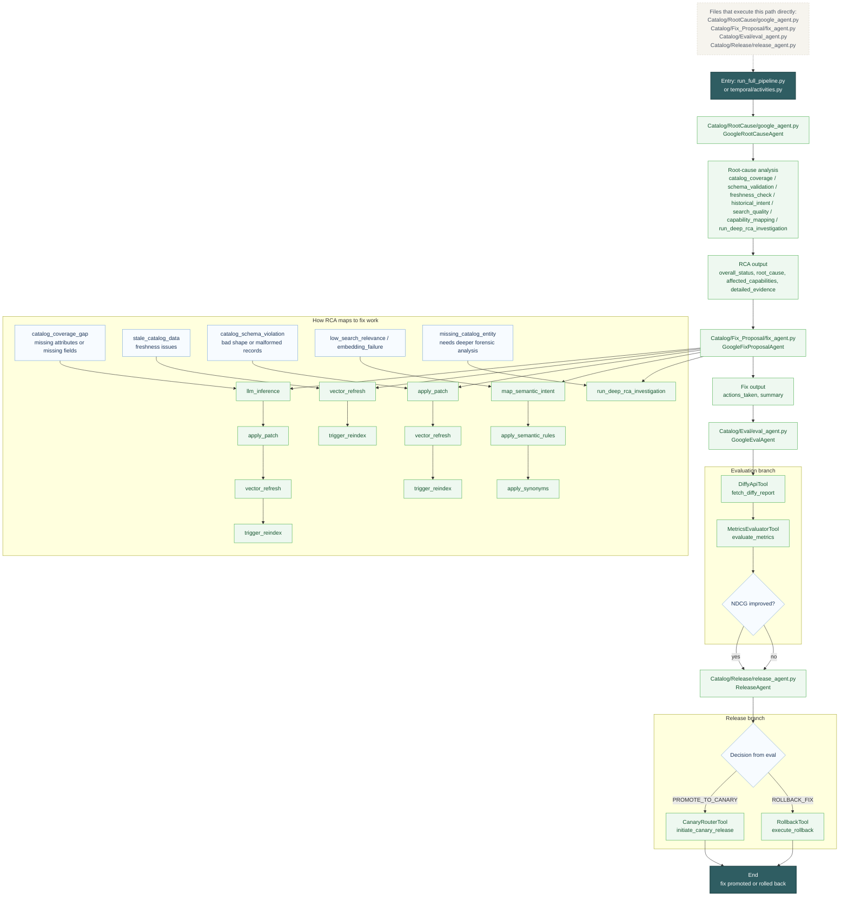

# Catalog Deep Flow

This diagram shows the full working path for catalog issues from signal intake to remediation and release.

Reading guide:
- RCA decides which catalog problem class you are in.
- Fix proposal then chooses the matching remediation tools.
- Evaluation checks whether the fix improved the shadow search results.
- Release either promotes the fix or rolls it back.

