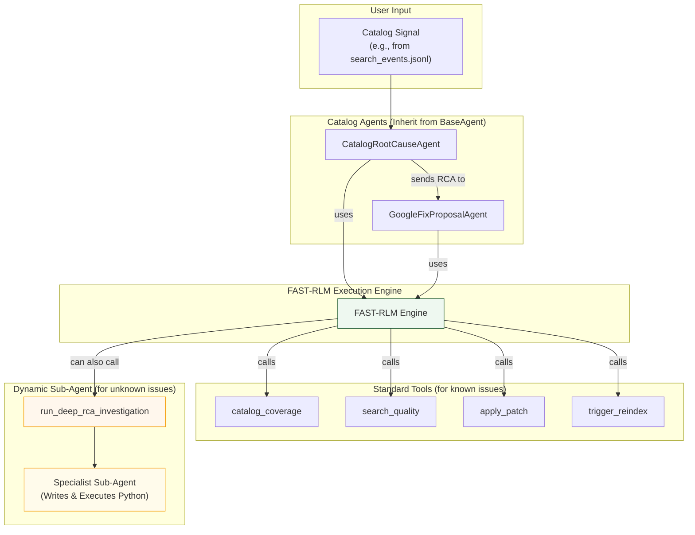

# Catalog Agent and FAST-RLM Workflow

This diagram shows how the Catalog agents use the FAST-RLM engine to diagnose issues and execute fixes, leveraging both standard tools and the deep investigation sub-agent for complex problems.

