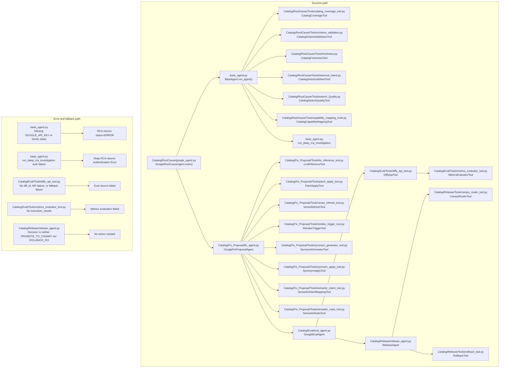

# Catalog Runtime Diagram

This diagram follows the current catalog execution path used by the source files in this workspace.

The catalog release step uses `Catalog/Release/release_agent.py` in the direct pipeline.
The Temporal path uses a different release agent in `Release/release_agent.py`.

