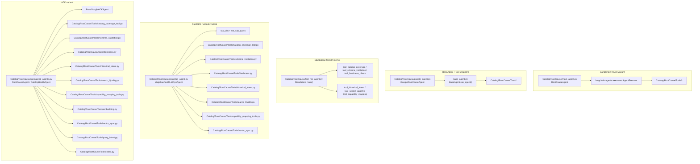

# Catalog Agent Variants

The catalog package contains several working RCA implementations.
This diagram shows the main variants and where they live.

Current usage notes:
- `Catalog/RootCause/google_agent.py` is the catalog RCA module used by `temporal/activities.py`.
- `Catalog/RootCause/specialized_agents.py` is the standalone ADK demo variant.
- `Catalog/RootCause/fast_rlm_agent.py` and `Catalog/RootCause/magellan_agent.py` are separate fast-RLM examples.
- The main graph is a map of variants, not a strict runtime sequence.
