# 📐 Magellan AI Search Ops Platform — Deep Technical Architecture

This document provides a highly detailed, comprehensive, production-grade technical architecture specification and associated visual diagrams for the **Magellan AI Search Ops Platform**—the autonomous self-healing repair pipeline for AI-powered search engines.

---

## 🏛️ 1. Complete System Topology & Service Layers

The platform is split into five distinct functional layers, communicating over secure networks and message queues:

1.  **Observability & Ingestion Layer**: Captures live search queries, result impressions, and clickstream events, serializing anomaly events into JSON Lines (JSONL) datasets.
2.  **Orchestration Engine (Temporal.io)**: Statefully orchestrates the multi-phase self-healing workflow. Guarantees 100% execution reliability, automated retries, time-outs, heartbeat monitoring, and human-in-the-loop approval gates.
3.  **Autonomous Agent Execution Layer (`fast-rlm` Sandbox)**: Spawns sandboxed **Deno** subprocesses running **Pyodide (WebAssembly Python REPL)**. This lets Google Gemini models securely write and run Python scripts to query databases, call diagnostic tools, and diagnose/repair issues without executing arbitrary code on the host.
4.  **Verification, Shadow Testing & Feedback Layer (`shadow_agent_framework`)**: Mirror production traffic to run side-by-side **Champion (Baseline) vs Challenger (Shadow)** model evaluations, logging metrics to MLflow and querying vector embeddings in LanceDB.
5.  **Telemetry, Dashboard & Control Center**:
    *   **FastAPI Backend Server**: Manages runs, processes audits, integrates with LanceDB, and acts as the Temporal client.
    *   **React-based Frontend Dashboard**: Displays live Temporal workflow execution pipelines, Diffy shadow comparison reports, and MLflow experiment charts.
    *   **MLflow Server (with Basic Auth)**: Logs telemetry runs, metrics (nDCG@10, MRR@10, Recall@5, P99 latency), and stashes JSON patches as artifacts.
    *   **LanceDB Vector Database**: Stores high-dimensional product vectors for semantic search.

---

## 🛠️ 2. Agent-Wise Architecture & Specialized Pipelines

The platform's intelligence is distributed across **five core categories of agents**, each engineered with specialized tool registries, processing loops, and scopes:

### A. Catalog Agent Pipeline Architecture
Addresses catalog-specific quality degradation, including structured data catalog coverage gaps, zero-result query terms, schema validation warnings, and catalog update freshness SLAs.

*   **RCA Phase**: Runs 8 diagnostic tools (`freshness`, `schema_validation`, `catalog_coverage`, `search_quality`, `historical_intent`, `embedding`, `vector_sync`, and `search_index_coverage`) inside the WebAssembly Pyodide sandbox to locate missing product attributes or synchronization gaps.
*   **Fix Phase**: Matches findings and calls `llm_inference` (to enrich missing data via LLM reasoning), `apply_patch` (updates SQLite catalog), and `vector_refresh` (syncs LanceDB segment embeddings).

---

### B. Autocomplete Agent Pipeline Architecture
Addresses autocomplete-specific quality degradation, including prefix weight calibrations, bias towards legacy popular keywords, and typo tolerance dict enforcements.

*   **RCA Phase**: Evaluates search CTR drops on typed-prefixes, checks typo tolerance dictionary configurations, and populates bias metrics.
*   **Fix Phase**: Resolves mismatches by dynamically executing score weight adjustments (`adjust_prefix_weights`), boosting trending entities (`boost_popular_entities`), and enriches dictionaries (`update_typo_dictionary`, e.g., mapping `shos -> shoes`).

---

### C. Semantic Agent Pipeline Architecture
Exclusively handles high-dimensional vector search issues, reachability degradations, and similarity deviations inside the vector stores.

*   **RCA Phase**: Checks vector DB reachability and latency via `vector_db_health`, measures embedding cosine similarity drifts, and highlights items missing from vector indexes.
*   **Fix Phase**: Executes LanceDB arrow table segment re-syncing to align indexes.

---

### D. Shadow Testing Engine Architecture
The core benchmarking system. It mirrors production traffic in real-time, dispatches requests to competing models, evaluates precision rankings, and checks gating rules.

*   **Traffic Routing**: `TrafficMirror` feeds incoming queries to `ModelClient`. The client queries the active **Champion** model and the patched **Challenger** model, capturing latency distributions.
*   **Evaluation**: Scores responses via `LLMJudge` and evaluates precision-at-k metrics via `RanxEvaluator`. If rules pass, the gating engine decides `PROMOTE_TO_CANARY` and streams telemetry to `MLflowTracer`.

---

### E. Feedback Guardrail Architecture
Acts as the ultimate post-canary release supervisor loop to verify production canary releases and write final system auditing telemetry directly on the host process.

*   **Post-Canary Execution**: **Executes strictly AFTER the Canary Release has been successfully committed** via `ReleaseAgent` (`initiate_autocomplete_canary` / `initiate_canary_release`).
*   **Safety Audit**: Reviews the live canary metrics. If the canary release operates cleanly without any latency spikes, it flags the deployment status as `APPROVED`. If a late-stage regression is captured, it flags the status as `REJECTED`, alerting operators to manually sign-off or trigger a safe rollback.
*   **Audit Logging**: Automatically logs the finalized release approvals and telemetry records directly to MLflow.

---

### F. Fast-RLM Sandbox Internals Architecture
Illustrates the deep orchestration and secure communication loops between the Host Python Process, the Deno Subprocess, the Isolated WebAssembly Pyodide Sandbox, and external LLM Provider APIs.

*   **Host Process**: `base_agent.py` Normalizes endpoint routes (Vertex vs AI Studio), compiles self-contained Python wrappers to circumvent WASM imports restrictions, and overrides stashed tool source properties.
*   **WASM Isolation**: The Deno subprocess (`subagents.ts`) loads the virtual Python REPL in WebAssembly memory (`Pyodide`). Pyodide mounts a secure, in-memory virtual filesystem, resolves standard libraries (`sys.path`), and compiles stashed tool sources, preventing arbitrary host-level code execution.
*   **Network Bridging**: Standard pure-python HTTP request calls inside Pyodide (`requests`, `httpx`) are intercepted and patched (`pyodide_http.patch_all()`) to securely bridge network packets out through Deno to external APIs (Gemini on Vertex / AI Studio).

---

## ⚡ 3. Latency, Concurrency & Telemetry Optimizations

*   **Parallel Execution via `batch_llm_query(...)`**: Rather than calling sequential `await llm_query(...)` calls in a blocking loop, group independent queries and run them concurrently. This runs a single batch-judge call and executes all child queries in parallel, **reducing latency by up to `70%+`**.
*   **Prompt-Caching / KV-Caching (Gemini-Native)**: Configure the engine to utilize Gemini 2.5 on Vertex AI / Google AI Studio. Since Fast-RLM prepends static system prompts, rules, and schemas on every turn, Gemini's native **Context Caching** automatically reads from cache on subsequent turns, achieving **sub-second response times**.
*   **MLflow Run-Draining**: Reused Temporal worker threads are protected from active run collisions by a safe draining loop that terminates stale runs on the thread before commencing new logging spans.
*   **Heartbeat Throttling**: Standard outputs (stdout/stderr) are captured via a `HeartbeatingStream`. To prevent `asyncio.queues.QueueFull` exceptions caused by rapid log printing, heartbeats are throttled to trigger at most once every **2.0 seconds**, ensuring flawless, long-running workflow executions.
