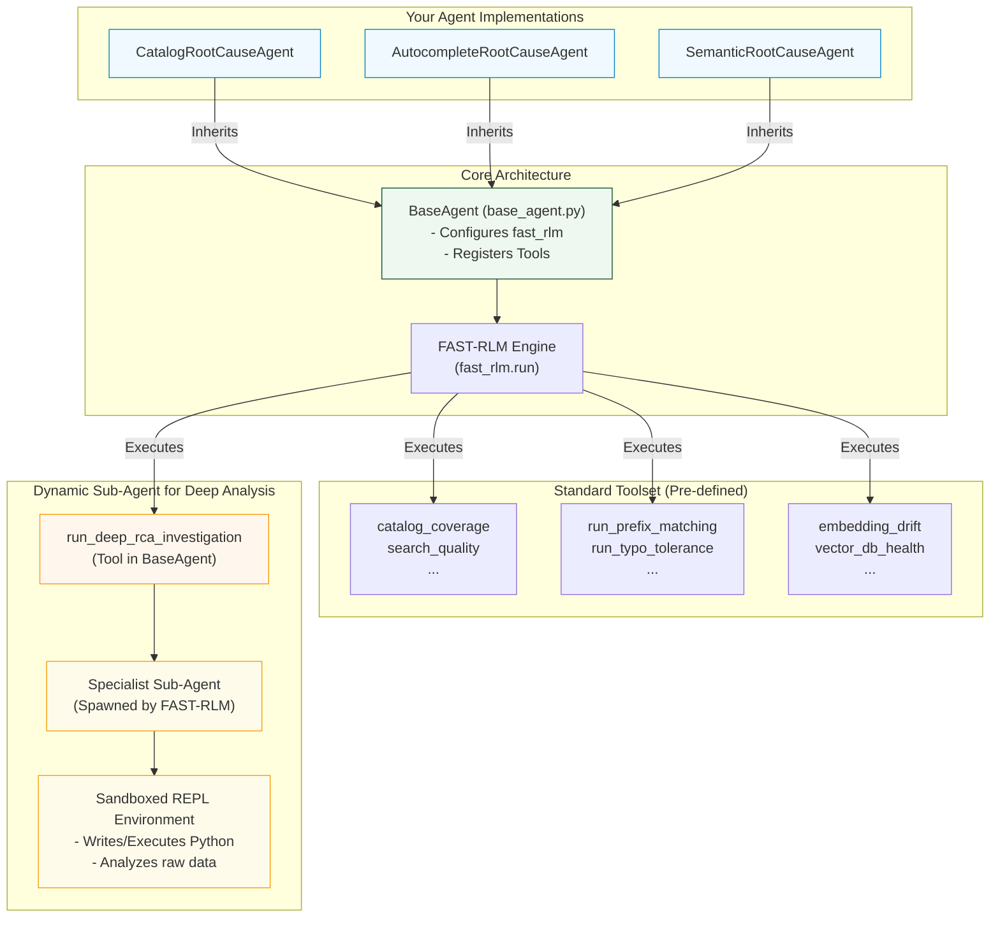

# FAST-RLM Integration Overview

This diagram illustrates how your agents are integrated with the FAST-RLM engine, showing the relationship between the `BaseAgent`, the FAST-RLM engine, and the dynamically spawned sub-agents for deep analysis.

