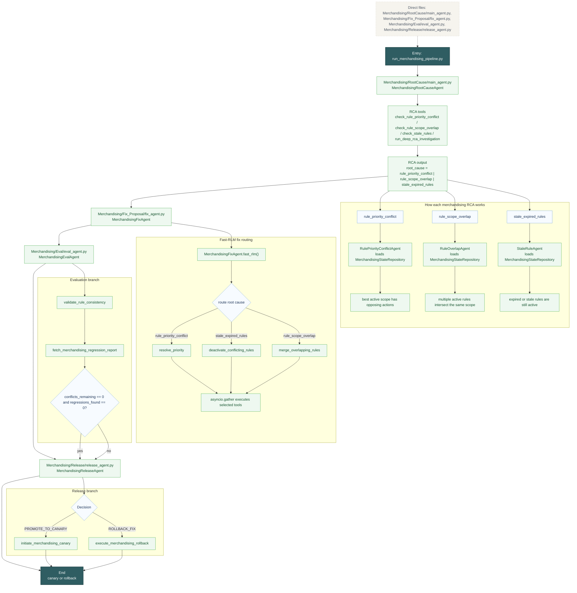

# Merchandising Deep Flow

This diagram shows the full working merchandising path, including the Fast-RLM fix router.

Reading guide:
- RCA chooses between conflicting rules, overlapping scopes, and stale rules.
- Fix proposal is the most dynamic part here because it uses Fast-RLM to route to the exact remediation tools.
- Evaluation checks consistency and regression safety before release.

