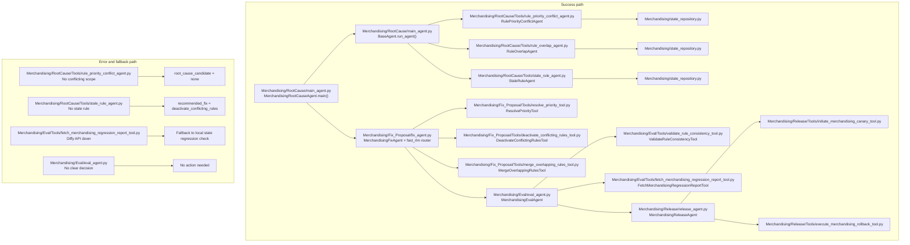

# Merchandising Runtime Diagram

This diagram follows the current merchandising pipeline.

```mermaid
flowchart TD
    start["Merchandising/RootCause/main_agent.py<br/>MerchandisingRootCauseAgent.main()"] --> rca["Merchandising/RootCause/main_agent.py<br/>BaseAgent.run_agent()"]

    rca --> priority["Merchandising/RootCause/Tools/rule_priority_conflict_agent.py<br/>RulePriorityConflictAgent"]
    rca --> overlap["Merchandising/RootCause/Tools/rule_overlap_agent.py<br/>RuleOverlapAgent"]
    rca --> stale["Merchandising/RootCause/Tools/stale_rule_agent.py<br/>StaleRuleAgent"]
    priority --> state1["Merchandising/state_repository.py"]
    overlap --> state2["Merchandising/state_repository.py"]
    stale --> state3["Merchandising/state_repository.py"]

    start --> fix["Merchandising/Fix_Proposal/fix_agent.py<br/>MerchandisingFixAgent + fast_rlm router"]
    fix --> resolve["Merchandising/Fix_Proposal/Tools/resolve_priority_tool.py<br/>ResolvePriorityTool"]
    fix --> deactivate["Merchandising/Fix_Proposal/Tools/deactivate_conflicting_rules_tool.py<br/>DeactivateConflictingRulesTool"]
    fix --> merge["Merchandising/Fix_Proposal/Tools/merge_overlapping_rules_tool.py<br/>MergeOverlappingRulesTool"]

    fix --> eval["Merchandising/Eval/eval_agent.py<br/>MerchandisingEvalAgent"]
    eval --> consistency["Merchandising/Eval/Tools/validate_rule_consistency_tool.py<br/>ValidateRuleConsistencyTool"]
    eval --> regression["Merchandising/Eval/Tools/fetch_merchandising_regression_report_tool.py<br/>FetchMerchandisingRegressionReportTool"]

    eval --> release["Merchandising/Release/release_agent.py<br/>MerchandisingReleaseAgent"]
    release --> canary["Merchandising/Release/Tools/initiate_merchandising_canary_tool.py"]
    release --> rollback["Merchandising/Release/Tools/execute_merchandising_rollback_tool.py"]

    subgraph success["Success path"]
        start
        rca
        priority
        overlap
        stale
        state1
        state2
        state3
        fix
        resolve
        deactivate
        merge
        eval
        consistency
        regression
        release
        canary
        rollback
    end

    subgraph errors["Error and fallback path"]
        e1["Merchandising/RootCause/Tools/rule_priority_conflict_agent.py<br/>No conflicting scope"] --> e2["root_cause_candidate = none"]
        e3["Merchandising/RootCause/Tools/stale_rule_agent.py<br/>No stale rule"] --> e4["recommended_fix = deactivate_conflicting_rules"]
        e5["Merchandising/Eval/Tools/fetch_merchandising_regression_report_tool.py<br/>Diffy API down"] --> e6["Fallback to local state regression check"]
        e7["Merchandising/Eval/eval_agent.py<br/>No clear decision"] --> e8["No action needed"]
    end
```

The merchandising fix and evaluation layers are the most complete part of the non-catalog pipelines.

