# Root Cause and Fix Proposal Scenario Map

This diagram shows how root-cause analysis and fix proposal move across the different agent families depending on the kind of scenario.

```mermaid
flowchart TB
    classDef scenario fill:#f8fafc,stroke:#94a3b8,color:#0f172a,stroke-width:1px;
    classDef wired fill:#ecfdf3,stroke:#22c55e,color:#14532d,stroke-width:1px;
    classDef scaffold fill:#fff7ed,stroke:#f59e0b,color:#7c2d12,stroke-dasharray: 5 3;
    classDef note fill:#f6f4ee,stroke:#d6d3d1,color:#4b5563,stroke-dasharray: 4 3;

    router["Scenario router<br/>pick the RCA + fix path based on the issue"]:::note

    subgraph catalog["Catalog scenario"]
        direction LR
        C0["Scenario: missing attributes, stale catalog, schema violation, low search relevance, missing catalog entity"]:::scenario --> C1["Catalog/RootCause/google_agent.py<br/>GoogleRootCauseAgent<br/>BaseAgent + RCA tools"]:::wired --> C2["Root-cause tools<br/>catalog_coverage / schema_validation / freshness_check / historical_intent / search_quality / capability_mapping / run_deep_rca_investigation"]:::wired --> C3["Catalog root cause output<br/>coverage_gap / stale_catalog_data / catalog_schema_violation / low_search_relevance / missing_catalog_entity"]:::wired --> C4["Catalog/Fix_Proposal/fix_agent.py<br/>GoogleFixProposalAgent<br/>BaseAgent + remediation tools"]:::wired --> C5["Fix tools<br/>llm_inference / apply_patch / vector_refresh / trigger_reindex / generate_synonyms / apply_synonyms / map_semantic_intent / apply_semantic_rules"]:::wired --> C6["Outcome<br/>catalog patched, vectors refreshed, search reindexed"]:::wired
    end

    subgraph autocomplete["Autocomplete scenario"]
        direction LR
        A0["Scenario: typo, prefix miss, popularity bias"]:::scenario --> A1["Autocomplete/RootCause/main_agent.py<br/>AutocompleteRootCauseAgent<br/>BaseAgent + RCA tools"]:::wired --> A2["Root-cause tools<br/>run_prefix_matching_analysis / run_popularity_bias_analysis / run_typo_tolerance_analysis / run_deep_rca_investigation"]:::wired --> A3["Autocomplete root cause output<br/>prefix_index_stale / popularity_bias_low / missing_typo_synonyms"]:::wired --> A4["Autocomplete/Fix_Proposal/fix_agent.py<br/>AutocompleteFixProposalAgent<br/>currently scaffolded"]:::scaffold --> A5["Planned fix tools<br/>adjust_prefix_weights / boost_popular_entities / update_typo_dictionary"]:::scaffold --> A6["Outcome<br/>fix path exists in tools, but agent wiring is still pending"]:::scaffold
    end

    subgraph merchandising["Merchandising scenario"]
        direction LR
        M0["Scenario: priority conflict, scope overlap, stale or expired rules"]:::scenario --> M1["Merchandising/RootCause/main_agent.py<br/>MerchandisingRootCauseAgent<br/>BaseAgent + RCA tools"]:::wired --> M2["Root-cause tools<br/>check_rule_priority_conflict / check_rule_scope_overlap / check_stale_rules / run_deep_rca_investigation"]:::wired --> M3["Merchandising root cause output<br/>rule_priority_conflict / rule_scope_overlap / stale_expired_rules"]:::wired --> M4["Merchandising/Fix_Proposal/fix_agent.py<br/>MerchandisingFixAgent<br/>BaseAgent + Fast-RLM router"]:::wired --> M5["Fast-RLM fix routing<br/>resolve_priority / deactivate_conflicting_rules / merge_overlapping_rules"]:::wired --> M6["Outcome<br/>rules re-scored, deactivated, or merged"]:::wired
    end

    subgraph semantic["Semantic scenario"]
        direction LR
        S0["Scenario: embedding drift, index coverage gap, vector DB health, semantic search quality"]:::scenario --> S1["Semantic/RootCause/main_agent.py<br/>SemanticRootCauseAgent<br/>currently scaffolded"]:::scaffold --> S2["Available specialist RCA tools<br/>vector_db_health / embedding_drift / semantic_coverage / semantic_search_quality"]:::scaffold --> S3["Semantic root cause output<br/>vector_db_unreachable / embedding_drift / index_coverage_gap / stale_embeddings"]:::scaffold --> S4["Semantic/Fix_Proposal/fix_agent.py<br/>SemanticFixProposalAgent<br/>currently scaffolded"]:::scaffold --> S5["Planned fix tools<br/>vector_refresh / reindex_trigger / semantic_rules"]:::scaffold --> S6["Outcome<br/>semantic fix flow exists conceptually, but agent wiring is incomplete"]:::scaffold
    end

    router --> C0
    C6 --> A0
    A6 --> M0
    M6 --> S0
```

Reading guide:
- Catalog and merchandising are the most fully wired end-to-end flows today.
- Autocomplete has a working RCA path, but the fix proposal class is still scaffolded.
- Semantic has the tools, but the main RCA and fix proposal agents are still scaffolds.
- `BaseAgent` powers the common RCA/fix behavior for the wired classes, while Merchandising adds a custom Fast-RLM router for fix selection.
