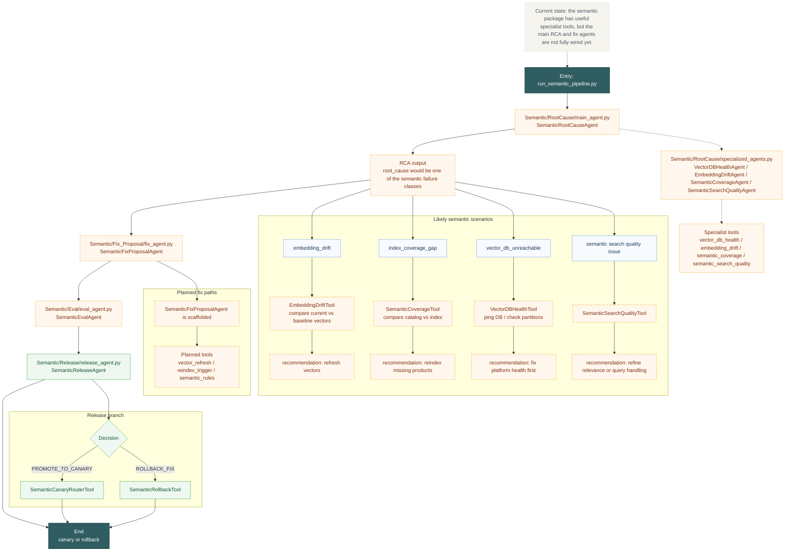

# Semantic Deep Flow

This diagram shows the semantic package as it exists now: RCA and fix proposal are scaffolded, while specialist tools exist separately.

Reading guide:
- Semantic has the clearest gap between available tools and actual agent wiring.
- The specialist tools can diagnose drift and coverage problems, but the main agents are still scaffolded.
- Release is wired, so once the upstream agents are completed the release step can already operate.
