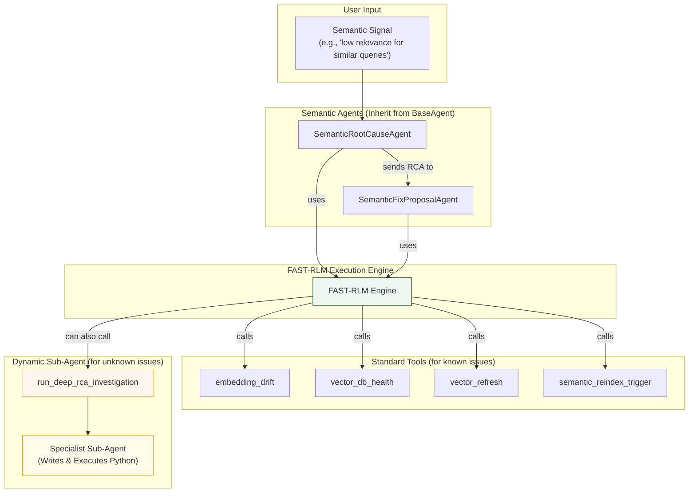

# Semantic Agent and FAST-RLM Workflow

This diagram shows how the Semantic agents use FAST-RLM to investigate complex issues related to vector embeddings and semantic search relevance, with the ability to use a deep investigation sub-agent for direct data analysis.

