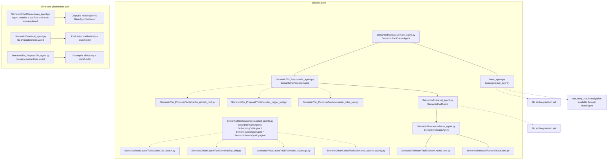

# Semantic Runtime Diagram

The semantic package currently has scaffolded agent shells plus standalone specialist tools.
This diagram reflects the current code exactly.

The standalone specialist tools under `Semantic/RootCause/Tools/` are currently available, but the main semantic agent does not wire them in yet.

