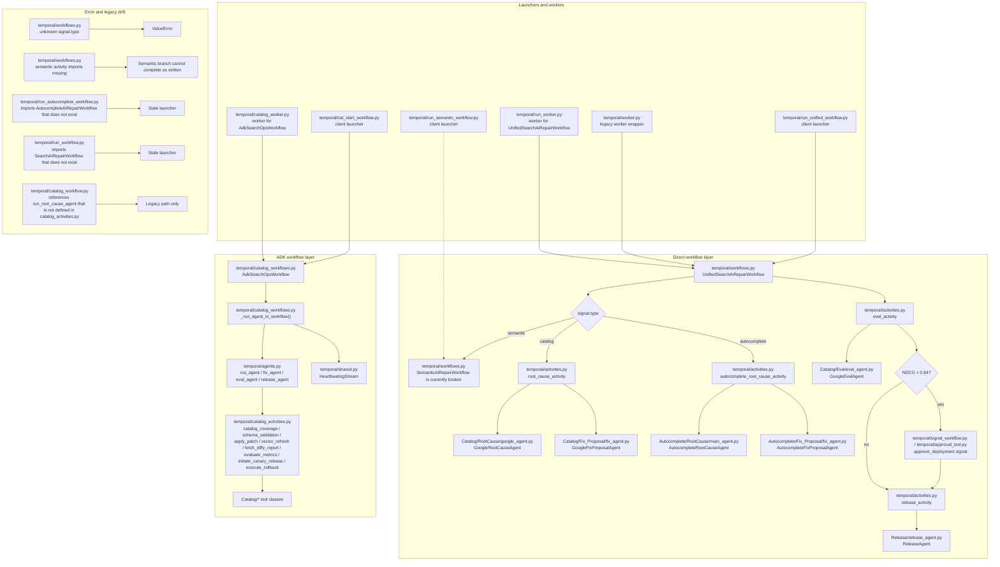

# Temporal Runtime Diagram

This diagram shows the current Temporal wiring in two layers:
- the direct workflow layer in `temporal/workflows.py` and `temporal/activities.py`
- the ADK layer in `temporal/catalog_workflows.py`, `temporal/agents.py`, and `temporal/catalog_activities.py`

The active Temporal catalog flow uses `UnifiedSearchAiRepairWorkflow` plus the ADK workflow `AdkSearchOpsWorkflow`.
The semantic and autocomplete launcher files are present, but the workflow imports are currently stale.
