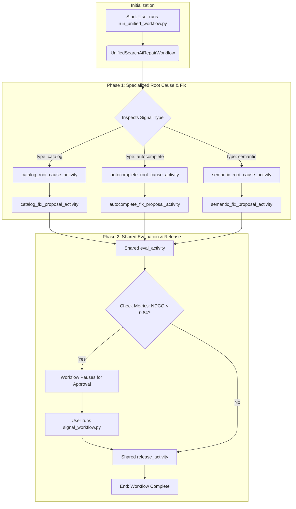

```mermaid
graph TD
    subgraph Initialization
        A[Start: User runs run_unified_workflow.py] --> B(UnifiedSearchAiRepairWorkflow);
    end

    subgraph "Phase 1: Specialized Root Cause & Fix"
        B --> C{Inspects Signal Type};
        C -->|"type: catalog"| D[catalog_root_cause_activity];
        D --> E[catalog_fix_proposal_activity];

        C -->|"type: autocomplete"| F[autocomplete_root_cause_activity];
        F --> G[autocomplete_fix_proposal_activity];

        C -->|"type: semantic"| H[semantic_root_cause_activity];
        H --> I[semantic_fix_proposal_activity];
    end

    subgraph "Phase 2: Shared Evaluation & Release"
        E --> J[Shared eval_activity];
        G --> J;
        I --> J;

        J --> K{Check Metrics: NDCG < 0.84?};
        K -->|Yes| L[Workflow Pauses for Approval];
        L --> M[User runs signal_workflow.py];
        M --> N[Shared release_activity];

        K -->|No| N;
        N --> O[End: Workflow Complete];
    end
```
